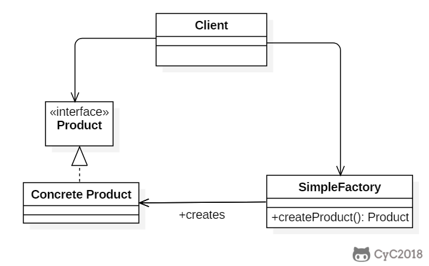
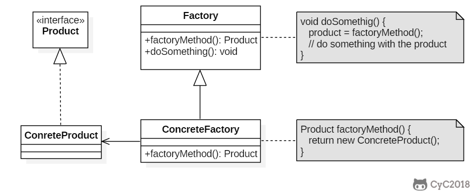
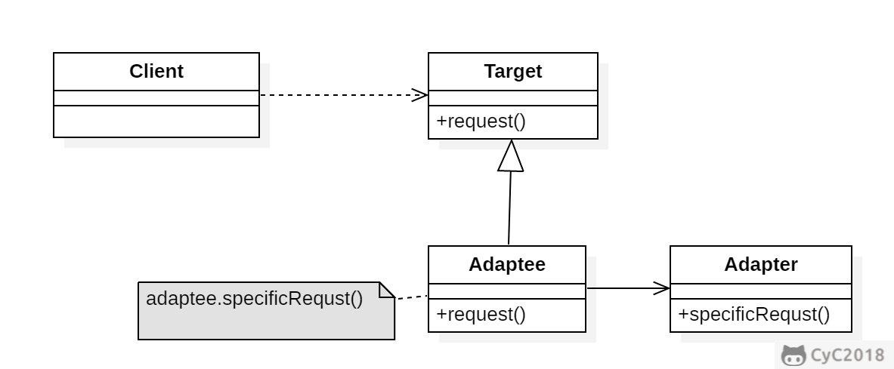
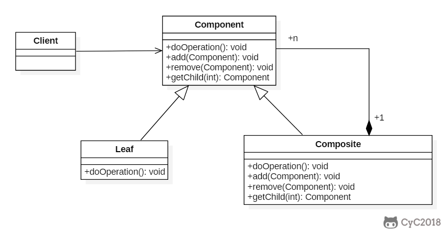
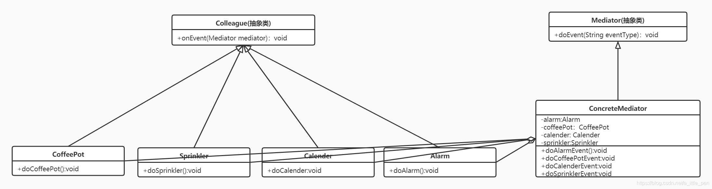
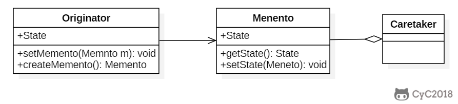

## 1.单例模式

> 确保一个类只有一个实例，并提供该实例的全局访问点。


单例模式的实现有很多种，常见的有：饿汉式、懒汉式、静态内部类、DCL、枚举。下面我们就从这种实现方式来了解学习单例模式

1. 饿汉式
   （饿汉式）优缺点说明：
    *	优点：这种写法比较简单，就是在类装载的时候就完成实例化。避免了线程同步问题
    *	缺点：在类装载的时候就完成实例化，没有达到Lazy Loading（懒加载）的效果。如果从始至终从未使用过这个实例，则会造成内存的浪费。
    *	这种方式基于classloader机制避免了多线程的同步问题，不过instance在类装载时就实例化，在单例模式中大多数都是调用getinstance方法，但是导致类装载的原因有很多种，因此不能确定有其他的方式（或者其他的静态方法）导致类装载，这时候初始化instance就没有达到lazy loading的效果。
    *	结论：这种单例模式可用，可能造成内存浪费。

**实现代码：**
```java
1.第一种实现方式
private final static SingletonModeDemo1 MysingletonMode = new SingletonModeDemo1();
    public static SingletonModeDemo1 getMysingletonMode() {
        return MysingletonMode;
    }
2.第二种实现方式
//这种方式和上面的实现方式一样，只是将静态成员变量放到了静态代码块中创建。
private  static SingletonModeDemo1 MysingletonMode1 = null;
    {
        MysingletonMode1 = new SingletonModeDemo1();
    }
    public static SingletonModeDemo1 getInstance(){
        return MysingletonMode1;
    }
```

2. 懒汉式
   （懒汉式--线程不安全）优缺点说明：
    *	优点：：起到了LazyLoading 的效果，但是只能在单线程下使用。
    *	缺点：如果在多线程下，一个线程进入了if(singleton ==null)判断语句块，还来得及往下执行，另一个线程也通过了这个判断语句，这时便会产生多个实例，所在在多线程环境下不可使用这种方式。
    *	结论：在实际开发中，不要使用这种方式。


**实现代码：**

```java
private static SingletonModeDemo1 singletonModeDemo1;
    public static SingletonModeDemo1 getInstance(){
        if (singletonModeDemo1==null){
            singletonModeDemo1 = new SingletonModeDemo1();
        }
        return singletonModeDemo1;
    }
```
2. 懒汉式
   （懒汉式--线程安全）优缺点说明：
    *	优点：：解决了线程安全问题
    *	缺点：效率太低了，每个线程在想获得类的实例时候，执行getinstance（）方法都要进行同步，而其实这个方法只执行一个实例化代码就够了，后面的想获得该类实例，直接return就行了，方法进行同步效率太低
    *	结论：在实际开发中，不推荐使用这种单例方式

**实现代码**：

```java
private static SingletonModeDemo1 singletonModeDemo1;
    public  synchronized static SingletonModeDemo1 getInstance(){
        if (singletonModeDemo1 == null) {
            singletonModeDemo1 = new SingletonModeDemo1();
        }
        return singletonModeDemo1;
    }
```

3. 静态内部类
*	优点：避免了线程不安全，利用静态内部类特点实现延迟加载，效率高。
*	缺点：相比较上面的几种实现方式，基本没有什么缺点
*	结论：推荐使用。
     **实现代码：**

```java
private static class Instance{
        public static SingletonModeDemo1 singletonModeDemo1= new SingletonModeDemo1();
    }
    public static SingletonModeDemo1 getInstance(){
        return Instance.singletonModeDemo1;
    }
```

4. DCL
*	优点：Double-Check概念是多线程开发中常使用到的，如代码中所示，我们进行了两次if（singleton == null）检查，这样就可以保证线程安全了。这样，实例化代码只用执行一次，后面再次访问时，判断if（singleton ==null），直接return实例化对象，也避免的反复进行方法同步。
*	线程安全，延迟加载；效率较高
*	缺点：相比较上面的几种实现方式，基本没有什么缺点
*	结论：推荐使用。
     **实现代码：**

```java
private volatile static SingletonModeDemo1 singletonMode=null;

    //不加volatile可能会出现指令重排序，导致其他线程获取的这个对象是一个没有new完全的对象
    public static SingletonModeDemo1 getInstance() {
        if (singletonMode == null) {
            synchronized (SingletonModeDemo1.class) {
                if (singletonMode == null) {
                    singletonMode = new SingletonModeDemo1();
                }
            }
        }
        return singletonMode;
    }
```

5. 枚举
*	优点：：借助JDK1.5中添加的枚举来实现单例模式，不仅能避免多线程同步问题，而且还能防止反序列化重新创建新的对象。
*	缺点：相比较上面的几种实现方式，基本没有什么缺点
*	结论：推荐使用。

**实现代码：**

```java
 public  enum Singleton{
        INSTANCE;
        public void doSomething(){
            System.out.println("枚举");
        }

    }
    public static void main(String[] args) {
//        SingletonModeDemo1 mysingletonMode = SingletonModeDemo1.getMysingletonMode();
//        SingletonModeDemo1 mysingletonMode1 = SingletonModeDemo1.getMysingletonMode();
//        System.out.println(mysingletonMode == mysingletonMode1?"相等":"不相等");
            Singleton.INSTANCE.doSomething();
    }
}
```
**单例模式的相关总结**
*	单例模式注意事项和细节说明
     单例模式保证了系统内存中该类只存在一个对象，节省了系统资源，对于一些需要频繁创建销毁的对象，用单例模式可以提高系统性能。
     当想实例化一个单例类的时候，必须要记住使用相应的获取对象的方法，而不是使用new
*	单例模式使用的场景：需要频繁的进行创建和销毁的对象，创建对象时耗时过多或耗费资源过多（即：重量级对象），但又经常用到的对象，工具类对象、频繁访问数据库或文件的对象（bs数据源、session工厂）

## 2.工厂模式(Factory)
工厂模式一共有三种模式：简单工厂模式、工厂方法模式、抽象工厂模式。其中简单工厂模式没有出现在23种设计模式中，可能是因为太简单，而且这种模式在开发中基本用不到，所以没把它纳入当中。


### 2.1.简单工厂模式
> 在创建一个对象时不向客户暴露内部细节，并提供一个创建对象的通用接口。
>
简单工厂把实例化的操作单独放到一个类中，这个类就成为简单工厂类，让简单工厂类来决定应该用哪个具体子类来实例化。

这样做能把客户类和具体子类的实现解耦，客户类不再需要知道有哪些子类以及应当实例化哪个子类。客户类往往有多个，如果不使用简单工厂，那么所有的客户类都要知道所有子类的细节。而且一旦子类发生改变，例如增加子类，那么所有的客户类都要进行修改




*	简单工厂模式是属于创建型模式，是工厂模式的一种，简单工厂模式是由一个工厂对象决定创建出哪一种产品类的实例。简单工厂模式是工厂模式家族中最简单实用的模式
*	简单工厂模式：定义了一个创建对象的类，由这个类来封装实例化对象的行为（代码）
*	在软件开发中，当我们会用到大量的创建某种、某类或者某批对象时，就会使用到工厂模式。

案例类图：


代码实现：

```java
public interface MoveAble {
        void move();
}

public class Aircraft implements MoveAble{
    @Override
    public void move() {
        System.out.println("飞机在飞...");
    }
}

public class Car implements MoveAble {
    @Override
    public void move() {
        System.out.println("车在跑...");
    }
}

public class Ship implements MoveAble {
    @Override
    public void move() {
        System.out.println("船在水上跑...");
    }
}

public class VehicleFactory {
    public Car createCar(){
        return new Car();
    }
    public Aircraft createAircraft(){
        return new Aircraft();
    }
    public Ship createShip(){
        return new Ship();
    }
}

public class Client {
    public static void main(String[] args) {
        VehicleFactory vehicleFactory = new VehicleFactory();
        Car car = vehicleFactory.createCar();
        car.move();
    }
}
```
### 2.2.工厂方法

> 定义了一个创建对象的接口，但由子类决定要实例化哪个类。工厂方法把实例化操作推迟到子类。

在简单工厂中，创建对象的是另一个类，而在工厂方法中，是由子类来创建对象。

下图中，Factory 有一个 doSomething() 方法，这个方法需要用到一个产品对象，这个产品对象由 factoryMethod() 方法创建。该方法是抽象的，需要由子类去实现。



实例类图：


代码实现：

```java
public class Client {
    public static void main(String[] args) {
        Factory aircraftFactory = new AircraftFactory();
        aircraftFactory.createVehicle();
    }
}

public abstract class Factory {
    public abstract MoveAble getVehicle();
    public MoveAble createVehicle(){
        return getVehicle();
    }
}

public interface MoveAble {
    void move();
}

public class Aircraft implements MoveAble {
    @Override
    public void move() {
            //TODO
    }
}

public class AircraftFactory extends Factory {
    @Override
    public MoveAble getVehicle() {
        return new Aircraft();
    }
}

public class Car implements MoveAble {
    @Override
    public void move() {
    //TODO
    }
}

public  class CarFactory extends Factory{
    @Override
    public MoveAble getVehicle() {
        return new Car();
    }
}

public class Ship implements MoveAble {
    @Override
    public void move() {
        //TODO
    }
}

public class ShipFactory extends Factory {
    @Override
    public MoveAble getVehicle() {
        return new Ship();
    }
}
```
### 2.3抽象工厂
提供一个接口，用于创建   **相关的对象家族**  。


抽象工厂模式创建的是对象家族，也就是很多对象而不是一个对象，并且这些对象是相关的，也就是说必须一起创建出来。而工厂方法模式只是用于创建一个对象，这和抽象工厂模式有很大不同。

抽象工厂模式用到了工厂方法模式来创建单一对象，AbstractFactory 中的 createProductA() 和 createProductB() 方法都是让子类来实现，这两个方法单独来看就是在创建一个对象，这符合工厂方法模式的定义。

至于创建对象的家族这一概念是在 Client 体现，Client 要通过 AbstractFactory 同时调用两个方法来创建出两个对象，在这里这两个对象就有很大的相关性，Client 需要同时创建出这两个对象。

从高层次来看，抽象工厂使用了组合，即 Cilent 组合了 AbstractFactory，而工厂方法模式使用了继承。

实例类图：


实例代码：

```java
public abstract class Pizza {
    protected abstract void prepare();
    protected abstract void bake();
    protected abstract void cut();
    protected abstract void box();
}

public abstract class PizzaFactory {
    public abstract Pizza createPizza(String PizzaType);
}

public class BJPizzaFactory extends PizzaFactory{
    @Override
    public Pizza createPizza(String PizzaType) {
        Pizza pizza = null;
        if (PizzaType.equals("CheesePizza")){
            pizza = new BJCheesePizza();
        }else if(PizzaType.equals("GreekPizza")){
            pizza = new BJGreekPizza();
        }else {
            return null;
        }
        return pizza;
    }
}

public class HNPizzaFactory extends PizzaFactory {
    @Override
    public Pizza createPizza(String PizzaType) {
        Pizza pizza = null;
        if (PizzaType.equals("CheesePizza")){
            pizza = new HNCheesePizza();
        }else if(PizzaType.equals("GreekPizza")){
            pizza = new HNGreekPizza();
        }else {
            return null;
        }
        return pizza;
    }
}

public class BJGreekPizza extends Pizza {

    String PizzaType;
    public BJGreekPizza(){
        this.PizzaType = "BJGreekPizza";
    }
    @Override
    protected void prepare() {
        System.out.println(PizzaType+"材料准备完毕");
    }

    @Override
    protected void bake() {
        System.out.println(PizzaType+"正在烘烤");
    }

    @Override
    protected void cut() {
        System.out.println(PizzaType+"正在切片");
    }

    @Override
    protected void box() {
        System.out.println(PizzaType+"打包完毕");
    }
}

public class BJCheesePizza extends Pizza {
    String PizzaType;
    public BJCheesePizza(){
        this.PizzaType = "BJCheesePizza";
    }
    @Override
    protected void prepare() {
        this.PizzaType = PizzaType;
        System.out.println(PizzaType+"材料准备完毕");
    }

    @Override
    protected void bake() {
        System.out.println(PizzaType+"正在烘烤");
    }

    @Override
    protected void cut() {
        System.out.println(PizzaType+"正在切片");
    }

    @Override
    protected void box() {
        System.out.println(PizzaType+"打包完毕");
    }
}

public class HNCheesePizza extends Pizza {
    String PizzaType;
    public HNCheesePizza(){
        this.PizzaType = "HNCheesePizza";
    }
    @Override
    protected void prepare() {
        this.PizzaType = PizzaType;
        System.out.println(PizzaType+"材料准备完毕");
    }

    @Override
    protected void bake() {
        System.out.println(PizzaType+"正在烘烤");
    }

    @Override
    protected void cut() {
        System.out.println(PizzaType+"正在切片");
    }

    @Override
    protected void box() {
        System.out.println(PizzaType+"打包完毕");
    }
}


public class HNGreekPizza extends Pizza {
    String PizzaType;
    public HNGreekPizza(){
        this.PizzaType = "HNGreekPizza";
    }
    @Override
    protected void prepare() {
        System.out.println(PizzaType+"材料准备完毕");
    }

    @Override
    protected void bake() {
        System.out.println(PizzaType+"正在烘烤");
    }

    @Override
    protected void cut() {
        System.out.println(PizzaType+"正在切片");
    }

    @Override
    protected void box() {
        System.out.println(PizzaType+"打包完毕");
    }
}

public class PizzaOrder {
    public void sellPizza() {
        System.out.println("=============欢迎光临Disaster的Pizza店=====================");
        System.out.println("您想买什么地区披萨：");
        PizzaFactory factory = createFactory();
        if (factory!=null){
            System.out.println("选择完毕，请您输入想吃的披萨种类：");
        }
        while (true) {
            if (factory==null){
                break;
            }
            Pizza pizza = factory.createPizza(getPizzaType());
            if (pizza != null) {
                pizza.prepare();
                pizza.bake();
                pizza.cut();
                pizza.box();
                System.out.println("请在输入你想买的其他Pizza：");
            } else {
                System.out.println("本店没有此披萨");
                return;
            }
        }

    }

    private PizzaFactory createFactory() {
        PizzaFactory pizzaFactory = null;
        Scanner scanner = new Scanner(System.in);
        String next = scanner.next();
        if (next.equals("BJ")) {
            pizzaFactory = new BJPizzaFactory();
        } else if (next.equals("HN")) {
            pizzaFactory = new HNPizzaFactory();
        } else {
            System.out.println("没有此地区的披萨");
            return null;
        }
        return pizzaFactory;
    }

    private String getPizzaType() {
        String stringBuilder = "";
        BufferedReader bf = new BufferedReader(new InputStreamReader(System.in));
        try {
            if ((stringBuilder = bf.readLine()) != null) {
                return stringBuilder;
            }
        } catch (IOException e) {
            e.printStackTrace();
        }
        return null;
    }
}

public class PizzaStore {
    public static void main(String[] args) {
        PizzaOrder pizzaOrder = new PizzaOrder();
        pizzaOrder.sellPizza();
    }
}
```
## 3.原型模式(Prototype)
原型模式：使用原型实例指定要创建对象的类型，通过复制这个原型来创建新对象。类似于现实中的克隆概念。


在进行原型模式之前，我们要先了解两个概念：
1.浅拷贝（shallow copy）
* 对于数据类型是基本数据类型的成员变量，浅拷贝会直接进行值传递，也就是将该属性值赋值一份给新的对象。
* 对于数据类型是引用数据类型的成员变量，比如说成员变量是某个数组，某个类的对象等， 那么浅拷贝会进行引用传递，也就是只是将该成员变量的引用值（内存地址）赋一份给新的对象。因为实际上两个对象的该成员变量都指向同一个实例。在这种情况下，在一个对象中修改该成员变量会影响到另一个对象的该成员变量值。
* 浅拷贝是使用默认的clone()方法实现的，也就是没有重写的Object中的Clone方法，它是同本地方法，是通过c++语言编写实现的相关对象的复制操作的。
  2.深拷贝（deep copy）
* 复制对象的所有基本数据类型的成员变量值。
* 为所有引用数据类型的成员变量申请存储空间，并复制每个引用数据类型成员变量所引用的对象，直到该对象可达的所有对象。也就是说，对象进行深拷贝要对整个对象进行拷贝。
* 深拷贝实现方式1：重写clone方法来实现深拷贝
* 深拷贝实现方式2：通过对象序列化实现深拷贝（推荐，因为clone方法的底层是c或c++来编写的，我们无法看到具体的操作逻辑，我们在使用它的时候是需要非常谨慎的，但是序列化是jdk给我们提供的，能够看到序列化的代码执行，一旦出现问题，程序员也能够快速的找到解决方案）

代码案例：
（浅拷贝就是创建对象然后调用clone方法就可以得到一个新的对象，相对比较简单，这里就没有放代码了）
1.通过clone方法来实现深拷贝

```java
public class Person implements Cloneable{
    private String name;
    private String age;
    public Son son;
    public Person(String name, String age, Son son){
        this(name, age);
        this.son = son;
    }
    public Person(String name, String age) {
        this.name = name;
        this.age = age;
    }

    public Son getSon() {
        return son;
    }

    public void setSon(Son son) {
        this.son = son;
    }

    public String getName() {
        return name;
    }

    public void setName(String name) {
        this.name = name;
    }

    public String getAge() {
        return age;
    }

    public void setAge(String age) {
        this.age = age;
    }

    @Override
    public String toString() {
        return "Person{" +
                "name='" + name + '\'' +
                ", age='" + age + '\'' +
                ", son=" + son +
                '}';
    }

    @Override
    protected Object clone() throws CloneNotSupportedException {
        Person person = null;//创建一个对象用于接收克隆之后的对象
        person = (Person) super.clone();//通过调用Object方法中的clone方法得到浅拷贝对象
        person.son = (Son) person.son.clone();//将对象中的引用成员变量也通过调用重写的clone方法来进行拷贝。
        //通过上面这两部操作能够实现深拷贝，但是当一个对象的引用数据类型变多的时候，代码量也就会相应的增多，这是十分繁琐的过程。
        return person;
    }
}

public class Son implements Cloneable{
    private String name;
    private int age;

    public Son(String name, int age) {
        this.name = name;
        this.age = age;
    }

    public String getName() {
        return name;
    }

    public void setName(String name) {
        this.name = name;
    }

    public int getAge() {
        return age;
    }

    public void setAge(int age) {
        this.age = age;
    }

    @Override
    protected Object clone() throws CloneNotSupportedException {
        Son son = null;
        son = (Son) super.clone();
        return son;
    }
}

public class Test {
    public static void main(String[] args) throws CloneNotSupportedException {
        Person disaster = new Person("disaster","20",new Son("son",10));
        Person disaster1 = (Person) disaster.clone();
        Person disaster2 = (Person) disaster.clone();
        Person disaster3 = (Person) disaster.clone();
        System.out.println("disaster:"+disaster.toString()+"===="+"hashcode:"+disaster.hashCode()+"====son===="+disaster.getSon().hashCode());
        System.out.println("disaster1:"+disaster.toString()+"===="+"hashcode:"+disaster1.hashCode()+"====son==="+disaster1.getSon().hashCode());
        System.out.println("disaster2:"+disaster.toString()+"===="+"hashcode:"+disaster2.hashCode()+"====son==="+disaster2.getSon().hashCode());
        System.out.println("disaster3:"+disaster.toString()+"===="+"hashcode:"+disaster3.hashCode()+"====son==="+disaster3.getSon().hashCode());
    }
}
```
2.通过序列化来实现深拷贝

```java
public class Person implements Serializable {
    private String name;
    private String age;
    public Son son;

    public Person(String name, String age, Son son){
        this(name, age);
        this.son = son;
    }
    public Person(String name, String age) {
        this.name = name;
        this.age = age;
    }

    public Son getSon() {
        return son;
    }

    public void setSon(Son son) {
        this.son = son;
    }

    public String getName() {
        return name;
    }

    public void setName(String name) {
        this.name = name;
    }

    public String getAge() {
        return age;
    }

    public void setAge(String age) {
        this.age = age;
    }

    @Override
    public String toString() {
        return "Person{" +
                "name='" + name + '\'' +
                ", age='" + age + '\'' +
                ", son=" + son +
                '}';
    }
    public Object deepCopy(){
        //创建流对象
        ByteArrayInputStream bis = null;
        ObjectInputStream ois = null;
        ByteArrayOutputStream bos = null;
        ObjectOutputStream oos = null;
        Person person = null;
        try {
            //序列化
            bos = new ByteArrayOutputStream();
            oos = new ObjectOutputStream(bos);
            oos.writeObject(this);
            //反序列化
            bis = new ByteArrayInputStream(bos.toByteArray());
            ois = new ObjectInputStream(bis);
            person = (Person)ois.readObject();
        } catch (IOException | ClassNotFoundException e) {
            e.printStackTrace();
        }finally {
            try {
                if(bos!=null&&oos!=null&&bis!=null&&ois!=null){
                    bos.close();
                    oos.close();
                    bis.close();
                    ois.close();
                }
            } catch (IOException e) {
                e.printStackTrace();
            }
        }
        return person;
    }
}


public class Son implements Cloneable,Serializable {
    private String name;
    private int age;

    public Son(String name, int age) {
        this.name = name;
        this.age = age;
    }

    public String getName() {
        return name;
    }

    public void setName(String name) {
        this.name = name;
    }

    public int getAge() {
        return age;
    }

    public void setAge(int age) {
        this.age = age;
    }

}

public class Test {
    public static void main(String[] args) throws CloneNotSupportedException {
        Person disaster = new Person("disaster","20",new Son("son",10));
        Person disaster1 = (Person) disaster.deepCopy();
        Person disaster2 = (Person) disaster.deepCopy();
        Person disaster3 = (Person) disaster.deepCopy();
        System.out.println("disaster:"+disaster.toString()+"===="+"hashcode:"+disaster.hashCode()+"====son===="+disaster.getSon().hashCode());
        System.out.println("disaster:"+disaster.toString()+"===="+"hashcode:"+disaster1.hashCode()+"====son==="+disaster1.getSon().hashCode());
        System.out.println("disaster:"+disaster.toString()+"===="+"hashcode:"+disaster2.hashCode()+"====son==="+disaster2.getSon().hashCode());
        System.out.println("disaster:"+disaster.toString()+"===="+"hashcode:"+disaster3.hashCode()+"====son==="+disaster3.getSon().hashCode());
    }
}

```

## 4.建造者模式(Builder)

建造者模式（Buidler Pattern）又叫生成器模式，是一种对象构建模式。它可以将复杂对象的建造过程抽象出来（抽象类别），使这个抽象过程的不同实现方法可以构造出不同表现的（属性）的对象。

建造者模式是一步一步创建一个复杂的对象，它允许用户只通过指定复杂对象的类型和内容就可以构建他们，用户不需要知道内部的具体构建细节。


* 建造者模式的注意事项和细节
    * 客户端（使用程序）不必知道产品内部组成的细节，将产品本身与产品的创建过程解耦，使得相同的创建过程可以创建不同的产品对象。
    * 每一个具体建造者都相对独立，而与其他的具体建造者无关，因此可以很方便地替换具体建造者或增加新的具体建造者，用户使用不同的具体建造者即可得到不同的产品对象。
    * 可以更爱精细得控制产品的创建过程。使复杂产品的创建步骤分解在不同的方法中，使得创建过程更加清晰，也更方便地使用程序来控制创建过程。
    * 增加新的具体建造者无需修改原有类库的代码，指挥者类针对抽象建造者类编程，系统扩展方便，符合开闭原则
    * 建造者模式所创建的产品一般具有较多的共同点，其组成部分相似，如果产品之间的差异性很大，则不适合使用建造者弄湿，因此其使用范围受到一定的限制。


案例类图：


代码实例：

```java
public class Client {
    public static void main(String[] args) {
        ComputerDirector director=new ComputerDirector();//1
        ComputerBuilder builder=new MacComputerBuilder("I5处理器","三星125");//2
        director.makeComputer(builder);//3
        Computer macComputer=builder.getComputer();//4
        System.out.println("mac computer:"+macComputer.toString());

        ComputerBuilder lenovoBuilder=new LenovoComputerBuilder("I7处理器","海力士222");
        director.makeComputer(lenovoBuilder);
        Computer lenovoComputer=lenovoBuilder.getComputer();
        System.out.println("lenovo computer:"+lenovoComputer.toString());
    }
}
public class Computer {
    private String cpu;//必须
    private String ram;//必须
    private int usbCount;//可选
    private String keyboard;//可选
    private String display;//可选

    public Computer(String cpu, String ram) {
        this.cpu = cpu;
        this.ram = ram;
    }

    public void setUsbCount(int usbCount) {
        this.usbCount = usbCount;
    }

    public void setKeyboard(String keyboard) {
        this.keyboard = keyboard;
    }

    public void setDisplay(String display) {
        this.display = display;
    }

    @Override
    public String toString() {
        return "Computer{" +
                "cpu='" + cpu + '\'' +
                ", ram='" + ram + '\'' +
                ", usbCount=" + usbCount +
                ", keyboard='" + keyboard + '\'' +
                ", display='" + display + '\'' +
                '}';
    }
}

public abstract class ComputerBuilder {
    public abstract void setUsbCount();

    public abstract void setKeyboard();

    public abstract void setDisplay();

    public abstract Computer getComputer();
}

public class LenovoComputerBuilder extends ComputerBuilder {
    private Computer computer;

    public LenovoComputerBuilder(String cpu, String ram) {
        computer = new Computer(cpu, ram);
    }

    @Override
    public void setUsbCount() {
        computer.setUsbCount(4);
    }

    @Override
    public void setKeyboard() {
        computer.setKeyboard("联想键盘");
    }

    @Override
    public void setDisplay() {
        computer.setDisplay("联想显示器");
    }

    @Override
    public Computer getComputer() {
        return computer;
    }
}

public class MacComputerBuilder extends ComputerBuilder {
    private Computer computer;

    public MacComputerBuilder(String cpu, String ram) {
        computer = new Computer(cpu, ram);
    }

    @Override
    public void setUsbCount() {
        computer.setUsbCount(2);
    }

    @Override
    public void setKeyboard() {
        computer.setKeyboard("苹果键盘");
    }

    @Override
    public void setDisplay() {
        computer.setDisplay("苹果显示器");
    }

    @Override
    public Computer getComputer() {
        return computer;
    }
}
public class ComputerDirector {
    public void makeComputer(ComputerBuilder builder){
        builder.setUsbCount();
        builder.setDisplay();
        builder.setKeyboard();
    }
}
```
其实对于构造者模式还有一种写法，这种写法很多框架都有用，相比较上面的写法，下面的写法在实际开发中会使用的更多。

```java
public class Computer {
    private String cpu;//必须
    private String ram;//必须
    private int usbCount;//可选
    private String keyboard;//可选
    private String display;//可选

    private Computer(Builder builder) {
        this.cpu = builder.cpu;
        this.ram = builder.ram;
        this.usbCount = builder.usbCount;
        this.keyboard = builder.keyboard;
        this.display = builder.display;
    }

    public static class Builder {
        private String cpu;//必须
        private String ram;//必须
        private int usbCount;//可选
        private String keyboard;//可选
        private String display;//可选

        public Builder(String cup, String ram) {
            this.cpu = cup;
            this.ram = ram;
        }

        public Builder setUsbCount(int usbCount) {
            this.usbCount = usbCount;
            return this;
        }

        public Builder setKeyboard(String keyboard) {
            this.keyboard = keyboard;
            return this;
        }

        public Builder setDisplay(String display) {
            this.display = display;
            return this;
        }

        public Computer build() {
            return new Computer(this);
        }
    }
}
```
这种建造者模式的精妙之处就在于能够有效的解决类爆炸的问题，而且在使用过程中更加的方便。

> 总结：
> //TODO

##  5.适配器模式（Adapter）
将类的接口转换为客户所期望的另一个接口。适配器允许类一起工作，否则由于接口不兼容而无法工作
用朴素的话说：适配器模式允许在适配器中包装其他不兼容的对象，使其与另一个类兼容。



适配器的分类：（命名方式是根据src是以怎样的形式给到Adapter（在Adapter里的形式）来命名的）。
1.类适配器：以类给到，在Adapter里，就是将src当做列，继承
* Adapter类，通过继承src类，实现dst类接口，完成src->dst的适配
* 类适配器模式的注意事项和细节
    * java是单继承 机制，所以类适配器需要src类这一点算是一个缺点，因为这要求dst必须是接口，有一定的局限性。
    * src类的方法在Adapter中都会暴露出来，也增加了使用的成本
    * 由于其继承了src类，所以它可以根据需求重写src类方法，使得Adapter的灵活性增强了。

2.对象适配器：以对象给到，在Adapter里，将src作为一个对象，持有
* 基本思路和类的适配器模式相同，只是将Adapter类作修改，不是继承src类，而是src类的实例，以解决兼容性的问题。即：持有src类，实现dst接口，完成src->dst的适配。
* 根据“合成复用原则”，在系统中尽量使用关联关系来替代继承关系。
* 对象适配器模式是适配器模式常用的一种


3.接口适配器：以接口给到，在Adapter里，将src作为一个接口，实现

* 核心思路：当不需要全部实现接口提供的方法时，可先设计一个抽象类实现接口，并为该接口中每个方法提供一个默认实现（空方法），那么该抽象类的子类可有选择地覆盖父类的某些方法来实现需求。
* 适用于一个接口不想使用其所有的方法的情况

使用场景：
* 你想要使用一个存在的类，但是他的接口类型不是你所需要的
*  你希望创建一个可重用类，该类需要与不相关的类（即不一定具有兼容接口的类）合作。
* 您需要使用几个现有的子类，但是通过对每个子类进行子类调整它们的接口是不切实际的。对象适配器可以调整其父类的接口。
* 大多数使用第三方库的应用程序使用适配器作为应用程序和第三方库之间的中间层，以便将应用程序与库分离。如果必须使用另一个库，则只需要一个新库的适配器，而不必更改应用程序代码。

类适配器和对象适配器的不同：
类适配器
* 通过提交具体的适应性类，使适应性适应与目标。因此，当我们想要调整一个类及其所有子类时，类适配器将无法工作。
* 需要我们重写Adapter的一些行为，因为Adapter是Adapter的子类。
  对象适配器
* 如果我们使用多个Adapter--即适配器本身和它的所有子类（如果有的话）。适配还可以一次向所有适配器添加功能。
* 使得覆盖适应性行为变得更加困难。它需要对适配器进行子类化，并使Adapter引用子类而不是适配器本身。

案例类图：


案例代码：

```java
public class Client {
    public static void main(String[] args) {
        Cat cat = new Cat();
        new Dog(cat).dogBarking();

    }
}

public interface Bark {
     void dogBarking();
}

public interface Catch {
     void catching();
}

public class Dog implements Bark{
    private Catch aCatch;
    public Dog(Catch aCatch){
        this.aCatch = aCatch;
    }
    @Override
    public void dogBarking() {
        aCatch.catching();
    }
}


public class Cat implements Catch {

    @Override
    public void catching() {
        System.out.println("猫在抓老鼠...");
    }
}
```

## 6.桥接模式（Bridge）
将抽象与实现分离开来，使它们可以独立变化。


传统解决一些问题的时候可能会有扩展性问题（类爆炸），违反了单依职责原则，因此提出了桥接模式来解决这些问题。
桥接模式基于类的最小设计原则，通过使用封装、聚合及继承等行为让不同的类承担不同的职责。它的主要特点是把抽象（Abstract）与行为实现（Implement）分离开来，从而可以保持各部分的独立性以及对应他们的功能扩展。

> **桥接模式的注意事项和细节**

> 	1.实现了抽象和事项部分的分离，从而极大的提供了系统的灵活性，让抽象部分和实现部分独立开来，这有助于系统进行分层设计，从而产生更好的结构化系统
> 2.对于系统的高层部分，只需要知道抽象部分和实现部分的接口就可以了，其他的部分由具体的业务来完成
> 3.桥接模式代替多层继承方案，可以减少子类的个数，降低系统的管理和维护成本。
> 4.桥接模式的引入增加了系统的理解和设计难度，由于聚合关联关系建立在抽象层，要求开发者针对抽象进行设计和编程。
> 5.桥接模式要求正确识别出系统中两个独立变化的唯独，因此使用范围有一定的局限性，即需要有这样的应用场景。

>**桥接模式的应用场景：**
>	1.JDBC驱动程序
> 2.银行转账系统
> 消息类型：即时消息、延时消息
>
桥接模式在JDBC的源码分析：
JDBC的Driver接口，如果从桥接模式来看，Driver就是一个接口，下面可以有MYSQL的Driver，Oracle的Driver，这些就一个当作实现接口类。
案例类图：


案例代码：

```java
public class Client {
    public static void main(String[] args) {
        RemoteControl remoteControl1 = new ConcreteRemoteControl1(new RCA());
        remoteControl1.on();
        remoteControl1.off();
        remoteControl1.tuneChannel();
        RemoteControl remoteControl2 = new ConcreteRemoteControl2(new Sony());
        remoteControl2.on();
        remoteControl2.off();
        remoteControl2.tuneChannel();
    }
}

public interface TV {
    void on();

    void off();

    void tuneChannel();
}

public abstract class RemoteControl {
    protected TV tv;
    public RemoteControl(TV tv){
        this.tv = tv;
    }
    public abstract void on();

    public abstract void off();

    public abstract void tuneChannel();
}


public class Sony implements TV{
    @Override
    public void on() {
        System.out.println("Sony.on()");
    }

    @Override
    public void off() {
        System.out.println("Sony.off()");
    }

    @Override
    public void tuneChannel() {
        System.out.println("Sony.tuneChannel()");
    }
}

public class RCA implements TV {
    @Override
    public void on() {
        System.out.println("RCA.on()");
    }

    @Override
    public void off() {
        System.out.println("RCA.off()");
    }

    @Override
    public void tuneChannel() {
        System.out.println("RCA.tuneChannel()");
    }
}

public class ConcreteRemoteControl1 extends RemoteControl {
    public ConcreteRemoteControl1(TV tv) {
        super(tv);
    }

    @Override
    public void on() {
        System.out.println("ConcreteRemoteControl1.on()");
        tv.on();
    }

    @Override
    public void off() {
        System.out.println("ConcreteRemoteControl1.off()");
        tv.off();
    }

    @Override
    public void tuneChannel() {
        System.out.println("ConcreteRemoteControl1.tuneChannel()");
        tv.tuneChannel();
    }
}

public class ConcreteRemoteControl2 extends RemoteControl {
    public ConcreteRemoteControl2(TV tv) {
        super(tv);
    }

    @Override
    public void on() {
        System.out.println("ConcreteRemoteControl2.on()");
        tv.on();
    }

    @Override
    public void off() {
        System.out.println("ConcreteRemoteControl2.off()");
        tv.off();
    }

    @Override
    public void tuneChannel() {
        System.out.println("ConcreteRemoteControl2.tuneChannel()");
        tv.tuneChannel();
    }
}
```
## 7. 装饰（Decorator）
为对象动态添加功能。
装饰者（Decorator）和具体组件（ConcreteComponent）都继承自组件（Component），具体组件的方法实现不需要依赖于其它对象，而装饰者组合了一个组件，这样它可以装饰其它装饰者或者具体组件。所谓装饰，就是把这个装饰者套在被装饰者之上，从而动态扩展被装饰者的功能。装饰者的方法有一部分是自己的，这属于它的功能，然后调用被装饰者的方法实现，从而也保留了被装饰者的功能。可以看到，具体组件应当是装饰层次的最低层，因为只有具体组件的方法实现不需要依赖于其它对象。


1. 装饰者模式：动态的将新功能附加到对象上。在对象功能扩展方面，它比继承更有弹性，装饰者模式也体现了开闭原则（OCP）
2. Java的IO结构，FilterInputStream就是一个装饰者
   案例类图：
   
   案例代码：

```java
public class Client {
    public static void main(String[] args) {
        Beverage beverage = new HouseBlend();
        beverage = new Mocha(beverage);
        beverage = new Milk(beverage);
        System.out.println(beverage.cost());
    }
}

public interface Beverage {
    double cost();
}

public abstract class CondimentDecorator implements Beverage {
    protected Beverage beverage;
}

public class DarkRoast implements Beverage{
    @Override
    public double cost() {
        return 1;
    }
}
public class HouseBlend implements Beverage {
    @Override
    public double cost() {
        return 1;
    }
}

public class Milk extends CondimentDecorator {

    public Milk(Beverage beverage) {
        this.beverage = beverage;
    }

    @Override
    public double cost() {
        return 1 + beverage.cost();
    }
}


public class Mocha extends CondimentDecorator {

    public Mocha(Beverage beverage) {
        this.beverage = beverage;
    }

    @Override
    public double cost() {
        return 1 + beverage.cost();
    }
}

```

## 8.组合模式（Composite）
将对象组合成树形结构来表示“整体/部分”层次关系，允许用户以相同的方式处理单独对象和组合对象。



* 主要用于处理树形结构的时候所用的一种模式
* 组合模式（Composite Pattern），又叫部分整体模式，它创建了对象组的树形结构， 将对象组合成树状结构以表示“整体-部分”的层次关系。
* 组合模式依据树形结构来组合对象，用来表示部分以及整体层次。
* 这种类型的设计模式属于结构型模式。
* 组合模式使得用户对单个对象和组合对象的访问具有一致性，即：组合能让客户以一致的方式处理个别对象以及组合对象

案例类图：


案例代码：

```java
public class Client {
    public static void main(String[] args) {
        Composite root = new Composite("root");
        Component node1 = new Leaf("1");
        Component node2 = new Composite("2");
        Component node3 = new Leaf("3");
        root.add(node1);
        root.add(node2);
        root.add(node3);
        Component node21 = new Leaf("21");
        Component node22 = new Composite("22");
        node2.add(node21);
        node2.add(node22);
        Component node221 = new Leaf("221");
        node22.add(node221);
        root.print();
    }
}


public abstract class Component {
    protected String name;

    public Component(String name) {
        this.name = name;
    }

    public void print() {
        print(0);
    }

    abstract void print(int level);

    abstract public void add(Component component);

    abstract public void remove(Component component);
}


public class Composite extends Component{
    private List<Component> child;

    public Composite(String name) {
        super(name);
        child = new ArrayList<>();
    }

    @Override
    void print(int level) {
        for (int i = 0; i < level; i++) {
            System.out.print("--");
        }
        System.out.println("Composite:" + name);
        for (Component component : child) {
            component.print(level + 1);
        }
    }

    @Override
    public void add(Component component) {
        child.add(component);
    }

    @Override
    public void remove(Component component) {
        child.remove(component);
    }
}


public class Leaf extends Component{
    public Leaf(String name) {
        super(name);
    }

    @Override
    void print(int level) {
        for (int i = 0; i < level; i++) {
            System.out.print("--");
        }
        System.out.println("left:" + name);
    }

    @Override
    public void add(Component component) throws UnsupportedOperationException{
        throw new UnsupportedOperationException(); // 牺牲透明性换取单一职责原则，这样就不用考虑是叶子节点还是组合节点
    }

    @Override
    public void remove(Component component) throws UnsupportedOperationException{
        throw new UnsupportedOperationException();
    }
}
```
## 9.外观模式（Fade）
提供了一个统一的接口，用来访问子系统中的一群接口，从而让子系统更容易使用。
外观模式（Facade），也叫“过程模式”：外观模式为子系统中的一组接口提供一个一致的界面，此模式定义了一个高层接口，这个接口使得这一子系统更加容易使用
外观模式通过定义一个一致的接口，用以屏蔽内部子系统的细节，使得调用端只需跟这个接口发生调用，而无需关心这个子系统的内部细节。


外观模式的注意事项和细节：

外观模式对外屏蔽了子系统的细节，因此外观模式降低了客户端对子系统使用的复杂性
* 外观模式对客户端与子系统的耦合关系，让字系统内部的模块更易维护和扩展
* 通过合理的使用外观模式，可以帮我们更好的划分访问的层次
  当系统需要进行分层设计时，可以考虑使用Facade模式
* 当维护一个遗留的大型系统时，可能这个系统已经变得非常难以维护和扩展，此时可以考虑为新系统开发一个Facade类，来提供遗留系统的比较清晰简单的接口，让新系统与Facade类交互，提高复用性。
* 不能过多的或者不合理的使用外观模式，使用外观模式好，还是直接调用模块好要让系统有层次，利于维护为目的
* 	外观模式在MyBatis框架应用的源码分析
     * 	MyBatis中的Configuration去创建MetaObject对象


案例类图：


案例代码：

```java
public class Client {
    public static void main(String[] args) {
        Facade facade = new Facade();
        facade.watchMovie();
    }
}


public class Facade {
    private SubSystem subSystem = new SubSystem();

    public void watchMovie() {
        subSystem.turnOnTV();
        subSystem.setCD("a movie");
        subSystem.startWatching();
    }
}

public class SubSystem {
    public void turnOnTV() {
        System.out.println("turnOnTV()");
    }

    public void setCD(String cd) {
        System.out.println("setCD( " + cd + " )");
    }

    public void startWatching(){
        System.out.println("startWatching()");
    }
}
```
## 10.享元模式（Flyweight）

利用共享的方式来支持大量细粒度的对象，这些对象一部分内部状态是相同的。

- Flyweight：享元对象
- IntrinsicState：内部状态，享元对象共享内部状态
- ExtrinsicState：外部状态，每个享元对象的外部状态不同

--享元模式（Flyweight Pattern）也叫 蝇量模式：运用共享技术有效地支持大量细粒度的对象
--常用于系统底层开发，解决系统的性能问题。想数据库连接池，里面都是创建好的连接对象，在这些连接对象中有我们需要的则直接拿来用，避免重新创建，如果没有我们需要的，则创建一个。
--享元模式能够解决重复对象的内存浪费的问题，当系统中有大量相似对象，需要缓冲池时。不需总是创建新对象，可以冲缓冲池里拿。这样可以降低系统内存，同时提高效率。
--享元模式金典的应用场景就是池技术了，String常量池、数据库连接池、缓冲池等等就是享元模式的应用，享元模式是池技术的重要实现方式。

注意事项和细节
* 在享元模式这样理解，“享”就表示共享，“元”表示对象
* 系统中有大量对象，这些对象消耗大量内存，并且对象的状态大部分可以外部化时，我们就可以考虑选用享元模式
* 用唯一标识码判断，如果在内存中有，则返回这个唯一标识码所表示的对象，用HashMap/HashTable存储
* 享元模式大大减少了对象的创建，降低了程序内存的占用，提高效率
* 享元模式提高了系统的复杂度。需要分离出内部状态和外部状态，而外部状态具有固话特性，不应该随着内部状态的改变而改变，这是我们使用享元模式需要注意的地方。
* 使用享元模式时，注意划分内部状态和外部状态，并且需要有一个工厂类加以控制。
* 享元模式金典的应用场景是需要缓冲池的场景，比如String常量池、数据库连接池。

案例类图：


案例代码：

```java
public class Client {
    public static void main(String[] args) {
        FlyweightFactory factory = new FlyweightFactory();
        Flyweight flyweight1 = factory.getFlyweight("aa");
        Flyweight flyweight2 = factory.getFlyweight("aa");
        flyweight1.doOperation("x");
        flyweight2.doOperation("y");
    }
}


public interface Flyweight {
    void doOperation(String extrinsicState);
}

public class FlyweightFactory {

    private HashMap<String, Flyweight> flyweights = new HashMap<>();

    Flyweight getFlyweight(String intrinsicState) {
        if (!flyweights.containsKey(intrinsicState)) {
            Flyweight flyweight = new ConcreteFlyweight(intrinsicState);
            flyweights.put(intrinsicState, flyweight);
        }
        return flyweights.get(intrinsicState);
    }
}

public class ConcreteFlyweight implements Flyweight {

    private String intrinsicState;

    public ConcreteFlyweight(String intrinsicState) {
        this.intrinsicState = intrinsicState;
    }

    @Override
    public void doOperation(String extrinsicState) {
        System.out.println("Object address: " + System.identityHashCode(this));
        System.out.println("IntrinsicState: " + intrinsicState);
        System.out.println("ExtrinsicState: " + extrinsicState);
    }
}
```
## 11.代理模式（Proxy）
控制对其它对象的访问。


代理模式有不同的形式，主要有三种 静态代理、动态代理（JDK代理、接口代理）和 cglib代理（可以在内存动态的创建对象，而不需要实现接口，他是属于动态代理的范畴）。

* 静态代理模式的基本介绍

    * 静态代理在使用时，需要定义接口或者父类，被代理对象（即目标对象）与代理对象一起实现相同的接口或者是继承相同父类


代码实现：

```java
public class Tank implements Movable {

    @Override
    public void move() {
        System.out.println("Cla...Cla...Cla");
        try {
            Thread.sleep(new Random().nextInt(10000));
        } catch (InterruptedException e) {
            e.printStackTrace();
        }
    }

    public static void main(String[] args) {
        new LogProxy(new Tank()).move();
    }
}

class TimeProxy implements Movable {
    Tank tank;

    public TimeProxy(Tank tank) {
        this.tank = tank;
    }

    @Override
    public void move() {
        long startTime = System.currentTimeMillis();
        tank.move();
        long endTime = System.currentTimeMillis();
        System.out.println(endTime - startTime);
    }
}

class LogProxy implements Movable {
    Tank tank;

    public LogProxy(Tank tank) {
        this.tank = tank;
    }

    @Override
    public void move() {
        System.out.println("Tank startEngine....");
        tank.move();
        System.out.println("Tank shutDownEngine....");
    }
}

interface Movable {
    void move();
}
```

* 动态代理模式的基本介绍

    * 代理对象不需要实现接口，但是目标对象要实现接口，否则不能用动态代理
    * 代理对象的生成，是利用JDK的API，动态的在内存中构建代理对象
    * 动态代理也叫做：JDK代理、接口代理
    * JDK中生成代理对象的API

        * 代理类所在包：javalang.reflect.Proxy
        * JDK实现代理只需要使用newProxyInstance方法，但是该方法需要接收三个参数


代码实现：

```java
public class Tank implements Movable {

    @Override
    public void move() {
        System.out.println("Cla...Cla...Cla");
        try {
            Thread.sleep(new Random().nextInt(10000));
        } catch (InterruptedException e) {
            e.printStackTrace();
        }
    }

    public static void main(String[] args) {
         final Tank tank = new Tank();
        //reflection 通过二进制字节码分析类的属性和方法
        Movable m = (Movable) Proxy.newProxyInstance(/*Tank.class.getClassLoader()*/ClassLoader.getSystemClassLoader(),
                new Class[]{Movable.class},
                new InvocationHandler() {
                    @Override
                    public Object invoke(Object proxy, Method method, Object[] args) throws Throwable {
                        System.out.println("method "+method.getName()+" start...");
                        Object o = method.invoke(tank,args);
                        System.out.println("method "+method.getName()+" end!");
                        return o;
                    }
                }
        );
        Movable m1 = (Movable) Proxy.newProxyInstance(Tank.class.getClassLoader(),
                new Class[]{Movable.class},
                new LogInvocationHandler(tank)
        );
        m.move();
        m1.move();
    }
}
class LogInvocationHandler implements InvocationHandler{
    Tank tank;

    public LogInvocationHandler(Tank tank) {
        this.tank = tank;
    }
    @Override
    public Object invoke(Object proxy, Method method, Object[] args) throws Throwable {
        System.out.println("method "+method.getName()+" start...");
        Object o = method.invoke(tank,args);
        System.out.println("method "+method.getName()+" end!");
        return o;
    }
}
interface Movable{
    void move();
}
```

* cglib代理模式的基本介绍

    * 静态代理和JDK代理模式都要求目标对象是一个实现一个接口，但是有时候目标对象只是一个单独的对象，并没有实现任何接口，这个时候可使用目标对象子类来实现代理，这就是cglib代理
    * cglib代理也叫子类代理，它是在内存中构建一个子类对象从而实现对目标对象功能扩展，有些书也将cglib代理归属到动态代理。
    * cglib是一个强大的高性能的代码生成包，它可以在运行期扩展java类与实现java接口，它广泛的被许多AOP的框架使用，例如Spring AOP，实现方法拦截
    * 在AOP编程中如何选择代理模式：

        * 目标对象需要实现接口，用JDK代理
        * 目标对象不需要实现接口，用cglib代理
        * cglib包的底层是通过使用字节码处理框架ASM来转换字节码并生成新的类

在进行相关代码的编写时，需要我们提前导入cglib相关的jar包。
代码实现：

```java
public class Main {
    public static void main(String[] args) {
        Enhancer enhancer = new Enhancer();
        enhancer.setSuperclass(Tank.class);
        enhancer.setCallback(new TimeMethodInterceptor());
        Tank tank = (Tank) enhancer.create();
        tank.move();
    }
}
class TimeMethodInterceptor implements MethodInterceptor {

    @Override
    public Object intercept(Object o, Method method, Object[] objects, MethodProxy methodProxy) throws Throwable {
        System.out.println(" start...");
        Object result = methodProxy.invokeSuper(o,objects);
        System.out.println(" end!");
        return result;
    }
}
class Tank{
    public void move(){
        System.out.println("Cla...Cla...Cla");
        try {
            Thread.sleep(new Random().nextInt(10000));
        } catch (InterruptedException e) {
            e.printStackTrace();
        }
    }
}
```
## 12.模板方式模式（Template Mode）
定义算法框架，并将一些步骤的实现延迟到子类。
通过模板方法，子类可以重新定义算法的某些步骤，而不用改变算法的结构。


* 模板方法模式（Template Method Pattern），又叫模板模式（Template Pattern），在一个抽象类公开定义了执行它的方法的模板。它的子类可以按需要重写方法实现，但调用将以抽象类中定义的方式进行。
* 简单说，模板方法模式定义一个操作中的算法的骨架，而将一些步骤延迟到子类中，使得子类可以不改变一个算法的结构，就可以重定义该算法的某些特定步骤。
* 这种类型的设计模式属于行为型模式

* 模板方法模式的钩子方法
    * 在模板方法模式的父类中， 我们可以定义一个方法，它默认不做任何事，子类可以视情况要不要覆盖它，该方法称为“钩子”。


模板方法模式的注意事项和细节


> 1. 基本思想是：算法只存在于一个地方，也就是父类中， 容易修改。需要修改算法时，只要修改父类的模板方法或者已经实现的某些步骤，子类就会继承这些修改
> 2.  实现了最大化代码复用。父类的模板方法和已实现的某些步骤会被子类继承而直接使用。
>  3.  即统一了算法，也提供了很大的灵活性。父类的模板方法确保了算法的结构保持不变，同时由子类提供部分步骤的实现
>  4.  该模式的不足之：每一个不同的实现都需要一个子类实现，导致类的个数增加，使得系统更加庞大。
>  5.  一般模板方法都加上final关键字，防止子类重写模板方法
>  6.  模板方法模式使用场景：当要完成在某个过程，该过程要执行一系列步骤，这一系列的步骤基本相同，但其个别步骤在实现时可能不同，通常考虑用模板方法模式来处理。


案例类图：


案例代码：

```java
public class Client {
    public static void main(String[] args) {
        SoybeanMilk blockBeanMilk = new BlockBeanMilk();
        SoybeanMilk redBeanMilk = new RedBeanMilk();
        SoybeanMilk pureBeanMilk = new PureBeanMilk();
        blockBeanMilk.make();
        redBeanMilk.make();
        pureBeanMilk.make();
    }
}


public abstract class SoybeanMilk {
    public void make() {
        materialsSelect();
        if (isAddCondiments()){
            ingredientsAdd();
        }
        soak();
        beat();
    }

    void materialsSelect() {
        System.out.println("选优良的豆子");
    }

    abstract void ingredientsAdd();

    void soak() {
        System.out.println("将所有材料进行浸泡");
    }

    void beat() {
        System.out.println("将所有材料放入豆浆机中打碎");
    }
    boolean isAddCondiments(){
        return true;
    }
}

public class RedBeanMilk extends SoybeanMilk {
    @Override
    public void ingredientsAdd() {
        System.out.println("添加红豆");
    }
}

public class PureBeanMilk extends SoybeanMilk {

    @Override
    void ingredientsAdd() {

    }

    @Override
    boolean isAddCondiments() {
        return false;
    }
}

public class BlockBeanMilk extends SoybeanMilk {
    @Override
    public void ingredientsAdd() {
        System.out.println("添加黑豆");
    }
}
```
## 13.命令模式(Command)
命令模式（Command Pattern）：在软件设计中，我们经常需要想某些对象发送请求，但是并不知道命令接受者是谁，也不知道被请求的操作是哪个，我们只需要在程序运行时指定具体的请求接受者即可，此时，可以使用命令模式来进行设计
命令模式使得请求发送者与请求接受者消除彼此之间的耦合，让对象之间的调用关系更加灵活，实现解耦。
在命名模式中，会将一个请求封装为一个对象，以便使用不同参数来表示不同的请求（即命名），同时命令模式也支持可撤销的操作。


- Command：命令
- Receiver：命令接收者，也就是命令真正的执行者
- Invoker：通过它来调用命令
- Client：可以设置命令与命令的接收者


**将命令封装成对象中，具有以下作用**：

- 使用命令来参数化其它对象
- 将命令放入队列中进行排队
- 将命令的操作记录到日志中
- 支持可撤销的操作

**命令模式的注意事项和细节**

* 将发起请求的对象与执行请求的对象解耦。发起请求的对象是调用者，调用者只要调用命令对象的execute（）方法就可以让接受者工作，而不必知道具体的接受者对象是谁、是如何实现的，命令对象会负责让接受者执行请求的动作，也就是说：“请求发起者”和“请求执行者”之间的解耦是通过命令对象实现的，命令对象起到了纽带桥梁的作用。
* 容易设计一个命令队列。只要把命令对象放到列队。只要把命令对象放到队列，就可以多线程的执行命令
* 容易实现对请求的撤销和重做
* 命令模式的不足：可能导致某些系统有过多的具体命令类，增加了系统的复杂度，这点在使用的时候要注意
* 空命令也是一种设计模式，它为我们省去了判空的操作。在上面的实例中，如果没有用空命令，我们每按下一个按键都要判空，这给我们编码带来一定的麻烦。
* 命令模式经典的应用场景：界面的一个按钮都是一条命令、模拟CMD（DOS命令）、订单的撤销/恢复、触发-反馈机制

案例类图：


案例代码：

```java
public class Client {
    public static void main(String[] args) {
        RemoteController remoteController = new RemoteController();
        LightReceiver lightReceiver = new LightReceiver();
        Command lightOffCommand = new LightOffCommand(lightReceiver);
        Command lightOnCommand = new LightOnCommand(lightReceiver);
        remoteController.setCommands(0, lightOnCommand, lightOffCommand);
        remoteController.onButtonWasPushed(0);
        remoteController.offButtonWasPushed(0);
        remoteController.undo();
    }
}

public interface Command {
    //执行操作
    void execute();
    //撤销操作
    void undo();
}

public class LightOffCommand implements Command{
    private LightReceiver lightReceiver;

    public LightOffCommand(LightReceiver lightReceiver) {
        this.lightReceiver = lightReceiver;
    }

    @Override
    public void execute() {
        lightReceiver.off();
    }

    @Override
    public void undo() {
        lightReceiver.on();
    }
}


public class LightOnCommand implements Command {
    private LightReceiver lightReceiver;

    public LightOnCommand(LightReceiver lightReceiver) {
        this.lightReceiver = lightReceiver;
    }

    @Override
    public void execute() {
        lightReceiver.on();
    }

    @Override
    public void undo() {
        lightReceiver.off();
    }
}

public class Nocommand implements Command {
    @Override
    public void execute() {
    }

    @Override
    public void undo() {

    }
}

public class LightReceiver {
    public void on(){
        System.out.println("灯被打开了");
    }
    public void off(){
        System.out.println("灯被关闭了");
    }
}

public class RemoteController {
    private Command[] onCommands;
    private Command[] offCommands;
    private Command noCommand;

    public RemoteController() {
        this.onCommands = new Command[5];
        this.offCommands = new Command[5];
        for (int i = 0; i < onCommands.length; i++) {
            onCommands[i] = new Nocommand();
            offCommands[i] = new Nocommand();
        }
    }

    public void setCommands(int no, Command onCommand, Command offCommand) {
        onCommands[no] = onCommand;
        offCommands[no] = offCommand;
    }

    public void onButtonWasPushed(int no) {
        onCommands[no].execute();
        noCommand = onCommands[no];
    }

    public void offButtonWasPushed(int no) {
        offCommands[no].execute();
        noCommand = offCommands[no];
    }

    public void undo() {
        noCommand.undo();
    }
}
```
## 14.访问者模式（Visitor）
封装一些作用于某种数据结构的各元素的操作，它可以在不改变数据结构的前提下定义作用于这些元素的新的操作，简而言之就是为一个对象结构（比如组合结构），增加新能力。


- Visitor：访问者，为每一个 ConcreteElement 声明一个 visit 操作
- ConcreteVisitor：具体访问者，存储遍历过程中的累计结果
- ObjectStructure：对象结构，可以是组合结构，或者是一个集合。

访问者模式的基本工作原理是：在被访问的类里面加一个对外提供接待访问者的接口

访问者模式主要应用场景是：需要对一个对象结构中的对象进行很多不同操作（这些操作彼此没有关联），同时需要避免让这些操作“污染”这些对象的类，可以选用访问者模式解决。

访问者模式的注意事项和细节

> 优点
> 1.访问者模式符合单依职责原则、让程序具有优秀的扩展性、灵活性非常高
> 2.访问者模式可以对功能进行统一，可以做报表、UI、拦截器与过滤器，适用于数据结构相对稳定的系统
>


>缺点
>1.具体元素对访问者公布细节，也就是说访问者关注了其他类的内部细节，这是迪米特法则所不建议的，这样造成了具体元素变更比较困难
>2.违背了依赖倒转原则。访问者依赖的是具体元素，而不是抽象元素
>3.因此，如果一个系统有比较稳定的数据结构，又有经常变化的功能需求，那么访问者模式就是比较合适的。

案例类图：


案例代码：

```java
public class Client {
    public static void main(String[] args) {
        Customer customer1 = new Customer("customer1");
        customer1.addOrder(new Order("order1", "item1"));
        customer1.addOrder(new Order("order2", "item1"));
        customer1.addOrder(new Order("order3", "item1"));

        Order order = new Order("order_a");
        order.addItem(new Item("item_a1"));
        order.addItem(new Item("item_a2"));
        order.addItem(new Item("item_a3"));
        Customer customer2 = new Customer("customer2");
        customer2.addOrder(order);

        CustomerGroup customers = new CustomerGroup();
        customers.addCustomer(customer1);
        customers.addCustomer(customer2);

        GeneralReport visitor = new GeneralReport();
        customers.accept(visitor);
        visitor.displayResults();
    }
}

public interface Element {
    void accept(Visitor visitor);
}


public interface Visitor {
    void visit(Customer customer);

    void visit(Order order);

    void visit(Item item);
}

public class Item implements Element{
    private String name;

    Item(String name) {
        this.name = name;
    }

    String getName() {
        return name;
    }

    public void accept(Visitor visitor) {
        visitor.visit(this);
    }
}

public class Order implements Element{
    private String name;
    private List<Item> items = new ArrayList();

    Order(String name) {
        this.name = name;
    }

    Order(String name, String itemName) {
        this.name = name;
        this.addItem(new Item(itemName));
    }

    String getName() {
        return name;
    }

    void addItem(Item item) {
        items.add(item);
    }

    public void accept(Visitor visitor) {
        visitor.visit(this);

        for (Item item : items) {
            item.accept(visitor);
        }
    }
}

public class Customer  implements Element{
    private String name;
    private List<Order> orders = new ArrayList<>();

    Customer(String name) {
        this.name = name;
    }

    String getName() {
        return name;
    }

    void addOrder(Order order) {
        orders.add(order);
    }

    public void accept(Visitor visitor) {
        visitor.visit(this);
        for (Order order : orders) {
            order.accept(visitor);
        }
    }
}

public class GeneralReport implements  Visitor{
    private int customersNo;
    private int ordersNo;
    private int itemsNo;

    public void visit(Customer customer) {
        System.out.println(customer.getName());
        customersNo++;
    }

    public void visit(Order order) {
        System.out.println(order.getName());
        ordersNo++;
    }

    public void visit(Item item) {
        System.out.println(item.getName());
        itemsNo++;
    }

    public void displayResults() {
        System.out.println("Number of customers: " + customersNo);
        System.out.println("Number of orders:    " + ordersNo);
        System.out.println("Number of items:     " + itemsNo);
    }
}

public class CustomerGroup {
    private List<Customer> customers = new ArrayList<>();

    void accept(Visitor visitor) {
        for (Customer customer : customers) {
            customer.accept(visitor);
        }
    }

    void addCustomer(Customer customer) {
        customers.add(customer);
    }
}
```

## 15.迭代器（Iterator）

提供一种顺序访问聚合对象元素的方法，并且不暴露聚合对象的内部表示。


- Aggregate 是聚合类，其中 createIterator() 方法可以产生一个 Iterator；
- Iterator 主要定义了 hasNext() 和 next() 方法；
- Client 组合了 Aggregate，为了迭代遍历 Aggregate，也需要组合 Iterator。

迭代器模式的注意事项和细节：

* 优点：
    * 	提供一个统一的方法遍历对象，客户不用再考虑聚合的类型，使用一种方法就可以遍历对象了
    * 隐藏了聚合的内部结构，客户端要遍历聚合的时候只能 取到迭代器，而不会知道聚合的组成。
    * 提供了一种设计思想，就是一个类应该只有一个引起变化的原因（叫做单一责任原则）。在聚合类中，我们把迭代器分开，就是要把管理对象集合和遍历对象集合的责任分开，这样一来集合改变的话，只影响到聚合对象。而如果遍历方式改变的话，只影响到了迭代器。
    * 当要展示一组相似对象，或者遍历一组相同对象时使用，适合使用迭代器模式。
* 缺点
    * 	每个聚合对象都要一个迭代器，会生成多个迭代器不好管理类。

案例类图：


案例代码：

```java
public interface Aggregate {
    Iterator createIterator();
}

public class ConcreteAggregate implements Aggregate {

    private Integer[] items;

    public ConcreteAggregate() {
        items = new Integer[10];
        for (int i = 0; i < items.length; i++) {
            items[i] = i;
        }
    }

    @Override
    public Iterator createIterator() {
        return new ConcreteIterator<Integer>(items);
    }
}

public class ConcreteIterator<Item> implements Iterator {

    private Item[] items;
    private int position = 0;

    public ConcreteIterator(Item[] items) {
        this.items = items;
    }

    @Override
    public Object next() {
        return items[position++];
    }

    @Override
    public boolean hasNext() {
        return position < items.length;
    }
}

public class Client {

    public static void main(String[] args) {
        Aggregate aggregate = new ConcreteAggregate();
        Iterator<Integer> iterator = aggregate.createIterator();
        while (iterator.hasNext()) {
            System.out.println(iterator.next());
        }
    }
}
```
其实对于迭代器模式，jdk中的容器类当中遍历的实现就是一个比较经典的例子。大家可以去看看源码吸收一下。
## 16.观察者模式（Observer）
定义对象之间的一对多依赖，当一个对象状态改变时，它的所有依赖都会收到通知并且自动更新状态。

主题（Subject）是被观察的对象，而其所有依赖者（Observer）称为观察者。


观察者模式的好处:

- 观察者模式设计后，会以集合的方式来管理用户（Observer），包括注册，移除和通知。
- 这样，我们增加观察者（这里可以理解成一个新的公告板），就不需要去修改核心类WeatherData不会修改代码遵守了ocp原则

观察者模式在jdk应用的源码分析:

- 模式角色分析
    - Observable的作用和地位等价于我们前面讲过Subject
    - Observable是类，不是接口，类中已经实现了核心的方法，即管理Observer的方法add..delete...notify
    - Observer的作用和地位等价于我们前面讲过的Onserver，有update
    - Observable和Observer的使用方法和前面讲过的一样，只是Observable是类，通过继承来实现观察者模式。

案例类图：


案例代码：

```java
public class Client {
    public static void main(String[] args) {
        //创建一个WeatherData
        WeatherData weatherData = new WeatherData();
        CurrentConditions currentConditions = new CurrentConditions();
        weatherData.registerObserver(currentConditions);
        System.out.println("通知各个注册的观察者，看看信息");
        weatherData.setData(10f,20f,30f);
        weatherData.removeObserver(currentConditions);
    }
}

//观察者接口，有观察者来实现
public interface Observer {
    void update(float temperature, float pressure, float humidity);
}

public interface Subject {
    void registerObserver(Observer o);

    void removeObserver(Observer o);

    void notifyObservers();
}

public class CurrentConditions implements Observer{
    private float temperature;
    private float pressure;
    private float humidity;

    @Override
    public void update(float temperature, float pressure, float humidity){
        this.temperature = temperature;
        this.pressure = pressure;
        this.humidity = humidity;
        display();
    }

    private void display() {
        System.out.println("*****Today mTemperature:"+temperature+"*****");
        System.out.println("*****Today mPressure:"+pressure+"*****");
        System.out.println("*****Today mHumidity:"+humidity+"*****");
    }

}

public class WeatherData implements Subject {
    private float temperature;
    private float pressure;
    private float humidity;
    private List<Observer> observerList = new ArrayList<>();

    public WeatherData() {
    }

    public float getTemperature() {
        return temperature;
    }

    public float getPressure() {
        return pressure;
    }

    public float getHumidity() {
        return humidity;
    }

    public void dataChange() {
        notifyObservers();
    }
    public void setData(float temperature,float pressure,float humidity){
        this.temperature =temperature;
        this.pressure =pressure;
        this.humidity = humidity;
        dataChange();
    }
    @Override
    public void registerObserver(Observer o) {
        observerList.add(o);
    }

    @Override
    public void removeObserver(Observer o) {
        if (observerList.contains(o)){
            observerList.remove(o);
        }
    }

    @Override
    public void notifyObservers() {
        Iterator<Observer> iterator = observerList.iterator();
        while (iterator.hasNext()) {
            iterator.next().update(getTemperature(), getPressure(), getHumidity());
        }
    }
}

```
## 17.中介者模式（Mediator）
集中相关对象之间复杂的沟通和控制方式。


- Mediator：中介者，定义一个接口用于与各同事（Colleague）对象通信。
- Colleague：同事，相关对象

中介者模式的注意事项和细节：
-  多个类互相耦合，会形成网状结构，使用中介者模式将网状结构分离为星型结构，进行解耦。
- 减少类间依赖，降低了耦合，符合迪米特原则
- 中介者承担了较多的责任，一旦中介者出现了问题，整个系统就会受到影响
- 如果设计不当，中介者对象本身变得过于复杂，这点在实际使用时，要特别注意

案例类图：



案例代码：

```java
public class Client {
    public static void main(String[] args) {
        Alarm alarm = new Alarm();
        CoffeePot coffeePot = new CoffeePot();
        Calender calender = new Calender();
        Sprinkler sprinkler = new Sprinkler();
        Mediator mediator = new ConcreteMediator(alarm, coffeePot, calender, sprinkler);
        // 闹钟事件到达，调用中介者就可以操作相关对象
        alarm.onEvent(mediator);
    }
}

public abstract class Colleague {
    public abstract void onEvent(Mediator mediator);
}

public abstract class Mediator {
    public abstract void doEvent(String eventType);
}

public class ConcreteMediator extends Mediator {
    private Alarm alarm;
    private CoffeePot coffeePot;
    private Calender calender;
    private Sprinkler sprinkler;

    public ConcreteMediator(Alarm alarm, CoffeePot coffeePot, Calender calender, Sprinkler sprinkler) {
        this.alarm = alarm;
        this.coffeePot = coffeePot;
        this.calender = calender;
        this.sprinkler = sprinkler;
    }

    @Override
    public void doEvent(String eventType) {
        switch (eventType) {
            case "alarm":
                doAlarmEvent();
                break;
            case "coffeePot":
                doCoffeePotEvent();
                break;
            case "calender":
                doCalenderEvent();
                break;
            default:
                doSprinklerEvent();
        }
    }

    public void doAlarmEvent() {
        alarm.doAlarm();
    }

    public void doCoffeePotEvent() {
        coffeePot.doCoffeePot();
        // ...
    }

    public void doCalenderEvent() {
        // ...
        calender.doCalender();
    }

    public void doSprinklerEvent() {
        // ...
        sprinkler.doSprinkler();
    }
}

public class Sprinkler extends Colleague {
    @Override
    public void onEvent(Mediator mediator) {
        mediator.doEvent("sprinkler");
    }

    public void doSprinkler() {
        System.out.println("doSprinkler()");
    }
}

public class CoffeePot extends Colleague {
    @Override
    public void onEvent(Mediator mediator) {
        mediator.doEvent("coffeePot");
    }

    public void doCoffeePot() {
        System.out.println("doCoffeePot()");
    }
}

public class Calender extends Colleague {
    @Override
    public void onEvent(Mediator mediator) {
        mediator.doEvent("calender");
    }

    public void doCalender() {
        System.out.println("doCalender()");
    }
}

public class Alarm extends Colleague {

    @Override
    public void onEvent(Mediator mediator) {
        mediator.doEvent("alarm");
    }

    public void doAlarm() {
        System.out.println("doAlarm()");
    }
}
```
## 18.备忘录模式（Memento）
在不违反封装的情况下获得对象的内部状态，从而在需要时可以将对象恢复到最初状态。




- Originator：原始对象
- Caretaker：负责保存好备忘录
- Memento：备忘录，存储原始对象的状态。备忘录实际上有两个接口，一个是提供给 Caretaker 的窄接口：它只能将备忘录传递给其它对象；一个是提供给 Originator 的宽接口，允许它访问到先前状态所需的所有数据。理想情况是只允许 Originator 访问本备忘录的内部状态。


备忘录模式的注意事项和细节
- 给用户提供了一种可以恢复状态的机制，可以使用户能够比较方便地回到某个历史的状态。
- 实现了信息的封装，使得用户不需要关心状态的保存细节
- 如果类的成员变量过多，势必会占用比较大的资源，而且每一次保存都会消耗一定的内存，这个需要注意
- 适用的应用场景：1、后悔药   2、打游戏时的存档  3、Windwos里的ctrl+z 4、IE中的后退 4、数据库的事务管理
- 为了节约内存，备忘录模式可以和原型模式配合使用

案例类图：


案例代码：

```java
public class Client {
    public static void main(String[] args) {
        Caretaker caretaker = new Caretaker();
        GameRole gameRole = new GameRole(100, 200);
        System.out.println("============大战前=============");
        gameRole.showRoleStatus();
        caretaker.saveMementoToList(gameRole.createMemento());
        gameRole.setVit(10);
        gameRole.setDef(399);
        caretaker.saveMementoToList(gameRole.createMemento());
        System.out.println("============大战后=============");
        gameRole.showRoleStatus();
        gameRole.recoverStatusFromMemento(caretaker.getMemento(0));
        System.out.println("===========恢复后=============");
        gameRole.showRoleStatus();
    }
}

public class Memento {
    private int vit;
    private int def;

    public Memento(int vit, int def) {
        this.vit = vit;
        this.def = def;
    }

    public int getVit() {
        return vit;
    }

    public void setVit(int vit) {
        this.vit = vit;
    }

    public int getDef() {
        return def;
    }

    public void setDef(int def) {
        this.def = def;
    }
}

public class GameRole {
    private int vit;
    private int def;

    public GameRole(int vit, int def) {
        this.vit = vit;
        this.def = def;
    }

    public Memento createMemento() {
        return new Memento(vit, def);
    }

    public void recoverStatusFromMemento(Memento memento) {
        this.vit = memento.getVit();
        this.def = memento.getDef();
    }

    public void showRoleStatus() {
        System.out.println("游戏角色当前的攻击力：" + this.vit + "\t防御力：" + this.def);
    }

    public int getVit() {
        return vit;
    }

    public void setVit(int vit) {
        this.vit = vit;
    }

    public int getDef() {
        return def;
    }

    public void setDef(int def) {
        this.def = def;
    }
}

public class Caretaker {
    private ArrayList<Memento> mementoArrayList = new ArrayList<>();

    public Memento getMemento(int numStatus) {
        return mementoArrayList.get(numStatus);
    }

    public void saveMementoToList(Memento memento) {
        mementoArrayList.add(memento);
    }
}

```
## 19.策略模式（Strategy）
定义一系列算法，封装每个算法，并使它们可以互换。策略模式可以让算法独立于使用它的客户端。


- Strategy 接口定义了一个算法族，它们都实现了  behavior() 方法。
- Context 是使用到该算法族的类，其中的 doSomething() 方法会调用 behavior()，setStrategy(Strategy) 方法可以动态地改变 strategy 对象，也就是说能动态地改变 Context 所使用的算法。

#### 与状态模式的比较

状态模式的类图和策略模式类似，并且都是能够动态改变对象的行为。但是状态模式是通过状态转移来改变 Context 所组合的 State 对象，而策略模式是通过 Context 本身的决策来改变组合的 Strategy 对象。所谓的状态转移，是指 Context 在运行过程中由于一些条件发生改变而使得 State 对象发生改变，注意必须要是在运行过程中。

状态模式主要是用来解决状态转移的问题，当状态发生转移了，那么 Context 对象就会改变它的行为；而策略模式主要是用来封装一组可以互相替代的算法族，并且可以根据需要动态地去替换 Context 使用的算法。


**策略模式的注意事项和细节**
- 策略模式的关键是：分析项目中变化部分与不变部分
- 策略模式的核心思想是：多用组合/聚合 少用继承；用行为类组合，而不是行为的继承。更有弹性
- 体现了“对修改关闭，对扩展开放”原则，客户端增加行为不用修改原有代码，只需要添加一种策略（或者行为）即可，避免了使用多重转移语句（if...else if...else）
- 提供了可以替换继承关系的办法：策略模式将算法封装在独立的Strategy类中的使得你可以独立于其Context改变它，使它易于切换、易于扩展
- 需要注意的是：每添加一个策略就要增加一个类，当策略过多是会导致类数目庞大

案例类图：


案例代码：

```java
public class Client {
    public static void main(String[] args) {
        WildDunk wildDunk = new WildDunk(new GoodFlyStrategy(),new GoodQuackStrategy());
        HomeDunk homeDunk = new HomeDunk(new BadFlyStrategy(),new BadQuackStrategy());
        wildDunk.quack();
        wildDunk.fly();
        homeDunk.quack();
        homeDunk.fly();
    }
}


public interface FlyStrategy {
    void fly();
}

public interface QuackStrategy {
    void quack();
}

public abstract class Dunk {
    private FlyStrategy flyStrategy;
    private QuackStrategy quackStrategy;

    public Dunk(FlyStrategy flyStrategy, QuackStrategy quackStrategy) {
        this.flyStrategy = flyStrategy;
        this.quackStrategy = quackStrategy;
    }

    public void quack() throws NullPointerException {
        if (quackStrategy==null){
            throw new NullPointerException();
        }
        quackStrategy.quack();
    }
    public void fly(){
        if (flyStrategy==null){
            throw new NullPointerException();
        }
        flyStrategy.fly();
    }

}

public class WildDunk extends Dunk {
    public WildDunk(FlyStrategy flyStrategy, QuackStrategy quackStrategy) {
        super(flyStrategy, quackStrategy);
    }

}
public class HomeDunk extends Dunk{
    public HomeDunk(FlyStrategy flyStrategy, QuackStrategy quackStrategy) {
        super(flyStrategy,quackStrategy);
    }

}

public class BadFlyStrategy implements FlyStrategy {
    @Override
    public void fly() {
        System.out.println("飞翔技术很差的鸭子！");
    }
}

public class BadQuackStrategy implements QuackStrategy {
    @Override
    public void quack() {
        System.out.println("叫声难听的鸭子！");
    }
}

public class GoodQuackStrategy implements QuackStrategy {
    @Override
    public void quack() {
        System.out.println("叫声好听的鸭子！");
    }
}

public class NoFlyStrategy implements FlyStrategy {
    @Override
    public void fly() {
        System.out.println("不会飞翔技术的鸭子！");
    }
}


public class NoQuackStrategy implements QuackStrategy {
    @Override
    public void quack() {
        System.out.println("不会叫的鸭子");
    }
}
```

策略模式在日常开发中有很多场景都能使用，这个模式需要我们重点掌握！

## 20.责任链模式（Chain of Responsibility）
使多个对象都有机会处理请求，从而避免请求的发送者和接收者之间的耦合关系。将这些对象连成一条链，并沿着这条链发送该请求，直到有一个对象处理它为止。


职责链模式通常每个接受者都包含对另一个接受者的引用。如果一个对象不能处理改请求，那么它会把相同的请求传给下一个接受者，以此类推。

职责链模式在SpringMVC框架应用：
- springMVC请求的流程图中，执行了拦截器相关方法interceptor.preHandler等等
- 在处理SpringMVC请求时，使用到职责链模式还是用到适配器模式
- HandlerExecutionChain主要负责的是请求拦截器的执行和请求处理，但是他本身不处理请求，只是将请求分配给链上注册处理器执行，这是职责链实现方式，减少职责链本身与处理逻辑之间的耦合，规范了处理流程
- HandlerExecutionChain维护了HandlerInterceptor的集合，可以向其中注册相应的拦截器。

其实责任链还在我们比较熟悉的servlet中的过滤器中有应用。
职责链模式的注意事项和细节：
- 将请求和处理分开，实现解耦，提高系统的灵活性
- 简化了对象，使对象不需要知道链的结构
- 性能会受到影响，特别是在链比较长的时候，因此需控制链中最大节点数量，一般通过在Handler中设置一个最大节点数量，在setNext（）方法中判断是否已经超过阈值，超过则不允许该链建立，避免出现超长链无意识地破坏系统性能
- 调试不方便。采用了类似递归的方法，调试时逻辑可能比较复杂
- 最佳引用场景：有多个对象可以处理同一个请求时，比如：多级请求、请假/加薪等审批流程、java web中tomcat对encoding的处理、拦截器。

案例类图：


案例代码：

```java
public class Client {
    public static void main(String[] args) {
        PurchaseRequest purchaseRequest = new PurchaseRequest(16887,"图书",10000);
        DepartmentApprover departmentApprover = new DepartmentApprover("李系长");
        departmentApprover.processRequest(purchaseRequest);
    }
}

public abstract class Approver {
    protected Approver approver;
    protected String name;

    public Approver(String name) {
        this.name = name;
    }

    public void setApprover(Approver approver) {
        this.approver = approver;
    }

    public abstract void processRequest(PurchaseRequest purchaseRequest);
}

public class CollegeApprover extends Approver {
    public CollegeApprover(String name) {
        super(name);
        approver = new ViceSchoolMasterApprover("李副校长");
        setApprover(approver);
    }

    @Override
    public void processRequest(PurchaseRequest purchaseRequest) {
            if (purchaseRequest.getPrice()<10000){
                System.out.println(this.name+"正在处理价格为"+purchaseRequest.getPrice()+"的项目");
            }else{
                approver.processRequest(purchaseRequest);
            }
    }
}

public class DepartmentApprover extends Approver{
    public DepartmentApprover( String name) {
        super(name);
        approver = new CollegeApprover("王院长");
        setApprover(approver);
    }

    @Override
    public void processRequest(PurchaseRequest purchaseRequest) {
        if (1000<purchaseRequest.getPrice()&&purchaseRequest.getPrice()<3000){
            System.out.println(this.name+"正在处理价格为"+purchaseRequest.getPrice()+"的项目");
        }else {
            approver.processRequest(purchaseRequest);
        }
    }
}

public class SchoolMasterApprover extends Approver {
    public SchoolMasterApprover(String name) {
        super(name);
    }

    @Override
    public void processRequest(PurchaseRequest purchaseRequest) {
        if (purchaseRequest.getPrice()<50000){
            System.out.println(this.name+"正在处理价格为"+purchaseRequest.getPrice()+"的项目");
        }else{
            System.out.println("已经无法进行处理");
        }
    }
}
public class ViceSchoolMasterApprover extends Approver{
    public ViceSchoolMasterApprover(String name) {
        super(name);
        approver = new SchoolMasterApprover("张校长");
        setApprover(approver);
    }

    @Override
    public void processRequest(PurchaseRequest purchaseRequest) {
        if (purchaseRequest.getPrice()<30000){
            System.out.println(this.name+"正在处理价格为"+purchaseRequest.getPrice()+"的项目");
        }else{
            approver.processRequest(purchaseRequest);
        }
    }
}

public class PurchaseRequest {
    private int price;
    private String type;
    private int weight;

    public PurchaseRequest(int price, String type, int weight) {
        this.price = price;
        this.type = type;
        this.weight = weight;
    }

    @Override
    public String toString() {
        return "PurchaseRequest{" +
                "price=" + price +
                ", type='" + type + '\'' +
                ", weight=" + weight +
                '}';
    }

    public int getPrice() {
        return price;
    }

    public void setPrice(int price) {
        this.price = price;
    }

    public String getType() {
        return type;
    }

    public void setType(String type) {
        this.type = type;
    }

    public int getWeight() {
        return weight;
    }

    public void setWeight(int weight) {
        this.weight = weight;
    }
}
```