### Informal Essay By English
I'm sorry that I haven't updated the article lately because the blogger has been busy with interviews and summarizing their experience. I will create a special article to describe the recent events. Next, let's get to the topic！

参考书籍：
1. “凤凰架构”
2. “微服务架构设计模式”
### 引言
以往的文章中我们介绍了微服务架构中远程服务调用中的两种实现方式。基于以往的文章的学习我们再深入思考一个问题“远程服务调用的目的是干什么？”这里博主先卖一个关子（注：会在本文的最后进行回答），在此之前，让我们介绍一下本文的核心内容“微服务之异步消息通信”，看到这个标题，有经验的开发人员脑子里面就已经蹦出了两个词“MQ”，对的就是目前讨论话题热度一直处于比较高的一个中间件。本文不会去重点说某一个消息中间件，而是会从消息机制的角度去解释MQ的特性。本文将讨论讨论以下几个主题，包括在扩展接收方的同时保持消息的顺序、检测和丢弃重复的消息，以及作为数据库事务的一部分发送和接收消息。让我们从查看消息机制的工作原理开始

#### 什么是消息传递
Gregor Hope 和 Bobby Woolf 在[《Enterprise Integration Patterns 》](https://www.enterpriseintegrationpatterns.com/)一书
 中 定 义 了一 种 有 用 的 消 息 传 递 模 型 。在这个模型里面，消息实体是通过消息通道进行交换的。发送方（应用程序或服务）将消息写入通道，接收方（应用程序或服务）从通道读取消息。

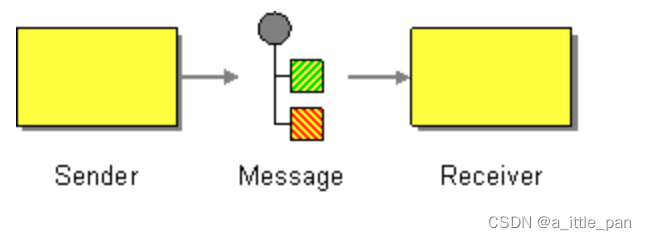

 ##### 消息
 消息由标头（标识或安全信息等元数据）和主体组成。其中标头是名称和值对的集合，描述正在发送的数据的元数据。除了消息发送者提供的名称与值对之外，消息头部还包含其他信息，例如发件人或消息传递基础设施生成的唯一消息D，以及可选的返回地址，该地址指定发送回复的消息通道。消息正文是以文本或二进制格式发送的数据。

 将消息归类可以划分为以下几种类型：

 - **文档**：仅包含数据的通用消息。由消息接收者去决定怎么消费。对命令式消息的回复是文档消息的一种使用场景

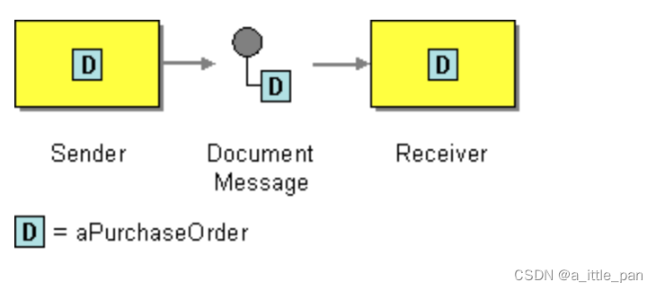

 - **命令**：一条等同于RPC请求的消息。它指定要调用的操作及其参数

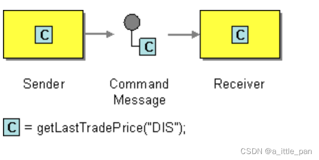

 - **事件**：表示发送方这一端发生了重要的事件。事件通常是领域事件，表示领域对象 (如 o r d e r 或 C u s t o m e r )的状态更改

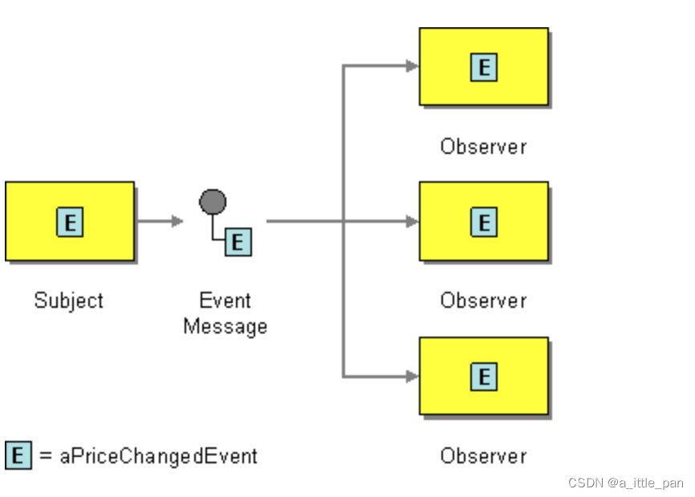

##### 消息通道
如下图所示，[消息通过消息通道进行交换](https://www.enterpriseintegrationpatterns.com/patterns/messaging/MessageChannel.html)。发送方中的业务逻辑调用发送端接口，该接口封装底层通信机制。 发送端由消息发送适配器类实现（六边形架构），该消息发送适配器类通过消息通道向接收器发送消息。消息通道是消息传递基础设施的抽象。调用接收器中的消息处理程序适配器类来处理消息。它调用接收方业务逻辑实现的接收端接口。任意数量的发送方都可以向通道发送消息 。类似地，任何数量的接收方都可以从通道接收消息

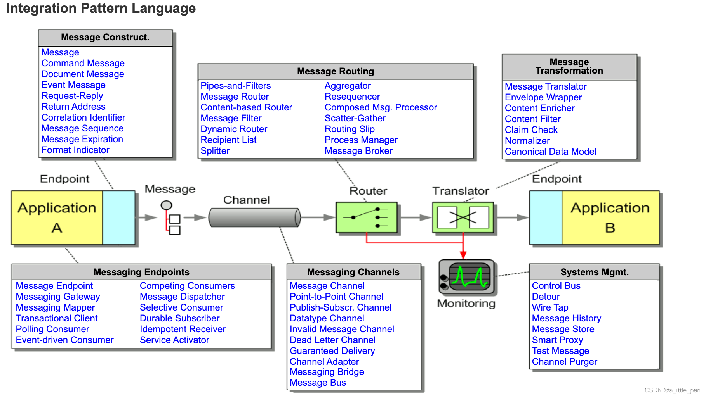

消息通道可以分为“点对点”、“发布-订阅”这两种类型：

 - **点对点通道**：向正在从通道读取的一个消费者传递消息。服务使用点对点通道来实现一对一交互方式。例如，命令式消息通常通过点对点通道发送

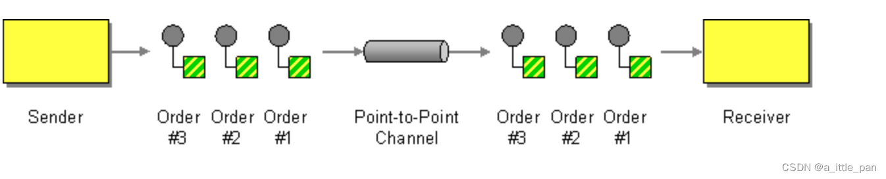

 - **发布-订阅**：通道将一条消息发给所有订阅的接收方。服务使用发布一订阅通道来实现一对多交互方式。例如，事件式消息通常通过发布一订阅通道发送

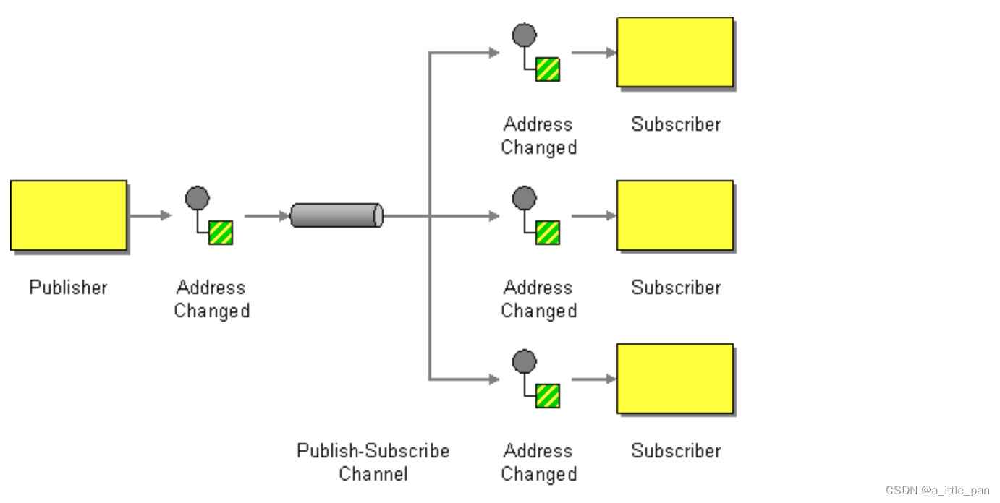

#### 使用消息机制实现交互方式
消息机制的一个有价值的特性是它足够灵活，可以支持常见的如下图所示的所有交互方式，下图中的一些交互方式可以直接通过消息机制直接实现。其他的必须在消息机制之上实现。

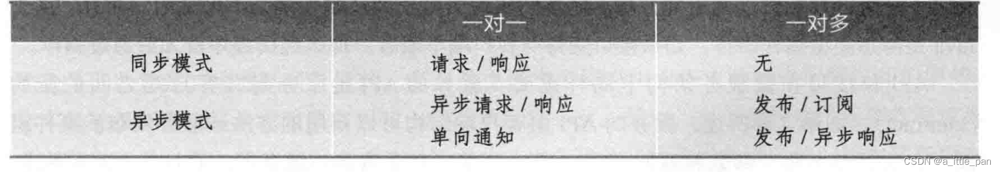

我们来看看消息是如何来实现上图的交互方式的，先从请求/响应和异步请求/响应开始
##### 实现请求 / 响应和异步请求 / 响应
当客户端和服务使用请求/ 响应 或异步请求/ 响应进行交互时，客户端会发送请求，服务会发回回复。两种交互方式之间的区别在于，对于请求/ 响应，客户端期望服务立即响应，而对于异步请求/ 响应，则没有这样的期望。消息机制本质上是异步的，因此只提供异步请求/ 响应。但客户端可能会堵塞，直到收到回复。

客户端和服务端通过交换 一对消息来实现异步请求/响应方式的交互。如下图所示， 客户端发送命令式消息，该消息指定要对服务执行的操作和参数，这些内容通过服务拥有的 点对点消息通道传递。该服务处理请求，并将包含结果的回复消息发送到客户端拥有的点对点通道

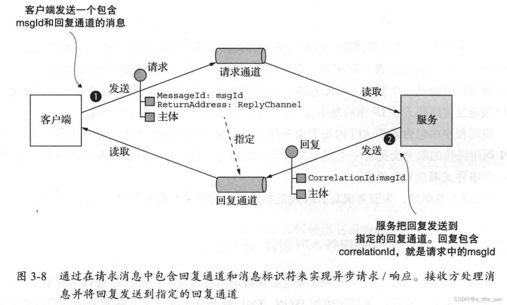

客户端必须告知服务发送回复消息的位置，并且必须将回复消息与请求匹配。幸运的是，解决这两个问题并不困难。客户端发送具有回复通道头部的命令式消息。服务器将回复消息写人回复通道，该回复消息包含与消息标识符具有相同值的相关性ID。客户端使用相关性 ID将回复消息与请求进行匹配。
由于客户端和服务使用消息机制进行通信，因此交互本质上是异步的。理论上，使用消息机制的客户端可能会阻塞，直到收到回复，但实际上客户端将异步处理回复。而且，回复通常可以由任何一个客户端实例处理。

#### 实现单向通知
使用异步消息实现单向通知非常简单。客户端将消息( 通常是命令式消息)发送到服务所拥有的点对点通道。服务订阅该通道并处理该消息，但是服务不会发回回复。

#### 实现发布 / 订阅
消息机制内置了对发布/ 订网交互方式的支持。客户端将消息发布到由多个接收方读取的发布/ 订阅通道，发布领域事件的服务拥有自己的发布/ 订阅通道，通道的名称往往派生自领域类。例如，Google Cloud Pub/Sub提供竞争消费者和发布订阅频道语义，通过主题（发布订阅）和订阅（竞争消费者）进行管理，如下图所示，在本例中，订阅方Y和订阅方Z都在订阅同一主题C时接收消息3的副本，但要通过单独的订阅。Google Cloud Pub/Sub不支持通配符订阅

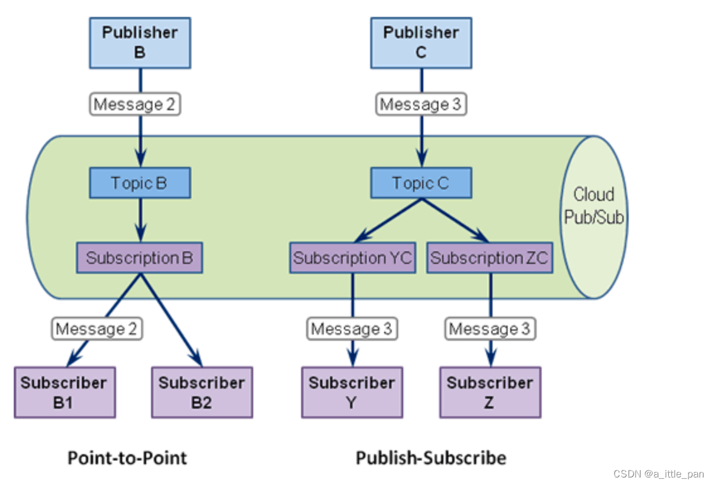

#### 实现发布/异步响应
发布/ 异步响应交互方式是一种更高级别的交互方式，它通过把发布/ 订阅和请求/ 响应 这两种方式的元素组合在一起实现。客户端发布一条消息，在消息的头部中指定回复通道， 这个通道同时也是一个发布一订阅通道。消费者将包含相关性D的回复消息写人回复通道。 客户端通过使用相关性1D来收集响应，以此将回复消息与请求进行匹配。 应用程序中包含异步API 的每个服务都会使用这些实现技术中的一种或多种。带有异步 API调用操作的服务会拥有一个用于发出请求的通道 ，同样地，需要发布事件的服务也会拥有一个事件式消息发布通道。

### 为基于消息机制的服务API创建API规范（Application Programming Interface：应用程序编程接口）
服务的异步API 规范必须指定消息通道的名称、通过每个通道交换的消息类型及其格式。你还必须使用诸如JSON、XML或Protobuf 之类的标准来描述消息的格式。 但与REST 和Open API 不同，并没有广泛采用的标准来记录通道和消息类型，你需要自己编写这样的文档。
服务的异步API 包含供客户端调用的操作和由服务对外发布的事件 。这些API 的记录方式不尽相同。让我们从操作开始逐一分析。

#### 记录异步操作

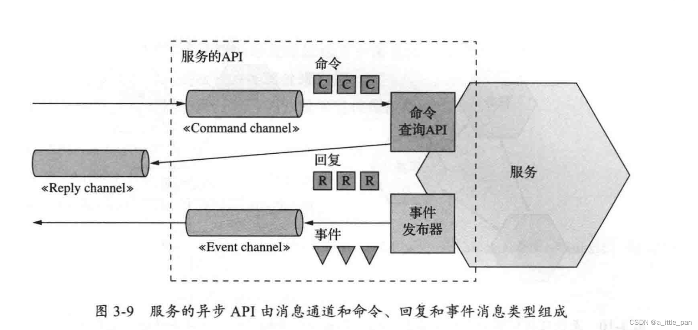

 - **请求/ 异步响应式API** ：包括服务的命令消息通道、服务接受的命令式消息的具体类型和格式，以及服务发送的回复消息的类型和格式
 - **单向通知式 API**：包括服务的命令消息通道，以及服务接受的命令式消息的具体类型和格式。

需要注意的是服务可以对异步请求/ 响应和单向通知使用相同的请求通道。

####  记录事件发布
服务还可以使用发布/ 订阅的方式对外发布事件。此API 风格的规范包括事件通道以及服务发布到通道的事件式消息的类型和格式。 
消息和消息通道模型是一种很好的抽象，也是设计服务异步API 的好方法。但是，为了实现服务，你需要选择具体的消息传递技术并确定如何使用它们的能力来实现设计。让我们看一看所涉及的内容

### 使用消息代理
基于消息传递的应用程序通常使用消息代理，即服务通信的基础设施服务。但基于消息 代理的架构并不是唯一的消息架构。你还可以使用基于无代理的消息传递架构，其中服务直接相互通信。这两种方法(如下图所示)具有不同的利弊，但通常基于代理的架构是一种更好的方法

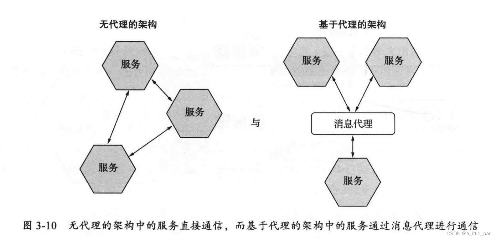

我们先看第一种“无代理架构”的实现方式：
#### 无代理消息
所谓的无代理其实就是不引入一个新的角色进行消息转发，而是由需要通过消息专递信息的两台服务器直接交互。[ZeroMQ](https://github.com/zeromq) 是一种流行的无代理消息技术。它既是规范，也是一组适用于不同编程语言的库。它支持各种传输协议， 包括TCP、UNIX风格的套接字和多播。

使用无代理架构有以下好处：

 - 允许更轻的网络流量和更低的延迟，因为消息直接从发送方发送到接收方，而不必从发送方到消息代理，再从代理转发到接收方
 - 消除了消息代理可能成为性能瓶颈或单点故障的可能性
 - 具有较低的操作复杂性，因为不需要设置和维护消息代理

同样的无代理也有着非常明显的弊端：

 - 服务需要了解彼此的位置，因此必须使用服务发现机制
 - 会导致可用性降低，因为在交换消息时，消息的发送方和接收方都必须同时在线
 - 在实现例如确保消息能够成功投递这些复杂功能时的挑战性更大

无代理架构中的一些弊端于使用同步请求/响应交互方式所导致的弊端相同，因此很多时候我们都会选用基于消息代理的架构。

#### 基于代理的消息
这种基于代理的消息其实就是我们目前市面上流传的MQ，如：[Apache ActiveMQ](https://activemq.apache.org)、[RabbitMQ](https://www.rabbitmq.com)、[Apache Kafka](https://kafka.apache.org)、[RocketMQ](https://rocketmq.apache.org)（以前由阿里维护，现交由apache维护）
这种架构的消息的一个重要好处是发送方不需要知道接收方的网络位置。另一个好处是消息代理缓冲消息，直到接收方能够处理它们

在进行MQ的技术栈的选择的时候我们需要关注一下几个点：

 - 支持的编程语言:你选择的消息代理应该支持尽可能多的编程语言
 - 支持的消息标准:消息代理是否支持多种消息标准，比如AMQP 和STOMP，还是它仅支持专用的消息标准
 - 消息排序:消息代理是否能够保留消息的排序
 - 投递保证:消息代理提供什么样的消息投递保证
 - 持久性:消息是否持久化保存到磁盘并且能够在代理崩溃时恢复
 - 耐久性:如果接收方重新连接到消息代理，它是否会收到断开连接时发送的消息
 - 可扩展性:消息代理的可扩展性如何
 -  延迟:端到端是否有较大延迟
 - 并发:消息代理是否支持高并发场景

每个消息代理都有不同的侧重点。例如，一个非常低延迟的代理可能不会保留消息的顺序 ，不保证消息投递成功，只在内存中存储消息。保证投递成功并在磁盘上可靠地存储消息的代理可能具有更高的延迟。哪种消息代理最适合取决于你的应用程序的需求。你的应用程序的不同部分甚至可能具有不同的消息传递需求。 但是，消息顺序和可扩展性很可能是必不可少的。

还是同样的，先列举一下使用代理架构的消息的优势：

 - 松耩合:客户端发起请求时只要发送给特定的通道即可，客户端完全不需要感知服务实例的情况，客户端不需要使用服务发现机制去获得服务实例的网络位置
 - 消息缓存:消息代理可以在消息被处理之前一直缓存消息。像HTTP这样的同步请求/ 响应协议 ，在交换数据时，发送方和接收方必领同时在线。然而，在使用消息机制的情况下，消息会在队列中缓存，直到它们被按收方处理。这就意味着，例如，即使订单处理系统暂时离线或不可用，在线商店仍1旧能够接受客户的订单。订单消息将会在队列中缓存 (并不会丢失）
 - 灵活的通信:消息机制支持前面提到的所有交互方式
 - 明确的进程间通信:基于RPC的机制总是企图让远程服务调用跟本地调用看上去没
什么区别 (在客户端和服务端同时使用远程调用代理)。然而，因为物理定律 (如服务器不可预计的硬件失效)和可能的局部故障，远程和本地调用还是大相径庭的。消息机制让这些差异变得很明确，这样软件工程师不会陷人一种“太平盛世” 的错觉

有优势必然会有一定弊端，使用代理架构的消息有如下弊端：

 - 潜在的性能瓶颈:消息代理可能存在性能瓶颈（许多现代消息代理都支持高度的横向扩展）
 - 潜在的单点故障:消息代理的高可用性至关重要，否则系统整体的可靠性将受到影响（大多数现代消息代理都是高可用的）
 - 额外的操作复杂性 :消息系统是一个必须独立安装、配置和运维的系统组件（这个才是最主要的弊端🤪）

到此，基于消息的通信，我们已经介绍的差不多了，其实在《微服务架构设计模式》中还对目前主流的MQ中间件是如何“处理并发和消息顺序”、“处理重复消息”、“事物性消息”这几个点进行了详细的描述，但是博主认为这些都是设计到具体的中间件的事情，不应该放到这种偏理论的文章中，以后MQ专题中，我们可以单拎出来进行一个详细的解释，因此此篇文章并不花篇幅去解释了。

最后就是再回答一开始提出的问题“远程服务调用的目的是干什么？”

远程服务调用的本质其实还是不同进程间的消息传递，既然RPC的本质是进行消息传递，那么RPC能做的事情，MQ很大程度上也是可以做到的，那么为什么还要有这种两技术栈出现让我们开发人员去选择呢？其实主要还是由他们在交互方式的实现上有不同，因此导致不同的业务场景需要使用不同的技术栈去实现不同进程间的消息传递，稍微总结归纳一下就是：

 - 使用 RPC 的场景一般都是上游服务需要实时依赖下游服务的返回
 - 使用MQ的场景一般都是上游不关心下游结果的场景