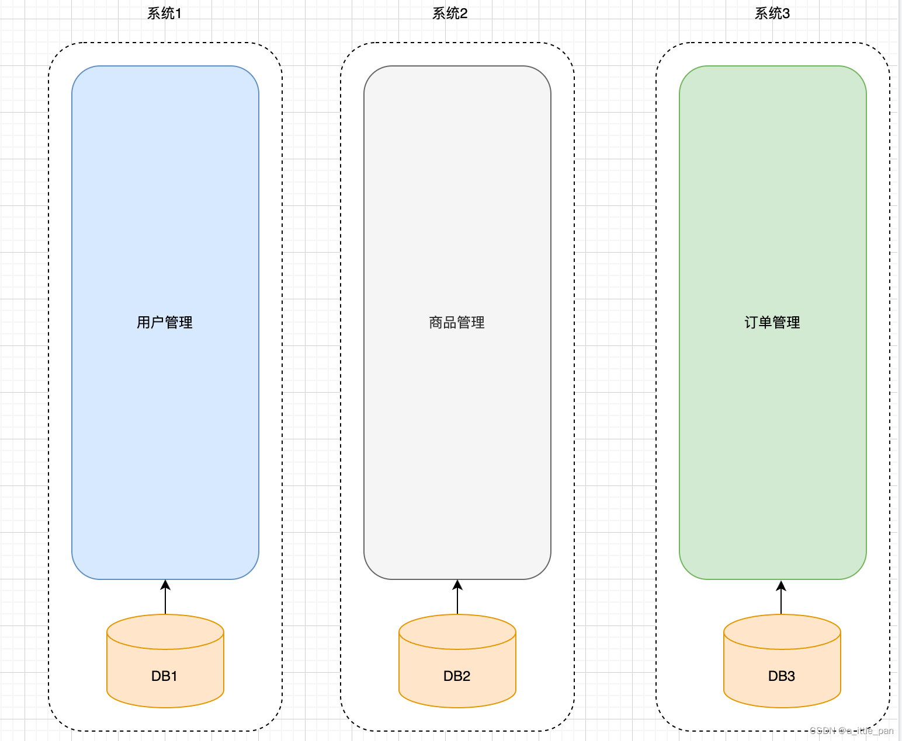
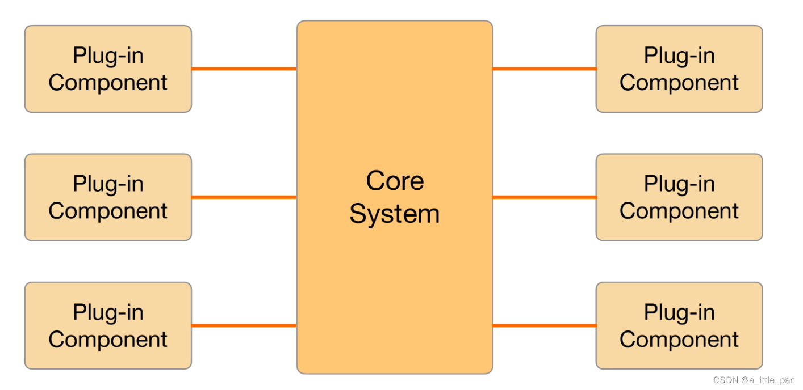
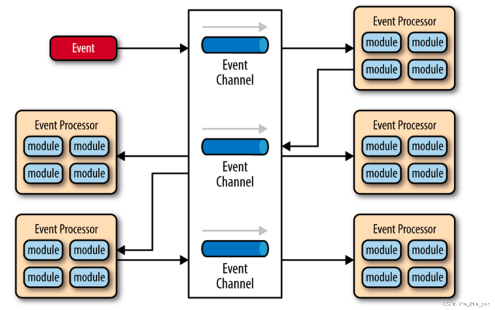

### 引言
He discovered a great rule of human behavior, which is that in order to make a man or a child want to do something badly, all you have to do is make it difficult to get at ---- The Adventures of Tom Sawyer

参考书籍：
1. “凤凰架构”
2. “微服务架构设计模式”

在了解微服务架构之前，我们有必要了解一下从SOA架构到微服务架构风格的演进的过程，以及这两种架构风格的关系
### SOA架构风格（Service Oriented Architecture）

> 面向服务的架构是一次具体地、系统性地成功解决分布式服务主要问题的架构模式。 --《凤凰架构》

网上很多文章对于SOA架构的定义都有不同，像Gartnet把它定义为一种软件的设计方法、百度百科把它定义为一个组件模型等等。

从另一个角度来看，SOA其实是拆分复杂单体应用的一种尝试，这种尝试在架构的历史长河中不止一次，像在SOA演进过程中的烟囱式架构（Information Silo Architecture）、微内核架构（Microkernel Architecture）、事件驱动架构（Event-Driven Architecture）。

下面我们就通过了解这些架构的演进过程来了解什么是SOA架构。

 1. 烟囱式架构（Information Silo Architecture）

> 一种不能与其他系统进行有效协调工作的信息系统，又称为孤岛系统 - -维基百科

下图为按照烟囱架构理论拆分之后的系统图，每个服务之间的数据是隔离的并不会有数据交互：

烟囱架构设计是一种完全不与其他相关信息系统进行互操作或者协调工作的设计模式。但是这种模式其实根本无法实现，像上图案例：“一个电商项目，系统按照业务可以拆分为用户管理、商品管理、订单管理、支付等系统”，但是按照烟囱式架构的设计理念就无法顺利按照上述的几种业务系统拆分实现，因为像商品管理、订单管理等系统模块都是需要依赖用户管理模块中的人员信息，不管是通过什么方式调用，这里面都涉及到不同的两个系统之间数据的通信与交互，这本身就违背了烟囱式架构“完全不与其他相关信息系统进行互操作或者协调工作”的设计理念。所以说烟囱架构只能永远的在美好的理念世界中存活，在真实架构设计中无法真正去落地实现。

2. 微内核架构（Microkernel Architecture）

> 微内核架构又被称为插件化架构（Plug-in Architecture），是一种面向功能进行拆分的可扩展性架构，通常用于实现基于产品的应用 - - 网络

微内核架构式在烟囱式架构的基础上对拆分单体项目的又一次尝试，在烟囱式架构中，没有业务往来关系的系统也可能需要共享人员、组织、权限等一些的公共的主数据，那不妨就将这些主数据，连同其他可能被各子系统使用到的公共服务、数据、资源集中到一块，成为一个被所有业务系统共同依赖的核心（Kernel，也称为 Core System），具体的业务系统以插件模块（Plug-in Modules）的形式存在，这样也可提供可扩展的、灵活的、天然隔离的功能特性。

在微内核架构中有两个核心组件：系统内核、插件化组件。这里的内核系统通常提供系统运行所需的最小功能集，而插件是独立的组件，包含自定义的各种业务代码，用来向内核系统增强或扩展额外的业务能力。（可以类比操作系统中的微内核设计，一通百通！！）

而微内核相比较烟囱架构的无法落地实现，微内核设计理念在桌面应用程序、 Web 应用程序中经常使用，如：Dubbo（SPI机制）、Eclips、IDEA、OSGI、Spring Plugin等

3. 事件驱动架构（Event-Driven Architecture）

> 事件驱动架构（Event Driven Architecture，EDA）一个事件驱动框架（EDA）定义了一个设计和实现一个应用系统的方法学，在这个系统里事件可传输于松散耦合的组件和服务之间。一个事件驱动系统典型地由事件消费者和事件产生者组成。事件消费者向事件管理器订阅事件，事件产生者向事件管理器发布事件。 - - 百度百科

事件驱动架构体系结构具备以下三个能力：

 1. 事件收集：负责收集各种应用发生的事件，如新建订单，退换货订单等其他状态变更。
 2. 事件处理：对事件进行脱敏处理，并对事件进行初步的过滤和筛选。
 3. 事件路由：分析事件内容并将事件路由分发至下游产品。

事件驱动架构具有以下优势：

 1. 降低耦合：降低事件生产者和订阅者的耦合性。事件生产者只需关注事件的发生，无需关注事件如何处理以及被分发给哪些订阅者。任何一个环节出现故障，不会影响其他业务正常运行。
 2. 异步执行：事件驱动架构适用于异步场景，即便是需求高峰期，收集各种来源的事件后保留在事件总线中，然后逐步分发传递事件，不会造成系统拥塞或资源过剩的情况。
 3. 可扩展性：事件驱动架构中路由和过滤能力支持划分服务，便于扩展和路由分发
 4. 敏捷性：支持各种敏捷高效的部署方案。

当拆分单体尝试到事件驱动架构的同时，远程服务调用的也迎来了一个重要突破，那就是“SOAP协议的诞生”，至此，SOA架构所需要的全部前置条件都已经具备。

SOA相比较上述三种架构涌现出了服务之间的松散耦合、注册、发现、治理，隔离、编排，等等理念。这些在今天微服务中耳熟能详的名词概念，大多数也是在分布式服务刚被提出时就已经可以预见的困难点。SOA 针对这些问题，甚至是针对“软件开发”这件事情本身，都进行了更加系统性、更加具体的探索。

而对于这里的“更加系统性”和“更加具体”引用“凤凰架构”一书来解释：

 1. “更具体”

	“更具体”体现在尽管 SOA 本身还是属抽象概念，而不是特指某一种具体的技术，但它比单体架构和前面所列举的三种架构模式的操作性要更强，已经不能简单视其为一种架构风格，而是可以称为一套软件设计的基础平台了。它拥有领导制定技术标准的组织 Open CSA；有清晰软件设计的指导原则，譬如服务的封装性、自治、松耦合、可重用、可组合、无状态，等等；明确了采用 SOAP 作为远程调用的协议，依靠 SOAP 协议族（WSDL、UDDI 和一大票 WS-*协议）来完成服务的发布、发现和治理；利用一个被称为企业服务总线（Enterprise Service Bus，ESB）的消息管道来实现各个子系统之间的通信交互，令各服务间在 ESB 调度下无须相互依赖却能相互通信，既带来了服务松耦合的好处，也为以后可以进一步实施业务流程编排（Business Process Management，BPM）提供了基础；使用服务数据对象（Service Data Object，SDO）来访问和表示数据，使用服务组件架构（Service Component Architecture，SCA）来定义服务封装的形式和服务运行的容器，等等。在这一整套成体系可以互相精密协作的技术组件支持下，若仅从技术可行性这一个角度来评判的话，SOA 可以算是成功地解决了分布式环境下出现的主要技术问题
2. “更系统”
	“更系统”指的是 SOA 的宏大理想，它的终极目标是希望总结出一套自上而下的软件研发方法论，希望做到企业只需要跟着 SOA 的思路，就能够一揽子解决掉软件开发过程中的全部问题，譬如该如何挖掘需求、如何将需求分解为业务能力、如何编排已有服务、如何开发测试部署新的功能，等等。这里面技术问题确实是重点和难点，但也仅仅是其中的一个方面，SOA 不仅关注技术，还关注研发过程中涉及到的需求、管理、流程和组织。如果这个目标真的能够达成，软件开发就有可能从此迈进工业化大生产的阶段，试想如果有一天写出符合客户需求的软件会像写八股文一样有迹可循、有法可依，那对软件开发者来说也许是无趣的，但整个社会实施信息化的效率肯定会有大幅的提升。

### 微服务架构（Microservices）

> 微服务是一种通过多个小型服务组合来构建单个应用的架构风格，这些服务围绕业务能力而非特定的技术标准来构建。各个服务可以采用不同的编程语言，不同的数据存储技术，运行在不同的进程之中。服务采取轻量级的通信机制和自动化的部署机制实现通信与运维。 - - 《凤凰架构》 

“将应用程序构建为松藕合、可独立部暑的一组服务”是“微服务架构设计模式”一书中对于微服务架构的定义，但是不管用什么语言去描述微服务架构，它的本质其实是一种“架构风格”，这一点是需要我们牢牢记住的。

微服务架构的核心思想就是“服务”，所谓“服务”，其实指的是项目中的功能模块，它可以帮助用户解决某一个或一组问题，在开发过程中表现为 IDE（集成开发环境，例如 Eclipse 或 IntelliJ IDEA）中的一个工程或 Moudle。举个例子（来自“微服务架构设计模式”）：下图是订单服务的外部视图。订单服务具有API ，为其客户端提供对功能的访问。有两种类型的操作:命令和查询。API 由命令、查询和事件组成。命令如 createorder ()执行操作并更新数据。查询，如findorderById()检素数据。服务还发布由其客户端使用的事件，例如OrderCreated

而且微服务架构风格天然就符合“松耦合”的设计原则，在微服务架构中服务之间的交互采用API 完成，这样做封装了服务的实现细节。这允许服务在不影响客户端的情况下，对实现方式做出修改。松藕合服务是改善开发效率、提升可维护性和可测试性的关键。小的、松藕合的服务更容易被理解、修改和测试。通过API 来实现松耦合服务之间的协调调用，避免了外界对服务的数据库的直接访问和调用。

而对于微服务更多的细节介绍本文直接引用“凤凰架构”中对于Martin Fowler 与 James Lewis 合写的文章《Microservices: A Definition of This New Architectural Term》九个核心的业务与技术特征的解读：

 - 围绕业务能力构建（Organized around Business Capability）。这里再次强调了康威定律的重要性，有怎样结构、规模、能力的团队，就会产生出对应结构、规模、能力的产品。这个结论不是某个团队、某个公司遇到的巧合，而是必然的演化结果。如果本应该归属同一个产品内的功能被划分在不同团队中，必然会产生大量的跨团队沟通协作，跨越团队边界无论在管理、沟通、工作安排上都有更高昂的成本，高效的团队自然会针对其进行改进，当团队、产品磨合调节稳定之后，团队与产品就会拥有一致的结构
 - 分散治理（Decentralized Governance）。这是要表达“谁家孩子谁来管”的意思，服务对应的开发团队有直接对服务运行质量负责的责任，也应该有着不受外界干预地掌控服务各个方面的权力，譬如选择与其他服务异构的技术来实现自己的服务。这一点在真正实践时多少存有宽松的处理余地，大多数公司都不会在某一个服务使用 Java，另一个用 Python，下一个用 Golang，而是通常会有统一的主流语言，乃至统一的技术栈或专有的技术平台。微服务不提倡也并不反对这种“统一”，只要负责提供和维护基础技术栈的团队，有被各方依赖的觉悟，要有“经常被凌晨 3 点的闹钟吵醒”的心理准备就好。微服务更加强调的是确实有必要技术异构时，应能够有选择“不统一”的权利，譬如不应该强迫 Node.js 去开发报表页面，要做人工智能训练模型时，应该可以选择 Python，等等。
 - 通过服务来实现独立自治的组件（Componentization via Services）。之所以强调通过“服务”（Service）而不是“类库”（Library）来构建组件，是因为类库在编译期静态链接到程序中，通过本地调用来提供功能，而服务是进程外组件，通过远程调用来提供功能。前面的文章里我们已经分析过，尽管远程服务有更高昂的调用成本，但这是为组件带来隔离与自治能力的必要代价。
 - 产品化思维（Products not Projects）。避免把软件研发视作要去完成某种功能，而是视作一种持续改进、提升的过程。譬如，不应该把运维只看作运维团队的事，把开发只看作开发团队的事，团队应该为软件产品的整个生命周期负责，开发者不仅应该知道软件如何开发，还应该知道它如何运作，用户如何反馈，乃至售后支持工作是怎样进行的。注意，这里服务的用户不一定是最终用户，也可能是消费这个服务的另外一个服务。以前在单体架构下，程序的规模决定了无法让全部人员都关注完整的产品，组织中会有开发、运维、支持等细致的分工的成员，各人只关注于自己的一块工作，但在微服务下，要求开发团队中每个人都具有产品化思维，关心整个产品的全部方面是具有可行性的。
 - 数据去中心化（Decentralized Data Management）。微服务明确地提倡数据应该按领域分散管理、更新、维护、存储，在单体服务中，一个系统的各个功能模块通常会使用同一个数据库，诚然中心化的存储天生就更容易避免一致性问题，但是，同一个数据实体在不同服务的视角里，它的抽象形态往往也是不同的。譬如，Bookstore 应用中的书本，在销售领域中关注的是价格，在仓储领域中关注的库存数量，在商品展示领域中关注的是书籍的介绍信息，如果作为中心化的存储，所有领域都必须修改和映射到同一个实体之中，这便使得不同的服务很可能会互相产生影响而丧失掉独立性。尽管在分布式中要处理好一致性的问题也相当困难，很多时候都没法使用传统的事务处理来保证，但是两害相权取其轻，有一些必要的代价仍是值得付出的。
 - 强终端弱管道（Smart Endpoint and Dumb Pipe）。弱管道（Dumb Pipe）几乎算是直接指名道姓地反对 SOAP 和 ESB 的那一堆复杂的通信机制。ESB 可以处理消息的编码加工、业务规则转换等；BPM 可以集中编排企业业务服务；SOAP 有几十个 WS-*协议族在处理事务、一致性、认证授权等一系列工作，这些构筑在通信管道上的功能也许对某个系统中的某一部分服务是有必要的，但对于另外更多的服务则是强加进来的负担。如果服务需要上面的额外通信能力，就应该在服务自己的 Endpoint 上解决，而不是在通信管道上一揽子处理。微服务提倡类似于经典 UNIX 过滤器那样简单直接的通信方式，RESTful 风格的通信在微服务中会是更加合适的选择。
 - 容错性设计（Design for Failure）。不再虚幻地追求服务永远稳定，而是接受服务总会出错的现实，要求在微服务的设计中，有自动的机制对其依赖的服务能够进行快速故障检测，在持续出错的时候进行隔离，在服务恢复的时候重新联通。所以“断路器”这类设施，对实际生产环境的微服务来说并不是可选的外围组件，而是一个必须的支撑点，如果没有容错性的设计，系统很容易就会被因为一两个服务的崩溃所带来的雪崩效应淹没。可靠系统完全可能由会出错的服务组成，这是微服务最大的价值所在，也是这部开源文档标题“凤凰架构”的含义。
 - 演进式设计（Evolutionary Design）。容错性设计承认服务会出错，演进式设计则是承认服务会被报废淘汰。一个设计良好的服务，应该是能够报废的，而不是期望得到长存永生。假如系统中出现不可更改、无可替代的服务，这并不能说明这个服务是多么的优秀、多么的重要，反而是一种系统设计上脆弱的表现，微服务所追求的独立、自治，也是反对这种脆弱性的表现。
 - 基础设施自动化（Infrastructure Automation）。基础设施自动化，如 CI/CD 的长足发展，显著减少了构建、发布、运维工作的复杂性。由于微服务下运维的对象比起单体架构要有数量级的增长，使用微服务的团队更加依赖于基础设施的自动化，人工是很难支撑成百上千乃至成千上万级别的服务的。

至此，对于微服务架构我们已经有较为完善的认识，如果想了解更多的细节可以去看看马丁·福乐写的[《Microservices: A Definition of This New Architectural Term》](https://martinfowler.com/articles/microservices.html)	。

🤺🤺🤺🤺🤺🤺🤺🤺🤺🤺🤺🤺🤺🤺🤺🤺🤺🤺🤺🤺🤺🤺🤺🤺🤺🤺🤺🤺🤺
最后，我们再来思考“SOA架构和微服务架构之间的关系”问题。这个就留给大家自己思考，希望大家看完本篇文章可以找到这个问题的答案！！
🤺🤺🤺🤺🤺🤺🤺🤺🤺🤺🤺🤺🤺🤺🤺🤺🤺🤺🤺🤺🤺🤺🤺🤺🤺🤺🤺🤺🤺