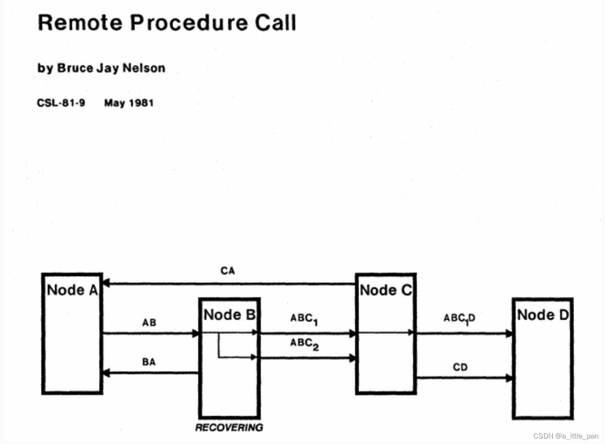

### 随笔
Dissatisfaction with oneself is the fundamental characteristic of any talented person


参考书籍：
1. “凤凰架构”
2. “微服务架构设计模式”

本篇文章开始之前提示一下，读者带着“IPC与RPC的有什么区别”疑惑读效果更好

### 引言

从架构师的角度来看，微服务架构的落地实现第一个需要解决问题就是如何进行远程服务调用。

我猜接触过微服务架构的小伙伴此时脑子里面已经涌现出诸如dubbo、feign、openfeign等RPC框架去实现远程服务调用。但是在面试过程中如果面试官问大家这些远程服务框架的实现原理是什么，有部分小伙伴就会哑火（以前的博主在面试的过程中体验过），正是有了这样的经历，博主每天头悬梁锥刺股地学习，现在把所学的内容总结一下通过文章的形式发布，巩固自身之外也希望能够给大家带来一点帮助。


### 进程间的通信（IPC）

> 进程间的通信：是指两个进程的数据之间产生交互

在了解IPC之前，我们先来看看同一个进程是怎么进行数据交互的，下面我们拿一个经典的案例程序“hello world”举例：

```java
// Caller    :  调用者，代码里的main()
// Callee    ： 被调用者，代码里的println()
// Call Site ： 调用点，即发生方法调用的指令流位置
// Parameter ： 参数，由Caller传递给Callee的数据，即“hello world”
// Retval    ： 返回值，由Callee传递给Caller的数据。以下代码中如果方法能够正常结束，它是void，如果方法异常完成，它是对应的异常
 public static void main(String[] args) {
        System.out.println("hello world");
 }
```
反编译（javap -c **.class）的结果：

```java
public class com.servicemeshmall.componet.infrastructure.config.RedisConfig {
  public com.servicemeshmall.componet.infrastructure.config.RedisConfig();
    Code:
       0: aload_0
       1: invokespecial #1                  // Method java/lang/Object."<init>":()V
       4: return

  public static void main(java.lang.String[]);
    Code:
       0: getstatic     #2                  // Field java/lang/System.out:Ljava/io/PrintStream;
       3: ldc           #3                  // String hello world
       5: invokevirtual #4                  // Method java/io/PrintStream.println:(Ljava/lang/String;)V
       8: return
}
```
我们分析一下这个程序从启动到调用println()方法输出hello world这行时，计算机（物理机或者虚拟机）要完成以下几项工作：

 1. 调用getstatic字节码指令获取System中的PrintStream静态对象
 2. 调用ldc字节码指令将字符串helloworld的引用地址压栈（传递方法参数）
 3. 根据println()方法的签名，确定其执行版本。这其实并不是一个简单的过程，不论是编译时静态解析也好，是运行时动态分派也好，总之必须根据某些语言规范中明确定义原则，找到明确的Callee，“明确”是指唯一的一个Callee，或者有严格优先级的多个Callee，譬如不同的重载版本。这个过程并没有体现在反编译的的结果上，但是在方法的调用之前都会执行的一个过程。（确定方法版本）
 4. 调用invokevirtual字节码指令，指令println()方法（执行被调方法）
 5. 调用return字节码指令，将Callee的执行结果压栈，并将程序的指令流恢复到Call Site的下一条指令，继续向下执行

上面就是java中方法调用的核心执行过程，放在同一个JVM里面，这个过程是没有问题的，但是我们思考一下，如果是在不同的JVM里面调用会有什么问题，不难想到，此时至少面临两个直接的障碍：首先，第二步和第五步所做的传递参数、传回结果都依赖于栈内存的帮助，如果Caller与Callee分属不同的进程，就不会拥有相同的栈内存，将参数在Caller进程的内存中压栈，对于 Callee 进程的执行毫无意义。其次，第三步的方法版本选择依赖于语言规则的定义，如果Caller与Callee不是同一种语言实现的程序，方法版本选择就将是一项模糊的不可知行为。

IPC就是为了解决上诉的两个障碍所涌现出的一种技术，为了简化一点，我们暂时忽略第二个障碍，假设Caller与Callee是使用同一种语言实现的，先来解决两个进程之间如何交换数据的问题。可以考虑的办法有以下几种（引用“凤凰架构”一书）：

 1. 管道（Pipe）或者具名管道（Named Pipe）：管道类似于两个进程间的桥梁，可通过管道在进程间传递少量的字符流或字节流。普通管道只用于有亲缘关系进程（由一个进程启动的另外一个进程）间的通信，具名管道摆脱了普通管道没有名字的限制，除具有管道所有的功能外，它还允许无亲缘关系进程间的通信。管道典型的应用就是命令行中的|操作符，譬如：

```bash
ps -ef | grep java
```
2. 信号（Signal）：信号用于通知目标进程有某种事件发生，除了用于进程间通信外，进程还可以发送信号给进程自身。信号的典型应用是kill命令，譬如：

```bash
# Shell 进程向指定 PID 的进程发送 SIGKILL 信号
kill -9 pid
```
3. 信号量（Semaphore）：信号量用于两个进程之间同步协作手段，它相当于操作系统提供的一个特殊变量，程序可以在上面进行wait()和notify()操作。(简而言之就是通过一个共享变量进行进程间的通信，加锁与解锁其实就是一种通信方式，是操作系统层面的提供的)
4. 消息队列（Message Queue）：以上三种方式只适合传递传递少量信息，POSIX 标准中定义了消息队列用于进程间数据量较多的通信。进程可以向队列添加消息，被赋予读权限的进程则可以从队列消费消息。消息队列克服了信号承载信息量少，管道只能用于无格式字节流以及缓冲区大小受限等缺点，但实时性相对受限。
5. 共享内存（Shared Memory）：允许多个进程访问同一块公共的内存空间，这是效率最高的进程间通信形式。原本每个进程的内存地址空间都是相互隔离的，但操作系统提供了让进程主动创建、映射、分离、控制某一块内存的程序接口。当一块内存被多进程共享时，各个进程往往会与其它通信机制，譬如信号量结合使用，来达到进程间同步及互斥的协调操作。（可由程序控制，与3中的方式层面不同）
6. 套接字接口（Socket）：消息队列和共享内存只适合单机多进程间的通信，套接字接口是更为普适的进程间通信机制，可用于不同机器之间的进程通信。套接字（Socket）起初是由 UNIX 系统的 BSD 分支开发出来的，现在已经移植到所有主流的操作系统上。出于效率考虑，当仅限于本机进程间通信时，套接字接口是被优化过的，不会经过网络协议栈，不需要打包拆包、计算校验和、维护序号和应答等操作，只是简单地将应用层数据从一个进程拷贝到另一个进程，这种进程间通信方式有个专名的名称：UNIX Domain Socket，又叫做 IPC Socket

现在我们已经具备多种实现进程间通信的能力，但是，哪种方式更适合实现，需要我们从更高层面的角度考虑几个问题（问题出自：Andrew Tanenbaum 教授曾发表的论文《A Critique of The Remote Procedure Call Paradigm》）：

 1. 两个进程通信，谁作为服务端，谁作为客户端？
 2. 怎样进行异常处理？异常该如何让调用者获知？
 3. 服务端出现多线程竞争之后怎么办？
 4. 如何提高网络利用的效率，譬如连接是否可被多个请求复用以减少开销？是否支持多播？
 5. 参数、返回值如何表示？应该有怎样的字节序？
 6. 如何保证网络的可靠性？譬如调用期间某个链接忽然断开了怎么办？
 7. 发送的请求服务端收不到回复该怎么办？
 8. .......

至于问题为什么提出，是由于科学界最初是通过socker（套接字）去实现进程间通信，将远程方法调用的通信细节隐藏在操作系统底层，很明显，历史证明这种方式去实现进程间通信是一种方向性的错误，至于为什么说这是方向性的错误，大佬们通过《通过网络进行分布式运算的八宗罪》（8 Fallacies of Distributed Computing）论文总结socket实现有如下问题（注意，下面是反话）：

 1. The network is reliable —— 网络是可靠的。
 2. Latency is zero —— 延迟是不存在的。
 3. Bandwidth is infinite —— 带宽是无限的。
 4. The network is secure —— 网络是安全的。
 5. Topology doesn't change —— 拓扑结构是一成不变的。
 6. There is one administrator —— 总会有一个管理员。
 7. Transport cost is zero —— 不必考虑传输成本。
 8. The network is homogeneous —— 网络是同质化的。

既然一开始想通过socket实现的IPC并没有满足分布式运算下的远程服务调用需要的条件，那么我们就需要采用其他的方式去满足分布式运算下的远程服务调用，先如今市面上主流的满足分布式运算下的远程服务调用有HTTP Rest、RPC框架两种方式。

### 远程服务调用（RPC）

> 远程服务调用是指位于互不重合的内存地址空间中的两个程序，在语言层面上，以同步的方式使用带宽有限的信道来传输程序控制信息。
> —— Bruce Jay Nelson，[Remote Procedure Call](http://www.bitsavers.org/pdf/xerox/parc/techReports/CSL-81-9_Remote_Procedure_Call.pdf)，Xerox PARC，1981



在 20 世纪 80 年代初期，传奇的施乐 Palo Alto 研究中心发布了基于 Cedar 语言的 RPC 框架 Lupine，并实现了世界上第一个基于 RPC 的商业应用 Courier，而上述RPC的概念也是施乐所提出。

而现在RPC框架满天飞，熟知的有RMI（Sun/Oracle）、Thrift（Facebook/Apache）、Dubbo（阿里巴巴/Apache）、gRPC（Google）、Motan1/2（新浪）、Finagle（Twitter）、brpc（百度/Apache）、.NET Remoting（微软）、Arvo（Hadoop）、JSON-RPC 2.0（公开规范，JSON-RPC 工作组）等。

至于目前的RPC为何如此之多，是因为目前的RPC框架所采用的RPC协议都没有很好的解决“RPC过程中的三个问题”，而且每个框架的侧重点不同，如（引用自《凤凰架构》）：

 - 朝着面向对象发展，不满足于 RPC 将面向过程的编码方式带到分布式，希望在分布式系统中也能够进行跨进程的面向对象编程，代表为 RMI、.NET Remoting，之前的 CORBA 和 DCOM 也可以归入这类，这条线有一个别名叫做分布式对象（Distributed Object）
 - 朝着性能发展，代表为 gRPC 和 Thrift。决定 RPC 性能的主要就两个因素：序列化效率和信息密度。序列化效率很好理解，序列化输出结果的容量越小，速度越快，效率自然越高；信息密度则取决于协议中有效荷载（Payload）所占总传输数据的比例大小，使用传输协议的层次越高，信息密度就越低，SOAP 使用 XML 拙劣的性能表现就是前车之鉴。gRPC 和 Thrift 都有自己优秀的专有序列化器，而传输协议方面，gRPC 是基于 HTTP/2 的，支持多路复用和 Header 压缩，Thrift 则直接基于传输层的 TCP 协议来实现，省去了额外应用层协议的开销。
 - 朝着简化发展，代表为 JSON-RPC，说要选功能最强、速度最快的 RPC 可能会很有争议，但选功能弱的、速度慢的，JSON-RPC 肯定会候选人中之一。牺牲了功能和效率，换来的是协议的简单轻便，接口与格式都更为通用，尤其适合用于 Web 浏览器这类一般不会有额外协议支持、额外客户端支持的应用场合。

虽然目前的RPC框架都没有达到解决“RPC需要解决的三个问题”的“完美 RPC 协议”的要求，但是需要进行表扬的就是来自Alibaba的RPC框架---Dubbo（虽然现在不是Ali维护了～），它默认有自己的传输协议（Dubbo 协议），同时也支持其他协议；默认采用 Hessian 2 作为序列化器，如果你有 JSON 的需求，可以替换为 Fastjson，如果你对性能有更高的追求，可以替换为Kryo、FST、Protocol Buffers 等效率更好的序列化器，如果你不想依赖其他组件库，直接使用 JDK 自带的序列化器也是可以的。这种设计在一定程度上缓和了 RPC 框架必须取舍，难以完美的缺憾。

#### RPC需要解决的三个问题（《凤凰架构》）
20 世纪 80 年代中后期，惠普和 Apollo 提出了网络运算架构（Network Computing Architecture，NCA）的设想，并随后在DCE 项目中将其发展成在 UNIX 系统下的远程服务调用框架DCE/RPC，笔者曾经在“原始分布式时代”中介绍过 DCE，这是历史上第一次对分布式有组织的探索尝试，由于 DCE 本身是基于 UNIX 操作系统的，所以 DCE/RPC 通常也仅适合于 UNIX 系统程序之间使用（微软 COM/DCOM 的前身MS RPC算是 DCE 的一种变体版本，如果把这些派生版算进去的话就要普适一些）。在 1988 年，Sun Microsystems 起草并向互联网工程任务组（Internet Engineering Task Force，IETF）提交了RFC 1050规范，此规范中设计了一套面向于广域网或混合网络环境的、基于 TCP/IP 的、支持 C 语言的 RPC 协议，后被称为ONC RPC（Open Network Computing RPC，也被称为 Sun RPC），这两套 RPC 协议就算是如今各种 RPC 协议和框架的鼻祖了，从它们开始，直至接下来这几十年来所有流行过的 RPC 协议，都不外乎变着花样使用各种手段来解决以下三个基本问题：

 - 如何表示数据：这里数据包括了传递给方法的参数，以及方法执行后的返回值。无论是将参数传递给另外一个进程，还是从另外一个进程中取回执行结果，都涉及到它们应该如何表示。进程内的方法调用，使用程序语言预置的和程序员自定义的数据类型，就很容易解决数据表示问题，远程方法调用则完全可能面临交互双方各自使用不同程序语言的情况；即使只支持一种程序语言的 RPC 协议，在不同硬件指令集、不同操作系统下，同样的数据类型也完全可能有不一样表现细节，譬如数据宽度、字节序的差异等等。有效的做法是将交互双方所涉及的数据转换为某种事先约定好的中立数据流格式来进行传输，将数据流转换回不同语言中对应的数据类型来进行使用，这个过程说起来拗口，但相信大家一定很熟悉，就是序列化与反序列化。每种 RPC 协议都应该要有对应的序列化协议，譬如：
	 - ONC RPC 的External Data Representation （XDR）
	 - CORBA 的Common Data Representation（CDR）
	 - Java RMI 的Java Object Serialization Stream Protocol
	 - gRPC 的Protocol Buffers
	 - Web Service 的XML Serialization
	 - 众多轻量级 RPC 支持的JSON Serialization
- 如何传递数据：准确地说，是指如何通过网络，在两个服务的 Endpoint 之间相互操作、交换数据。这里“交换数据”通常指的是应用层协议，实际传输一般是基于标准的 TCP、UDP 等标准的传输层协议来完成的。两个服务交互不是只扔个序列化数据流来表示参数和结果就行的，许多在此之外信息，譬如异常、超时、安全、认证、授权、事务，等等，都可能产生双方需要交换信息的需求。在计算机科学中，专门有一个名称“Wire Protocol”来用于表示这种两个 Endpoint 之间交换这类数据的行为，常见的 Wire Protocol 有：
	-  Java RMI 的Java Remote Message Protocol（JRMP，也支持RMI-IIOP）
	- CORBA 的Internet Inter ORB Protocol（IIOP，是 GIOP 协议在 IP 协议上的实现版本）
	- DDS 的Real Time Publish Subscribe Protocol（RTPS）
	- Web Service 的Simple Object Access Protocol（SOAP）
	- 如果要求足够简单，双方都是 HTTP Endpoint，直接使用 HTTP 协议也是可以的（如 JSON-RPC）
- 如何确定方法：这在本地方法调用中并不是太大的问题，编译器或者解释器会根据语言规范，将调用的方法签名转换为进程空间中子过程入口位置的指针。不过一旦要考虑不同语言，事情又立刻麻烦起来，每门语言的方法签名都可能有所差别，所以“如何表示同一个方法”，“如何找到对应的方法”还是得弄个跨语言的统一的标准才行。这个标准做起来可以非常简单，譬如直接给程序的每个方法都规定一个唯一的、在任何机器上都绝不重复的编号，调用时压根不管它什么方法签名是如何定义的，直接传这个编号就能找到对应的方法。这种听起既粗鲁又寒碜的办法，还真的就是 DCE/RPC 当初准备的解决方案。虽然最终 DCE 还是弄出了一套语言无关的接口描述语言（Interface Description Language，IDL），成为此后许多 RPC 参考或依赖的基础（如 CORBA 的 OMG IDL），但那个唯一的绝不重复的编码方案UUID（Universally Unique Identifier）却也被保留且广为流传开来，今天已广泛应用于程序开发的方方面面。类似地，用于表示方法的协议还有：
	-  Android 的Android Interface Definition Language（AIDL）
	- CORBA 的OMG Interface Definition Language（OMG IDL）
	- Web Service 的Web Service Description Language（WSDL）
	- JSON-RPC 的JSON Web Service Protocol（JSON-WSP）


 以上 RPC 中的三个基本问题，全部都可以在本地方法调用过程中找到相对应的操作。RPC 的想法始于本地方法调用，尽管早已不再追求实现成与本地方法调用完全一致，但其设计思路仍然带有本地方法调用的深刻烙印，抓住两者间的联系来类比，对我们更深刻地理解 RPC 的本质会很有好处。


###  REST（Representational State Transfer）
在开始了解 REST（这里所说的REST其实就是我们常挂在嘴边的RESTful）实现远程服务调用之前，需要我们明确的是，REST和RPC是两个完全不同的概念，差异的核心是抽象的目标不一样，即面向资源的编程思想与面向过程的编程思想两者之间的区别。

REST是一种使用HTTP协议的进程间通信机制，REST 之父Roy Fielding曾经说过：

> REST 提供了一系列架构约束， 当作为整体使用时，它强调组件交互的可扩展性、接口的通用性、组件的独立部署，以及那些能减少交互延迟的中间件，它强化了安全性，也能封装遗留系统

看了上述解释，大家应该感觉更难理解REST了，咱们来换个角度理解REST，其实与RPC不同REST是比协议层面的更高层面的东西（更高层面：比协议层面更抽象），鲁迅曾经说过：“越抽象的东西，越难理解”，鲁迅还说过：“理解抽象的东西，先把被抽象的概念弄清楚”。作为鲁迅先生的忠实粉丝，当时是选择听鲁迅先生的。


但是HTTP是我们熟知的一种协议，因此本文不做过多的阐述，我们通过具体事例去描述一下REST中的的几个概念（引自《凤凰架构》）：

 1. 资源（Resource）：譬如你现在正在阅读一篇名为《微服务系列之远程服务调用》的文章，这篇文章的内容本身（你可以将其理解为其蕴含的信息、数据）我们称之为“资源”。无论你是购买的书籍、是在浏览器看的网页、是打印出来看的文稿、是在电脑屏幕上阅读抑或是手机上浏览，尽管呈现的样子各不相同，但其中的信息是不变的，你所阅读的仍是同一份“资源”。
 2. 表征（Representation）：当你通过电脑浏览器阅读此文章时，浏览器向服务端发出请求“我需要这个资源的 HTML 格式”，服务端向浏览器返回的这个 HTML 就被称之为“表征”，你可能通过其他方式拿到本文的 PDF、Markdown、RSS 等其他形式的版本，它们也同样是一个资源的多种表征。可见“表征”这个概念是指信息与用户交互时的表示形式，这与我们软件分层架构中常说的“表示层”（Presentation Layer）的语义其实是一致的。
 3. 状态（State）：当你读完了这篇文章，觉得博主写的好然后想点赞、收藏、评论，你向服务器发出请求“点赞、收藏、评论”三个请求。但是“点赞、收藏、评论”是个相对概念，必须依赖“当前你正在阅读的文章是哪一篇”才能正确回应，这类在特定语境中才能产生的上下文信息即被称为“状态”。我们所说的有状态（Stateful）抑或是无状态（Stateless），都是只相对于服务端来说的，服务器要完成“点赞、收藏、评论””的请求，要么自己记住用户的状态：这个用户现在阅读的是哪一篇文章，这称为有状态；要么客户端来记住状态，在请求的时候明确告诉服务器：我正在阅读某某文章，现在要读它的下一篇，这称为无状态。
 4. 转移（Transfer）：无论状态是由服务端还是客户端来提供的，“点赞、收藏、评论”这个行为逻辑必然只能由服务端来提供，因为只有服务端拥有该资源及其表征形式。服务器通过某种方式，把文章的点赞数、收藏数、评论数增加显示，这就被称为“表征状态转移”。
 5. 统一接口（Uniform Interface）： 上面说的服务器“通过某种方式”让表征状态发生转移，具体是什么方式？答案就是HTTP请求，HTTP 协议中已经提前约定好了一套“统一接口”，它包括：GET、HEAD、POST、PUT、DELETE、TRACE、OPTIONS 七种基本操作，任何一个支持 HTTP 协议的服务器都会遵守这套规定，对特定的 URI 采取这些操作，服务器就会触发相应的表征状态转移。
 6. 超文本驱动（Hypertext Driven）：尽管表征状态转移是由浏览器主动向服务器发出请求所引发的，该请求导致了“文章的点赞、收藏、评论增加”这个结果的出现。但是，你我都清楚这不可能真的是浏览器的主动意图，浏览器是根据用户行为发送不同的请求到服务器，然后通过渲染服务器的资源展示内容。浏览器作为所有网站的通用的客户端，任何网站的导航（状态转移）行为都不可能是预置于浏览器代码之中，而是由服务器发出的请求响应信息（超文本）来驱动的。这点与其他带有客户端的软件有十分本质的区别，在那些软件中，业务逻辑往往是预置于程序代码之中的，有专门的页面控制器（无论在服务端还是在客户端中）来驱动页面的状态转移
 7. 自描述消息（Self-Descriptive Messages）：由于资源的表征可能存在多种不同形态，在消息中应当有明确的信息来告知客户端该消息的类型以及应如何处理这条消息。一种被广泛采用的自描述方法是在名为“Content-Type”的 HTTP Header 中标识出互联网媒体类型（MIME type），譬如“Content-Type : application/json; charset=utf-8”，则说明该资源会以 JSON 的格式来返回，请使用 UTF-8 字符集进行处理。

除了以上列出的这些看名字不容易弄懂的概念外，在理解 REST 的过程中，还有一个常见的误区值得注意，Fielding 提出 REST 时所谈论的范围是“架构风格与网络的软件架构设计”（Architectural Styles and Design of Network-based Software Architectures），而不是现在被人们所狭义理解的一种“远程服务设计风格”，这两者的范围差别就好比本书所谈论的话题“软件架构”与本章谈论话题“访问远程服务”的关系那样，前者是后者的一个很大的超集，尽管基于本节的主题和多数人的关注点考虑，我们确实是会以“远程服务设计风格”作为讨论的重点，但至少应该说明清楚它们范围上的差别。

现在我们已经了解REST的基本概念，接下来再来了解一下REST的理查德成熟度模型（Richardson Maturity Model），模型提出了四个等级（0-3）：

 - Level 0: Level0层级服务的客户端只是向服务端点发起HTTPPOST请求，进行服 务调用。每个请求都指明 了需要执行的操作、这个操作针对的目标 (例如，业务对象) 和必要的参数。
 - Level 1:  Level 1层级的服务引人了资源的概念。要执行对资源的操作，客户端需要发出指定要执行的操作和包含任何参数的POST 请求。
 - Level 2 ：层级的服务使用HTTP动词来执行操作，譬如GET表示获取、 POST 表示创建、PUT表示更新。请求查询参数和主体(如果有的话)指定操作的参数。这让服务能够借助Web 基础设施服务，例如通过CDN 来缓存GET请求。
 - Level 3 : Level 3 层级的服务基于HATEOAS (Hypertext As The Engine Of Application State)原则设计，基本思想是在由GET请求返回的资源信息中包含链接，这些链接 能够执行该资源允许的操作。例如，客户端通过订单资源中包含的链接取消某一订 单，或者发送GET请求去获取该订单，等等。HATEOAS的优点包括无须在客户端代码中写人硬链接的URL。此外由于资源信息中包含可允许操作的链接，客户端无须猜测在资源的当前状态下执行何种操作 


REST的好处和弊端：
好处：
 - 它非常简单，并且大家都很熟悉
 - 可以使用浏览器扩展 (比如Postman 插件)或者curl 之类的命令行 (假设使用的是JSON或其他文本格式)来测试HTTP API
 - 直接支持请求/ 响应方式的通信
 - HTTP 对防火墙友好。
 - 不需要中间代理，简化 了系统架构。

弊端：

 - 它只支持请求/响应方式的通信
 - 可能导致可用性降低。由于客户端和服务直接通信而没有代理来缓冲消息，因此它们必须在REST API 调用期间都保持在线
 - 客户端必领知道服务实例的位置(URL)
 - 在单个请求中获取多个资源具有挑战性。
 - 有时很难将多个更新操作映射到HTTP 动词。