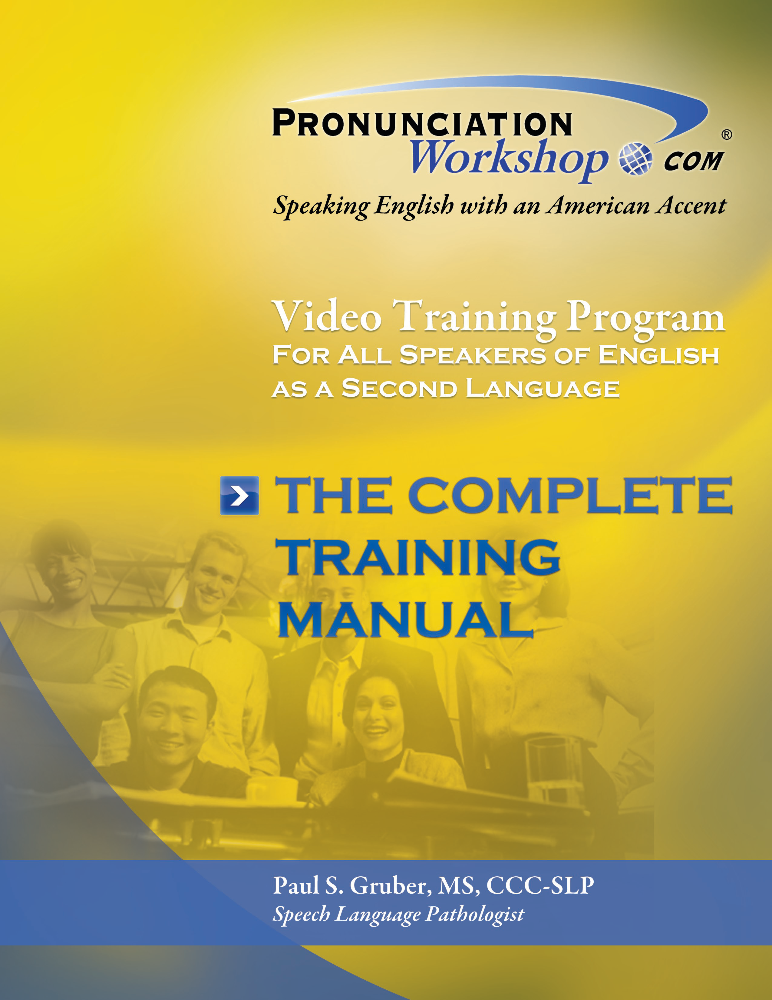
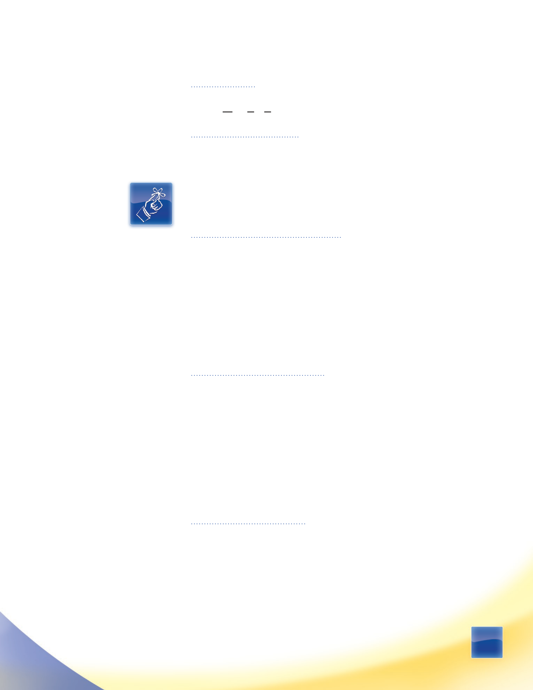
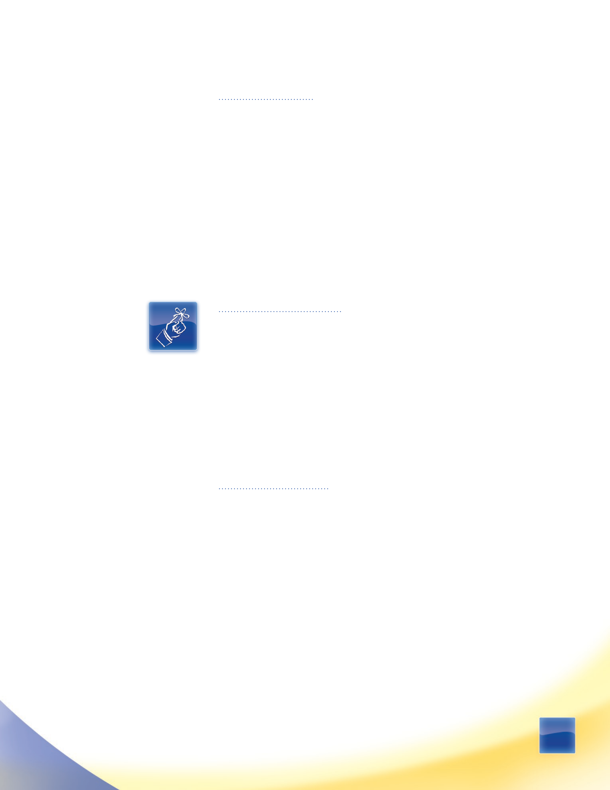
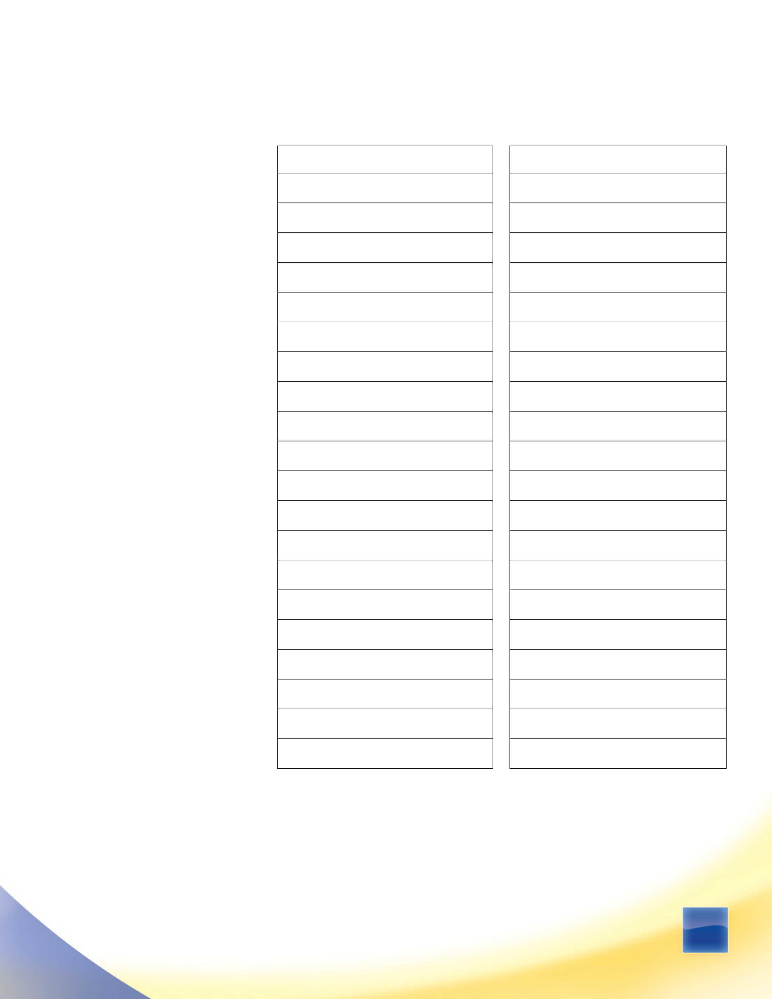
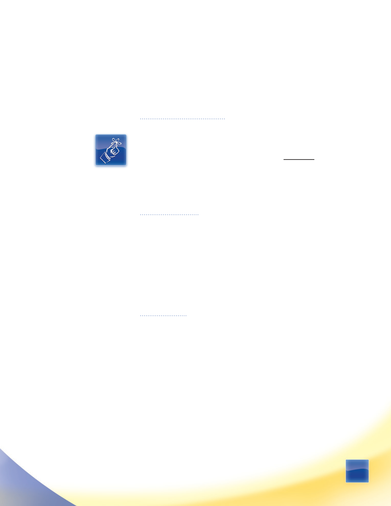
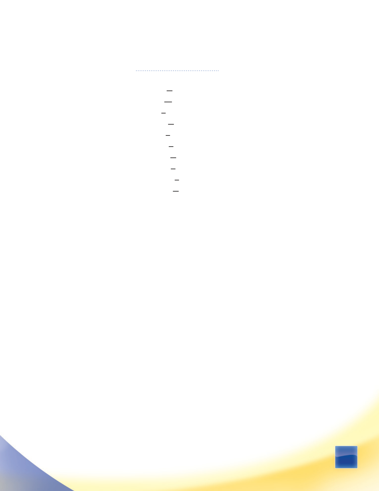
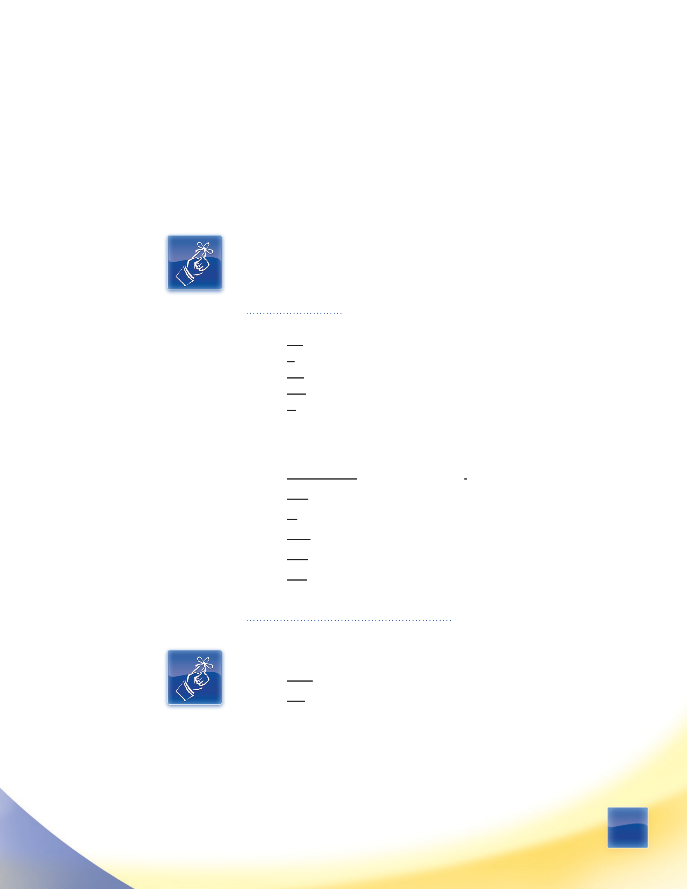
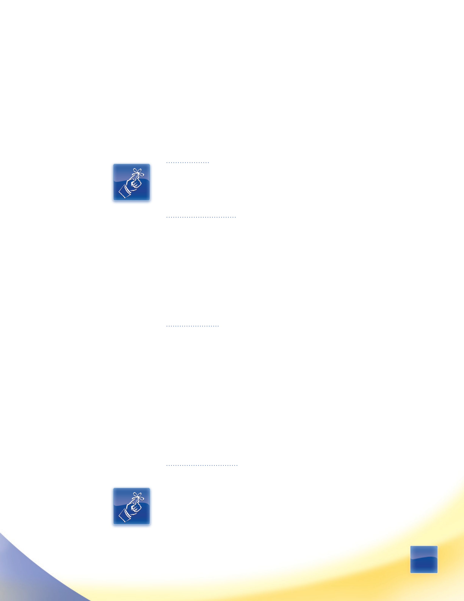
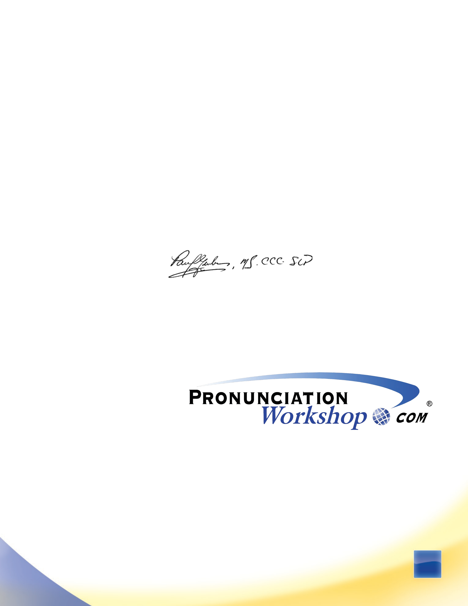

{width="8.5in"
height="11.0in"}

{width="8.5in"
height="11.0in"}

**Table of Contents**

Introduction 01

1. Session 1      R and  W
2. Session 2     Voicing,S and Z
3. Session 3      TH,voiced T
4. Session 4      F and V,Sh and Voiced SH
5. Session 5       L
6. Session 6       Word Endings
7. Session 7       DG and Ch,H
8. Session 8       Vowel Overview,I and EE
9. Session 9        OW and AE
10. Session 10       OO,UH,EH
11. Session 11       AU,AH,A
12. Session 12       Tongue Twisters
13. Session 13       Phrase Reductions,Intonatiion
14. Session 14       Reading Passages
15. Session 15       Reading Passages

> This manual accompanies the video training program in American English
> Pronunciation available only at www.PronunciationWorkshop.com.
>
> ALL RIGHTS RESERVED. No part of this manual may be publicly distributed,
> presented, duplicated or transmitted in any form or by any means,
> electronic or mechanical, including photocopying and recording, or by
> any information storage and retrieval system, without the expressed
> written consent of the publisher. You should further understand that
> text, images, sounds, video clips, and other multimedia items included
> in the PronunciationWorkshop.com website, represent valuable
> intellectual property and redistribution of such material is a violation
> of federal and international law. You agree to be wholly liable for any
> dissemination of such materials and realize that your computer and other
> possessions may be seized by law enforcement officials.
>
> © 2005 - 2007 PronunciationWorkshop.com, LLC -- all rights reserved

{width="8.5in"
height="11.0in"}

**Pronunciation Workshop Manual -** *Introduction*

> **I n T r o d u C T I o n**

**Welcome!**

> Congratulations! You are about to embark on a very exciting program.
> Learning to speak English clearly, with proper pronunciation is the
> single most important skill you must have to communicate effectively
> in today's world market. The *Pronunciation Workshop Video Training
> Program* will enhance your English speaking abilities and vocal
> skills, improve your self-confidence and will greatly increase your
> chances for success.
>
> This course is based on years of linguistic research and has produced
> dramatic results for thousands of individuals around the globe. It is
> designed to help you sound "*more American*" for oral presentations,
> interviews, teaching, business situations, telephone conversations and
> general daily communication.
>
> When a person learns English as a Second Language, they are speaking
> English *"filtered"* through their first language. They are using
> their native language's "speech rules" of pronunciation (and often
> grammar) on their new language...They are not aware of the American
> set of "speech rules". This is basically what the Pronunciation
> Workshop program teaches you... *"The Speech Rules of American
> English".*
>
> There are many schools and classes which teach English all around the
> world; however, very few of them address the "speech rules" that you
> will learn in this course. This is because many of the teachers who
> are providing English training, do not know of these "speech rules".
> Many of them are even making errors themselves and teaching them to
> you! We hear this daily from our clients.
>
> When you were a child and learned your first language, you constructed
> a mental inventory of your native language's speech sounds. Those
> sounds became a part of your speech repertoire. Unfortunately, you are
> now inserting these speech sounds into your English. Today, when you
> speak English, you reach into that inventory and come out with many
> substitute sounds, something that is close, but nonetheless incorrect.
> These repeated errors in conversation often cause you to be
> misunderstood.
>
> Some people call what we do "Foreign Accent Reduction"...this is not
> quite accurate, for you are not reducing your foreign accent\...you
> are actually gaining an American Accent - - you are adding new sounds
> and new "speech rules" to your speech inventory.
>
> While you progress through this program, you will be learning things
> you were never aware of before. You most likely will find yourself
> saying, *"Wow! I never*
>
> *© 2005 - 2007 PronunciationWorkshop.com, LLC -- ALL RIGHTS RESERVED*
> 1

{width="8.5in"
height="11.0in"}

**Pronunciation Workshop Manual -** *Introduction*

> *knew that!"* Changing your old speech habits takes time. At first you
> may possibly be apprehensive using the learned techniques. However,
> eventually you will relax and the words and sounds will flow smoothly
> and clearly on their own.
>
> Once you complete each session, it should *not* be your objective to
> start speaking differently right away. Your focus should be on
> listening to the sounds of your speech and the speech of those around
> you. For example, when you say *"[T]{.underline}ank you"* instead of
> *"[T]{.underline}hank you",* your focus should not be on saying it
> correctly[...]{.underline}but rather, "Oops -- [I ju]{.underline}st
> said that word wrong...I should have used a *TH* sound". It is this
> AWARENESS that will eventually lead you to the improved pronunciation
> skills you are striving for.
>
> Each video training session has its own accompanying chapter in this
> manual with practice material. You will notice during the video
> classes that I often speak slowly and exaggerate certain target
> sounds. I do this purposely so that you can 'hear' and understand what
> I am teaching you. I recommend that you try practicing the material a
> little everyday using the learned techniques. Practice speaking VERY
> SLOWLY, out loud, in a strong voice and exaggerate the mouth
> movements. You will be retraining the muscles of your mouth and tongue
> to move in new and different ways while mastering your new
> pronunciation patterns. Theoretically, once you understand the
> concepts and have retrained yourself, eventually these new speech
> patterns will progress into your own spontaneous conversational rapid
> speech.
>
> To receive maximum benefits, we recommend that you take our course
> over a period of two to three months, focusing on one session per
> week. Try to practice daily with the videos.
>
> The program you are about to begin was created to help people "sound
> American" for the purposes of teaching, interviewing, lecturing,
> business and general daily communication. Although America has many
> regional pronunciation differences, the accent you will learn is that
> of standard American English as spoken and understood by the majority
> of educated native speakers.
>
> Changing your old speech habits takes time. At first, the information
> presented on the videos may seem unusual, but eventually, you will see
> that these techniques will transform your speech, providing you with
> clearer, more intelligible English speaking abilities.
>
> Good Luck and have fun! I hope you enjoy this program as much as I
> enjoy teaching it!
>
> Paul S. Gruber MS, CCC-SLP\
> Speech Language Pathologist
>
> *© 2005 - 2007 PronunciationWorkshop.com, LLC -- ALL RIGHTS RESERVED*
> 2

{width="8.5in"
height="11.0in"}

**Pronunciation Workshop Manual -** *Session 1*

> **S e S S I o n 1**

**This session covers:**

> *Consonant 'R'*\
> *Consonant 'W'*

Two things to remember

when making an American 'R' sound...

• Your mouth and lips come forward, like you are going to kiss.

• Your tongue moves back in your mouth, NOT forward.

'[R' at the beginning of words]{.underline}

> *Rock*\
> *Rip*\
> *Reach*\
> *Road*\
> *Rain*\
> *Rich*\
> *Rome*\
> *Raise*\
> *Robe*\
> *Rice*

'[R' at the end of words or after a vowel]{.underline}

> *Car*\
> *Far*\
> *Star*\
> *Door*\
> *Bear*\
> *Four*\
> *Air*\
> *Year*\
> *Turn*\
> *Poor*
>
> *© 2005 - 2007 PronunciationWorkshop.com, LLC -- ALL RIGHTS RESERVED*
> 3

{width="8.5in"
height="11.0in"}

**Pronunciation Workshop Manual -** *Session 1*

'[R' in the middle of words]{.underline}

> *Very*\
> *Direction*\
> *Arrange*\
> *Erase*\
> *Correct*\
> *Marry*\
> *Garage*\
> *Original*\
> *Hurry*\
> *Zero*\
> *Marine*\
> *Berry*\
> *Operation*\
> *Caring*\
> *Arrive*\
> *Everyone*

'[R' Sentence]{.underline}

*The round rooster rushed into the wrong road.*

[R' Blends]{.underline}

Remember...

•*'R'* is the strongest sound of the blend.

•When the blend is at the beginning of a word, your mouth prepares

for the 'R', by coming forward [before]{.underline} you even say the
word.

'[R' blends at the beginning of words]{.underline}

> *Training*\
> *Trust*\
> *Trip*\
> *Great*\
> *Tropical*\
> *Bring*\
> *Print*
>
> *© 2005 - 2007 PronunciationWorkshop.com, LLC -- ALL RIGHTS RESERVED*
> 4

{width="8.5in"
height="11.0in"}

**Pronunciation Workshop Manual -** *Session 1*

> *President*\
> *Product*\
> *Cracker*\
> *Crawl*\
> *Break*

'[R' blends in the middle of words]{.underline}

> *Subtract*\
> *Waitress*\
> *Nutrition*\
> *Australia*\
> *Introduce*\
> *Compress*\
> *Oppression*\
> *Betray*

'[R' practice sentences]{.underline}

*- The story he read on the radio was incorrect.*

*- Her career in the law firm is permanent.*

*- Richard and Brooke took a ride in their brand new Range Rover truck.*

*- Everyone will respect the Royal Family when they arrive at the
airport.*

*- The trip to the Rocky Mountains will be rescheduled on Friday.*

[Consonant 'W]{.underline}'

+-----------------------+-----------------------+-----------------------+
| Practice first with   | »                     | > *'OO'*              |
+=======================+=======================+=======================+
| then go into          | »                     |                       |
+-----------------------+-----------------------+-----------------------+
|                       |                       | > *'OOOOOWAWAWA'*     |
+-----------------------+-----------------------+-----------------------+

> Remember, A *"W"* is always makes a *"W"* sound.\
> It NEVER makes a *"V"* sound.
>
> *© 2005 - 2007 PronunciationWorkshop.com, LLC -- ALL RIGHTS RESERVED*
> 5

{width="8.5in"
height="11.0in"}

**Pronunciation Workshop Manual -** *Session 1*

'[W' Sentence]{.underline}

*[W]{.underline}hat [w]{.underline}ill [w]{.underline}e do?*

[Comparing 'R' and 'W]{.underline}'

> *Rick -- Wick*\
> *Right -- White*

Remember, the 'W' sound is also at the

beginning of the words One and Once.

'[W' at the beginning of words]{.underline}

> *Why*\
> *Which*\
> *When*\
> *What*\
> *Wipe*\
> *Wish*\
> *Weight*\
> *Wing*

'[W' in the middle of words]{.underline}

> *Always*\
> *Away*\
> *Beware*\
> *Rewind*\
> *Awake*\
> *Someone*\
> *Halloween*\
> *Hollywood*

'[W' practice sentences]{.underline}

*- The wind from the west was very wet.(Notice very has a /v/ sound)*

*- We woke up and washed the white washcloth.*

*- We waited for the waitress to give us water.*

*- We had a wonderful time in Washington and Wisconsin.*

> *© 2005 - 2007 PronunciationWorkshop.com, LLC -- ALL RIGHTS RESERVED*
> 6

{width="8.5in"
height="11.0in"}

**Pronunciation Workshop Manual -** *Session 1*

'[Q' words (produced as a KW sound)]{.underline}

Question

Quiet

Queen

Qualify

Quit

Quebec

Quilt

Choir

[Paragraph Practice]{.underline}

*Word Review -*

> *Ray*\
> *Russia*\
> *Dreamed*\
> *Roller Coaster*\
> *Grand Canyon*\
> *Arizona*\
> *Friend*\
> *Fred*\
> *Norway*\
> *Railroad*\
> *Traveling*\
> *Creative*\
> *Perfect*\
> *Construct*\
> *Everyone*

*Ray was born in Russia. He dreamed of building the perfect roller
coaster at the*

*Grand Canyon in Arizona. He had a friend named Fred who lived in
Norway.*

*Fred's profession was designing railroad tracks and his career involved
traveling*

*around the world. Ray thought it would be perfect if Fred designed his
roller*

*coaster ride. Fred was creative, brilliant and worked well with
railroad tracks. He*

*would be the perfect engineer for the project. The ride took two years
to construct*

*and was painted red and white. Everyone really wanted to ride the
brand-new*

*roller coaster.*

> *© 2005 - 2007 PronunciationWorkshop.com, LLC -- ALL RIGHTS RESERVED*
> 7

{width="8.5in"
height="11.0in"}

**Pronunciation Workshop Manual -** *Session 2*

> **S e S S I o n 2**

**This session covers:**

> *Voicing*\
> *Consonant pairs*\
> *Consonant 'S'*\
> *Consonant 'Z'*

[Voicing...]{.underline}

> Is when your vocal cords are vibrating in your throat, creating a
> "buzzing sound".

Say *"Ahhhh"*

Can you feel the vibrations in your neck?

> \- all vowels are voiced\
> - some consonants are voiced, some are not

Paired Consonants:

+-----------------------+-----------------------+-----------------------+
| Unvoiced              | Voiced                | > Voiced              |
+=======================+=======================+=======================+
| P                     | »                     | B                     |
+-----------------------+-----------------------+-----------------------+
| T                     | »                     | D                     |
+-----------------------+-----------------------+-----------------------+
| F                     | »                     | V                     |
+-----------------------+-----------------------+-----------------------+
| SH                    | »                     | > ZSH                 |
+-----------------------+-----------------------+-----------------------+
| K                     | »                     | G                     |
+-----------------------+-----------------------+-----------------------+
| S                     | »                     | Z                     |
+-----------------------+-----------------------+-----------------------+

> [Three rules for S/Z endings]{.underline}\
> *[This is easier than it looks]{.underline}!*
>
> Rule #1\
> If a word ends in a sound that is unvoiced (such as P,T,K,F), you add
> an [unvoiced]{.underline} /S/
>
> *© 2005 - 2007 PronunciationWorkshop.com, LLC -- ALL RIGHTS RESERVED*
> 8

{width="8.5in"
height="11.0in"}

**Pronunciation Workshop Manual -** *Session 2*

*Examples:*

> 1 cup, 2 cups

(the 'p' in *cup* is unvoiced, so you just add an unvoiced 's')

> 1 cat, 2 cats

(the 't' in *cat* is unvoiced, so just add an unvoiced 's')

> I break, he breaks
>
> I stop, he stops

Rule #2

If a word ends in any of these sounds: 's,z,sh,ch,or dg (j)'

when adding an 'S' ending, add... *[IZZZZZZ]{.underline}*

+-----------------------------------+-----------------------------------+
| > *Examples:*\                    | > 2 Pages\                        |
| > 1 Page\                         | > 2 Buses\                        |
| > 1 Bus\                          | > 2 Lunches\                      |
| > 1 Lunch\                        | > He Raises\                      |
| > I Raise,\                       | > He Brushes\                     |
| > I Brush,\                       | > He Pushes                       |
| > I Push,                         |                                   |
+===================================+===================================+
+-----------------------------------+-----------------------------------+

Rule #3

If a word [ends]{.underline} in a vowel sound (like the word *Tree*) or
a voiced consonant (like

the word *Game*), then when you add an 'S', continue the voicing
throughout

the entire word, and it should become a voiced ZZZZ.

+-----------------------+-----------------------+-----------------------+
| > *Examples:*\        | > 2 Treezzzz          | 9                     |
| > 1 Tree,             | > (correctly spelled  |                       |
|                       | >                     |                       |
|                       |  [Trees]{.underline}) |                       |
+=======================+=======================+=======================+
| 1 Day,                | > 2 Days              |                       |
+-----------------------+-----------------------+-----------------------+
| 1 Shoe,               | > 2 Shoes             |                       |
+-----------------------+-----------------------+-----------------------+
| I Fly,                | > He Flies            |                       |
+-----------------------+-----------------------+-----------------------+
| 1 Game,               | > 2 Games             |                       |
+-----------------------+-----------------------+-----------------------+
| 1 Head,               | > 2 Heads             |                       |
+-----------------------+-----------------------+-----------------------+
| 1 Train,              | > 2 Trains            |                       |
+-----------------------+-----------------------+-----------------------+
| 1 Song,               | > 2 Songs             |                       |
+-----------------------+-----------------------+-----------------------+
| > *© 2005 - 2007      |                       |                       |
| > Pronu               |                       |                       |
| nciationWorkshop.com, |                       |                       |
| > LLC -- ALL RIGHTS   |                       |                       |
| > RESERVED*           |                       |                       |
+-----------------------+-----------------------+-----------------------+

{width="8.5in"
height="11.0in"}

**Pronunciation Workshop Manual -** *Session 2*

> *Some common wordswhere [S]{.underline}'s are pronounced as
> [Z]{.underline}'s*\
> IS\
> HIS\
> AS\
> WAS\
> THESE\
> THOSE\
> EASY\
> BECAUSE

[Paragraph Practice]{.underline}

> *If you have a color printer, notice that all voiced S/Z sounds are in
> the color Red to help you remember to add voicing.*
>
> Another zippy, zappy, crazy day comes to a close. As we zoom up to
> Joe's snooze zone, Zoe Jones of Zodiac Zoo plays with her zipper.
>
> Last week, Jim's brothers were picked to represent their country in
> the Olympic Games. Two of the brothers were swimmers, while the other
> two were long distance runners. All of the brothers wore glasses.
> These athletes worked hard at qualifying for the games and were hoping
> to come home with prizes. Since the brothers go to the same
> university, they often take the same courses. This makes studying
> easier and gives them more time to do other things.
>
> On Thursday, I had a very lazy day. I woke up early and first squeezed
> oranges into juice. I then got dressed and watched the sunrise come up
> over the mountains. It was so beautiful that I took many pictures with
> my camera and I used three rolls of film. After drinking two cups of
> coffee, I got dressed, left the house, and walked three miles home.
>
> *© 2005 - 2007 PronunciationWorkshop.com, LLC -- ALL RIGHTS RESERVED*
> 10

{width="8.5in"
height="11.0in"}

**Pronunciation Workshop Manual -** *Session 3*

> **S e S S I o n 3**

**This session covers:**

> *The Unvoiced 'TH' Sound*\
> *The Voiced 'TH' Sound*\
> *'THR' Blends*\
> *Voicing the 'T' Sound*

[The 'Unvoiced TH' Sound]{.underline}

Flat tongue protruding through your teeth. Maintain a steady air stream.

Stretch out the 'TH' sound.

> *Example:*\
> Think of the word '*[Thum]{.underline}b*" as having two beats

+-----------------------+-----------------------+-----------------------+
| > Th\                 | »                     | > umb\                |
| > 1                   |                       | > 2                   |
+=======================+=======================+=======================+
+-----------------------+-----------------------+-----------------------+

'[TH' practice words]{.underline}

+-----------------------+-----------------------+-----------------------+
| *Beginning*           | *Middle*              | *End*                 |
+=======================+=======================+=======================+
| Thanks                | Anything              | Bath                  |
+-----------------------+-----------------------+-----------------------+
| > Thick\              | > Bathmat\            | > North\              |
| > Thunder             | > Toothpick           | > Beneath             |
+-----------------------+-----------------------+-----------------------+
| Thursday              | Athletic              | Fourth                |
+-----------------------+-----------------------+-----------------------+
| Think                 | Mouthwash             | South                 |
+-----------------------+-----------------------+-----------------------+

**The 'Voiced TH' Sound**

[Voiced 'TH' at the beginning of words]{.underline}

The (The book)

That (That house)

> *© 2005 - 2007 PronunciationWorkshop.com, LLC -- ALL RIGHTS RESERVED*
> 11

{width="8.5in"
height="11.0in"}

**Pronunciation Workshop Manual -** *Session 3*

> They (They came over)\
> Them (Give them water)\
> There (There it is)\
> This (This is my nose)\
> Those (Those boys are good)\
> These (These are my parents)

[Voiced 'TH' in the middle of words]{.underline}

> Clothing\
> Leather\
> Mother\
> Another\
> Weather\
> Northern

[Voiced 'TH' at the end of words]{.underline}

> Smooth\
> Bathe\
> Breathe

[Practice Phrases]{.underline}

> This and that\
> A tablecloth\
> Winter clothing\
> Athens, Greece\
> That's the one\
> Her skin is smooth\
> Thirty Day's notice\
> A famous author\
> Here and there\
> False teeth\
> Thread the needle\
> A thoughtful gift\
> Thunder and lightening\
> Thumbs up
>
> *© 2005 - 2007 PronunciationWorkshop.com, LLC -- ALL RIGHTS RESERVED*
> 12

{width="8.5in"
height="11.0in"}

**Pronunciation Workshop Manual -** *Session 3*

[Practice Sentences]{.underline}

\- Thelma arrived in town last Thursday.

\- I'm having trouble threading this needle.

\- I need 33 thick thermometers.

> \- The thing they like best about Athens is the weather.\
> - This thrilling novel was written by a famous author.
>
> \- He will be through with his work at three-thirty.\
> - Now and then, she likes to buy new clothing.
>
> \- They thought they were going to Northern Spain.\
> - Which tablecloth shall we use for the party?

\- That was the thirty-third theatre to open.

[THR Blends]{.underline}

> *Thread* "thread the needle"\
> *Throw* "throw the ball"\
> *Throat* "my throat is sore"\
> *Thrill* "a thrilling ride"\
> *Three* "three more days"\
> *Threw* "he threw the ball"\
> *Throne* "the king sits on a throne"

[Paragraph Practice]{.underline}

> Nurse Thatcher was thankful it was Thursday. She knew that on Thursday
> she had to deliver 33 boxes of thermometers to the North American
> Athletic Club. They thought that thermometers were necessary for
> testing the hydrotherapy baths. This was thought to benefit the
> athletes with arthritis. The athletic trainers required authorization
> to provide hydrotherapy to the youthful athletes on the three bulletin
> boards with thumbtacks throughout the athletic club. Rather than risk
> the health of the athletes, they thoroughly checked the thousands of
> thermometers to insure their worthiness; otherwise they needed to be
> thrown away.
>
> *© 2005 - 2007 PronunciationWorkshop.com, LLC -- ALL RIGHTS RESERVED*
> 13

{width="8.5in"
height="11.0in"}

**Pronunciation Workshop Manual -** *Session 3*

"[TH" Exceptions]{.underline}

> Although the following words are spelled with a 'TH', they are
> pronounced as a 'T':\
> *Thomas*\
> *Thompson*\
> *Theresa*\
> *Thailand*\
> *Thames*\
> *Esther*\
> *Thyme*

[Voicing the 'T' Sound]{.underline}

> If a 'T' falls within two voiced sounds (usually vowels), the 'T'
> becomes voiced like a 'D'.

*Examples:*

+-----------------------+-----------------------+-----------------------+
| Water                 | »                     | > Wader (the whole    |
|                       |                       | > word is voiced)     |
+=======================+=======================+=======================+
| Better                | »                     | > Bedder              |
+-----------------------+-----------------------+-----------------------+
| Butter                | »                     | > Budder              |
+-----------------------+-----------------------+-----------------------+

[Voiced 'T' Practice]{.underline}

*Betty bought a bit of better butter.*

> *But, said she,*\
> *This butter's bitter.*
>
> *If I put it in my batter,*\
> *It'll make my batter bitter.*
>
> *© 2005 - 2007 PronunciationWorkshop.com, LLC -- ALL RIGHTS RESERVED*
> 14

{width="8.5in"
height="11.0in"}

**Pronunciation Workshop Manual -** *Session 4*

> **S e S S I o n 4**

**This session covers:**

> *Consonant 'F'*\
> *Consonant 'V'*\
> *The Unvoiced 'SH' Sound*\
> *The Voiced 'ZSH' Sound*

[Consonants 'F' and 'V]{.underline}'

> Consonants 'F' and 'V' are produced with contact of your upper teeth
> and lower lip. Think of it as *"biting your lower lip"*. Maintain a
> steady air stream.
>
> They are both identical, except the 'F' is unvoiced, and the 'V' is
> voiced. Correct voicing will make your speech clearer and more
> intelligible.

[Practice Words with 'F]{.underline}'

> Foot\
> Find\
> Finally\
> Family\
> Freedom\
> Laugh\
> Telephone\
> Symphony\
> Rough

[Practice Sentences]{.underline}

> Do you feel like a physical wreck? Are you fed up with your feeling of
> fatigue? Have you had enough of feeling rough? Why don't you fight
> fever with Pharaoh's Friend. A medicine that is tough on Flu.

[Practice Words with 'V]{.underline}'

> Vote\
> Vine\
> Oven\
> Evaluate
>
> *© 2005 - 2007 PronunciationWorkshop.com, LLC -- ALL RIGHTS RESERVED*
> 15

{width="8.5in"
height="11.0in"}

**Pronunciation Workshop Manual -** *Session 4*

> Voice\
> Travel\
> River\
> Every\
> Glove\
> Alive\
> Leave

[Comparing 'F' and 'V]{.underline}'

> Feel -- Veal\
> Safe -- Save\
> Fat -- Vat\
> Fine -- Vine\
> Face -- Vase\
> Fan -- Van\
> Foul -- Vowel\
> Proof -- Prove

[Practice Phrases]{.underline}

> A famous athlete\
> A food vendor\
> The Foreign Service\
> Summer vacation\
> Vocabulary test\
> Over the rainbow\
> Our first victory\
> Harvard University\
> Husband and wife\
> Very well done

[Practice Sentences]{.underline}

\- Her promotion in the firm was well deserved.

\- There was only one survivor on the island.

> \- Steve noticed that the olive juice must have stained his sleeve.-
> The street vendor was selling souvenirs to tourists.
>
> \- Dave gave me his car so that I could drive on New Year's Eve. -
> There were several dents in the rear fender.

\- Tom placed several tomatoes from the vine into a basket.

> *© 2005 - 2007 PronunciationWorkshop.com, LLC -- ALL RIGHTS RESERVED*
> 16

{width="8.5in"
height="11.0in"}

**Pronunciation Workshop Manual -** *Session 4*

[The Unvoiced 'SH' Sound]{.underline}

> To make the Unvoiced 'SH' sound, bring your mouth and lips forward,
> teeth should be slightly apart. Produce air stream. Words beginning
> with 'SH" begin with this sound. (So are the words "*Sugar*",
> "*Sure*", *"Chef"* and *"Chicago"*.)

'[SH' practice words]{.underline}

+-----------------------+-----------------------+-----------------------+
| > *Beginning*\        | > *Middle*\           | > *End*\              |
| > She                 | > Nation              | > Rush                |
+=======================+=======================+=======================+
| Sugar                 | Motion                | Dish                  |
+-----------------------+-----------------------+-----------------------+
| Sure                  | Mission               | Establish             |
+-----------------------+-----------------------+-----------------------+
| Shadow                | Special               | Splash                |
+-----------------------+-----------------------+-----------------------+
| Sheep                 | Reputation            | Irish                 |
+-----------------------+-----------------------+-----------------------+
| Shirt                 | Official              | Fresh                 |
+-----------------------+-----------------------+-----------------------+
| Shoe                  | Machine               | Finish                |
+-----------------------+-----------------------+-----------------------+
| Shape                 | Fishing               |                       |
+-----------------------+-----------------------+-----------------------+
| Chicago               | Insurance             |                       |
+-----------------------+-----------------------+-----------------------+
| Chef                  | Sunshine              |                       |
+-----------------------+-----------------------+-----------------------+
|                       | Ocean                 |                       |
+-----------------------+-----------------------+-----------------------+
|                       | Tissue                |                       |
+-----------------------+-----------------------+-----------------------+
|                       | Addition              |                       |
+-----------------------+-----------------------+-----------------------+
|                       | Subtraction           |                       |
+-----------------------+-----------------------+-----------------------+

'[SH' Sentences]{.underline}

> \- The fishing trip was planned and we left to go to the ocean.- Was
> the chef ashamed to use the precious sugar?

\- Sharon gave a special performance.

> \- He will be stationed in Washington, D.C, the nation's capital.- She
> went to a fashion show after taking a shower.

\- She sells seashells by the seashore.

\- The social club was praised for their cooperation.

'[SH' Practice]{.underline}

Joe's weather machine shows a sharp drop in air pressure, especially
offshore.

Ships in motion on the ocean should be sure to use caution.

> *© 2005 - 2007 PronunciationWorkshop.com, LLC -- ALL RIGHTS RESERVED*
> 17

{width="8.5in"
height="11.0in"}

**Pronunciation Workshop Manual -** *Session 4*

[The Voiced 'ZSH' Sound]{.underline}

> The Voiced 'ZSH' sound is exactly like the 'SH' except voicing is
> added. This is an important sound in American English.

'[ZSH' practice words]{.underline}

+-----------------------------------+-----------------------------------+
| > *Middle*\                       | > *End*\                          |
| > Usual\                          | > Beige\                          |
| > Unusual\                        | > Massage\                        |
| > Usually\                        | > Prestige                        |
| > Vision\                         |                                   |
| > Visual\                         |                                   |
| > Conclusion\                     |                                   |
| > Asia\                           |                                   |
| > Version\                        |                                   |
| > Division\                       |                                   |
| > Casual\                         |                                   |
| > Television                      |                                   |
+===================================+===================================+
+-----------------------------------+-----------------------------------+

[Practice Sentences]{.underline}

\- It's not unusual for people to study division in Asia.

\- I usually use a measuring cup to measureerosion.

\- The beige walls were the usual color in the treasury building.

> List things that are appropriate for each column. Then say them out
> loud in full sentences for practice.

+-----------------------+-----------------------+-----------------------+
| Example:              | > *"It's              | 18                    |
|                       | >                     |                       |
|                       | [usually]{.underline} |                       |
|                       | > hot in the          |                       |
|                       | > summer."*\          |                       |
|                       | > *"It's              |                       |
|                       | >                     |                       |
|                       | [unusual]{.underline} |                       |
|                       | > for me to be late   |                       |
|                       | > for an              |                       |
|                       | > appointment."*      |                       |
+=======================+=======================+=======================+
| > *© 2005 - 2007      |                       |                       |
| > Pronu               |                       |                       |
| nciationWorkshop.com, |                       |                       |
| > LLC -- ALL RIGHTS   |                       |                       |
| > RESERVED*           |                       |                       |
+-----------------------+-----------------------+-----------------------+

{width="8.5in"
height="11.0in"}

**Pronunciation Workshop Manual -** *Session 4*

-----------------------------------------------------------------------
  Usually
  -----------------------------------------------------------------------
  *Hot in the summer*

-----------------------------------------------------------------------

-----------------------------------------------------------------------
  Unusual
  -----------------------------------------------------------------------
  *Late for appointments*

-----------------------------------------------------------------------

> *© 2005 - 2007 PronunciationWorkshop.com, LLC -- ALL RIGHTS RESERVED*
> 19

{width="8.5in"
height="11.0in"}

**Pronunciation Workshop Manual -** *Session 5*

> **S e S S I o n 5**

**This session covers:**

*Consonant 'L'*

Things to rememberwhen making an American 'L' sound...

• Your bottom jaw should be as wide open as possible.

• Your tongue should RISE UP (independently of your jaw) and touch right

behind your top teeth.

• Produce the 'L' sound by dropping and relaxing your tongue.

> • Practice *"LA, LA, LA",* keeping your bottom jaw lowered and open
> while only raising your tongue.

['L' at the beginning of words]{.underline}

> *Lunch*\
> *Local*\
> *London*\
> *Learn*\
> *Large*\
> *Life*\
> *Lobby*\
> *Library*\
> *Lucky*\
> *Lift*\
> *Laugh*\
> *Long*

'[L' in the middle of words]{.underline}

> *Inflation*\
> *Believe*\
> *Volume*\
> *Glue*\
> *Elevator*\
> *Solve*\
> *Pulling*
>
> *© 2005 - 2007 PronunciationWorkshop.com, LLC -- ALL RIGHTS RESERVED*
> 20

{width="8.5in"
height="11.0in"}

**Pronunciation Workshop Manual -** *Session 5*

> *Flood*\
> *Delete*\
> *Elect*\
> *Alive*\
> *Color*

'[L' at the end of a word]{.underline}

> • To produce an 'L' at the end of a word, remember to slowly raise
> your tongue upward, towards your upper teeth, while keeping your
> bottom jaw as open as possible. The 'L' sound comes from the tongue
> [movement]{.underline}, not from the placement.
>
> (Using your finger to push down on your bottom teeth to keep your jaw
> open, may be helpful for practicing.)

[Practice words]{.underline}

+-----------------------------------+-----------------------------------+
| > *Will*\                         | > *Apple*\                        |
| > *Ball*\                         | > *Miracle*\                      |
| > *Tall*\                         | > *Powerful*\                     |
| > *Call*\                         | > *Control*\                      |
| > *Small*\                        | > *Financial*\                    |
| > *Control*\                      | > *People*                        |
| > *Bowl*                          |                                   |
+===================================+===================================+
+-----------------------------------+-----------------------------------+

'[L' Sentences]{.underline}

\- The lollipop fell into the cool water.

> \- Her driver's license was pulled out of the blue golf bag. - Blake's
> bowling ball fell under his tools.

\- Carl could not locate the lemons or the limes.

\- The school was a mile away from the hill.

\- The golf club was made of steel.

\- Al's goal was to play baseball with Carol.

> \- A certified letter was delivered for the enrollment list.\
> - It was revealing to look at the smiling lawyer.
>
> *© 2005 - 2007 PronunciationWorkshop.com, LLC -- ALL RIGHTS RESERVED*
> 21

{width="8.5in"
height="11.0in"}

**Pronunciation Workshop Manual -** *Session 5*

'[FL' Blend Poem]{.underline}

*A flea and a fly, flew up in a flue.*

> *Said the flea, "Let us fly!"*\
> *Said the fly, "Let us flee!"*\
> *So they flew through a flaw in the flue.*

[Practice using 'Will]{.underline}'

Will you empty the garbage?

Will you ask her to clean the kitchen?

Will you prepare a meal for the children?

When will you begin your studies at college?

> When will she purchase the dress for her wedding?\
> Why will he ask them to stay late at work?

Why will she bring her baby to the meeting?

How will they know if our flight is delayed?

Where will the child be going next year?

Where will they put all of the pillows?

What will she do with the millions of dollars she won?

[Comparing 'R' and 'L]{.underline}'

+-----------------------------------+-----------------------------------+
| > *Red -* *Led*\                  | 22                                |
| > *Rick - Lick*\                  |                                   |
| > *Reef - Leaf*\                  |                                   |
| > *Rear - Lear*\                  |                                   |
| > *Rest - Less*\                  |                                   |
| > *Grass - Glass*\                |                                   |
| > *Crime - Climb*\                |                                   |
| > *Free - Flee*                   |                                   |
| >                                 |                                   |
| > *© 2005 - 2007                  |                                   |
| > PronunciationWorkshop.com, LLC  |                                   |
| > -- ALL RIGHTS RESERVED*         |                                   |
+===================================+===================================+
+-----------------------------------+-----------------------------------+

{width="8.5in"
height="11.0in"}

**Pronunciation Workshop Manual -** *Session 5*

'[L' and 'R' Combinations]{.underline}

> sea[l r]{.underline}ing\
> to[ll r]{.underline}oad\
> a[lr]{.underline}eady\
> civi[l r]{.underline}ights\
> rai[lr]{.underline}oad\
> riva[lr]{.underline}y\
> cora[l r]{.underline}eef\
> jewe[lr]{.underline}y\
> schoo[lr]{.underline}oom\
> grave[l r]{.underline}oad
>
> *© 2005 - 2007 PronunciationWorkshop.com, LLC -- ALL RIGHTS RESERVED*
> 23

{width="8.5in"
height="11.0in"}

**Pronunciation Workshop Manual -** *Session 6*

> **S e S S I o n 6**

**This session covers:**

*Word Endings*

> Make sure that the final sounds in your words come through clearly and
> fully. Don't drop off or shorten the endings!

'[P' endings]{.underline}

\- I hope the group will sleep on the ship.

> \- The soda pop spilled out of the cup, over the map and onto her
> lap.- Was the Egg Drop Soup cheap?

'[B' endings]{.underline}

> \- We cleaned the cobweb from the doorknob in the bathtub.- Rob broke
> his golf club when he slipped on the ice cube.
>
> \- The crab was under the cement slab at the yacht club.\
> - The ticket stub was found in the taxicab.

'[T' endings]{.underline}

\- Kate left her cat on the mat as she flew a kite.

\- The sailboat came into the port to join the fleet.

\- What bait will make the fish bite? A cricket or a piece of meat?

'[D' endings]{.underline}

\- Fred will decide which sled should be painted red.

\- David tried to send a refund back to England.

\- He could not hide his report card behind the chalk board.

> *© 2005 - 2007 PronunciationWorkshop.com, LLC -- ALL RIGHTS RESERVED*
> 24

{width="8.5in"
height="11.0in"}

**Pronunciation Workshop Manual -** *Session 6*

**Three rules for '--ed' endings**

> Many verbs that are in the past tense, end in '--ed'.\
> (*Example:* "Today I walk, yesterday I walked")
>
> Rule #1\
> If a word ends in an [unvoiced]{.underline} consonant, when adding
> '-ed', just add an *[Unvoiced 'T']{.underline}*
>
> *Example:*\
> *Today I jump, yesterday I jumped.*(pronounced jump-T) *Today I walk,
> yesterday I walked.* (pronounced walk-T)
>
> Rule #2\
> If a word ends in a [voiced]{.underline} consonant, add a *[Voiced
> 'D']{.underline}*
>
> *Example:*\
> *Today I rub, yesterday I rubbed.*(pronounced rub-D)\
> *I cleaned the kitchen.*

*I poured the milk.*

*I scrubbed the floor.*

*I tagged the clothing.*

*I spilled some juice.*

*I trimmed the tree.*

*I moved to California.The clock buzzed all night.*

> Rule #3\
> If a word ends in a 'T' or a 'D' sound, we add a *[Voiced
> 'ED']{.underline}*
>
> *Example:*\
> *Today, I lift the ball. Yesterday, I [lifte]{.underline}d the ball.*\
> *I heated up my dinner.*

*He voted this morning.*

*He handed me his report.*

> *© 2005 - 2007 PronunciationWorkshop.com, LLC -- ALL RIGHTS RESERVED*
> 25

{width="8.5in"
height="11.0in"}

**Pronunciation Workshop Manual -** *Session 6*

*I traded in my old car.*

*She added some information.*

> *If you have a color printer, notice that all voiced 'D' endings are
> in the color Red to help you remember to add voicing.*
>
> Bob raked the leaves and then started to wash his car. He then loaded
> up the dishwasher and finished washing his dishes.
>
> Susan spilled her drink on the spotted rug. She cleaned it up with a
> napkin, which wasted a lot of time.

He thanked me and offered me money, if I picked up the used equipment.

> 3 [Nasal Sounds]{.underline}\
> '*M'*\
> *'N'*\
> *'NG'*\
> [practice --ng endings]{.underline}\
> Ring Sing Thing Bring\
> [practice sentences]{.underline}

\- I have a feeling that she is working too much.

\- She has been wearing a hearing aid so that she could sing.

\- He is looking forward to speaking at the Thanksgiving celebration.

> *© 2005 - 2007 PronunciationWorkshop.com, LLC -- ALL RIGHTS RESERVED*
> 26

{width="8.5in"
height="11.0in"}

**Pronunciation Workshop Manual -** *Session 7*

> **S e S S I o n 7**

**This session covers:**

> *'CH' sound*\
> *'The American J' sound (DG)*\
> *Consonant 'H'*
>
> *CH* -- Unvoiced*as in [Ch-]{.underline}ur-[ch ]{.underline}*\
> *AmericanJ*-- Voiced *[as in]{.underline}
> [J-]{.underline}u-[dge]{.underline}*

'[Ch' at the beginning of words]{.underline}

> China\
> Cherry\
> Charge\
> Chocolate\
> Challenge\
> Cheese\
> Chunk\
> Chairman

'[Ch' in the middle of words]{.underline}

> Key chain\
> Lunch box\
> Richard\
> Picture\
> Teacher\
> Fortune\
> Nature\
> Beach ball
>
> *© 2005 - 2007 PronunciationWorkshop.com, LLC -- ALL RIGHTS RESERVED*
> 27

{width="8.5in"
height="11.0in"}

**Pronunciation Workshop Manual -** *Session 7*

'[Ch' at the end of words]{.underline}

> Detach\
> Teach\
> Porch\
> March\
> Patch\
> Wrench\
> Coach\
> Approach

'[Ch' exercise]{.underline}

*Chop-chop, children, it's Charlie's Kitchen adventure!*

> *Today, Chuck will be teaching future champion cooks how to make a
> chocolate cheesecake.*

'[American J' at the beginning of words]{.underline}

> Juice\
> Jump\
> Juggle\
> Jury\
> Japan\
> Giant\
> Genetic\
> Junior\
> Generate\
> German

['American J' in the middle of words]{.underline}

> Algebra\
> Legend
>
> *© 2005 - 2007 PronunciationWorkshop.com, LLC -- ALL RIGHTS RESERVED*
> 28

{width="8.5in"
height="11.0in"}

**Pronunciation Workshop Manual -** *Session 7*

> Magic\
> Subject\
> Digest\
> Rejoice\
> Objective\
> Majesty\
> Educate\
> Suggestion

'[American J' at the end of words]{.underline}

> Age\
> College\
> Postage\
> Stage\
> Pledge\
> Village\
> Average\
> Page\
> Courage\
> Knowledge

'[American J' exercise]{.underline}

> *A German judge and jury have charged and jailed a strange giant, who
> sat on the edge of a bridge throwing jelly onto large barges.*

[Consonant 'H]{.underline}'

> When an 'H' is at the beginning of a word it is pronounced with a
> strong, loud air-stream.
>
> Practice:\
> *[H]{.underline}a\... [H]{.underline}a... [H]{.underline}a.*
>
> *© 2005 - 2007 PronunciationWorkshop.com, LLC -- ALL RIGHTS RESERVED*
> 29

{width="8.5in"
height="11.0in"}

**Pronunciation Workshop Manual -** *Session 7*

'[H' at the beginning of words]{.underline}

> Hand\
> Hide\
> Hope\
> Hair\
> House\
> Harvard\
> Honey\
> Happy\
> Who\
> Whole

'[H' word pairs]{.underline}

> Old- *Hold*\
> Is- *His*\
> It- *Hit*\
> At- *Hat*\
> Arm- *Harm*\
> Ill- *Hill*\
> Ate- *Hate*\
> As- *Has*

'[H' in the middle of words]{.underline}

> Ahead\
> Behave\
> Anyhow\
> Inhale\
> Downhill\
> Dehydrate
>
> *© 2005 - 2007 PronunciationWorkshop.com, LLC -- ALL RIGHTS RESERVED*
> 30

{width="8.5in"
height="11.0in"}

**Pronunciation Workshop Manual -** *Session 7*

Wholehearted

Overhaul

'[H' exercise]{.underline}

[He]{.underline} thought that [he]{.underline} should....

wash the car.

thank his teacher.

watch television.

use the telephone.

shut the door.

> brea[th]{.underline}e deeply. (Voiced TH)\
> tell the truth.
>
> Henry the hungry hippo, who hogged a huge heap of one hundred
> hamburgers, has had hiccups for one whole week.
>
> *© 2005 - 2007 PronunciationWorkshop.com, LLC -- ALL RIGHTS RESERVED*
> 31

{width="8.5in"
height="11.0in"}

**Pronunciation Workshop Manual -** *Session 8*

> **S e S S I o n 8**

**This session covers:**

> *American English Vowels*\
> *Vowel 'EE'*\
> *Vowel 'I'*
>
> The best way to learn American vowels is by *Ear Training.* Listen
> carefully and repeat.

[Front Vowels:]{.underline} (From high to low)

+-----------------------+-----------------------+-----------------------+
| [EE]{.underline}      | > \- *as in*\         | > *Heat*\             |
|                       | > - *as in*\          | > *Hit*\              |
|                       | > - *as in*\          | > *Hate*\             |
|                       | > - *as in*\          | > *Het*(nonsense      |
|                       | > *as in*             | > word) *Hat*         |
+=======================+=======================+=======================+
| [I]{.underline}       |                       |                       |
+-----------------------+-----------------------+-----------------------+
| [AE]{.underline}      |                       |                       |
+-----------------------+-----------------------+-----------------------+
| [EH]{.underline}      |                       |                       |
+-----------------------+-----------------------+-----------------------+
| [A]{.underline} -     |                       |                       |
+-----------------------+-----------------------+-----------------------+

[Back Vowels:]{.underline} (From high to low)

+-----------------------+-----------------------+-----------------------+
| [OO]{.underline}      | *- as in*             | > *Boot*              |
+=======================+=======================+=======================+
| [U]{.underline}       | *- as in*             | > *Book*              |
+-----------------------+-----------------------+-----------------------+
| [OW]{.underline}      | *- as in*             | > *Boat*              |
+-----------------------+-----------------------+-----------------------+
| [AW]{.underline}      | *- as in*             | > *Bought*            |
+-----------------------+-----------------------+-----------------------+
| [AH]{.underline}      | *- as in*             | > *Bot* (nonsense     |
|                       |                       | > word)               |
+-----------------------+-----------------------+-----------------------+

[Comparing Heat (EE) and Hit (I)]{.underline}

Remember,...

*[Heat]{.underline}* is high

*[Hit]{.underline}* is lower

+-----------------------+-----------------------+-----------------------+
| Heat -- Hit           | Seen -- Sin           | 32                    |
+=======================+=======================+=======================+
| Keen -- Kin           | Reap -- Rip           |                       |
+-----------------------+-----------------------+-----------------------+
| Deal -- Dill          | Teal - Till           |                       |
+-----------------------+-----------------------+-----------------------+
| Seek -- Sick          | Bean --Been\*         |                       |
+-----------------------+-----------------------+-----------------------+
| > *© 2005 - 2007      |                       |                       |
| > Pronu               |                       |                       |
| nciationWorkshop.com, |                       |                       |
| > LLC -- ALL RIGHTS   |                       |                       |
| > RESERVED*           |                       |                       |
+-----------------------+-----------------------+-----------------------+

{width="8.5in"
height="11.0in"}

**Pronunciation Workshop Manual -** *Session 8*

> \* Bean -- I ate a [bean]{.underline} (noun). -- 'high'\
> Been -- I have [been]{.underline} here (verb). -- 'low'

+-----------------------------------+-----------------------------------+
| '[EE' Vowel Sound]{.underline}    | > *...remember, smile and think   |
|                                   | > high*                           |
| > See\                            | >                                 |
| > Me\                             | > Very\                           |
| > Each\                           | > Happy\                          |
| > Even\                           | > Softly\                         |
| > Key\                            | > Mary\                           |
| > Green\                          | > Busy\                           |
| > Tree                            | > Finally\                        |
|                                   | > Country                         |
+===================================+===================================+
+-----------------------------------+-----------------------------------+

'[EE' Practice]{.underline}

> *Speeding on the Freeway*\
> *Happily eating cheese*\
> *He and She*\
> *Skiing very Rapidly*
>
> *She sees a monkey eating honey. We see a pony stealing money. Who can
> he see? It must be me!*

'[I' Vowel Sound]{.underline}

+-----------------------+-----------------------+-----------------------+
| Bit                   | > Business            | 33                    |
+=======================+=======================+=======================+
| Bill                  | > Fist                |                       |
+-----------------------+-----------------------+-----------------------+
| Lift                  | > Display             |                       |
+-----------------------+-----------------------+-----------------------+
| Fizz                  | > Filming             |                       |
+-----------------------+-----------------------+-----------------------+
| Kitchen               | > Live                |                       |
+-----------------------+-----------------------+-----------------------+
| Build                 | > Fish                |                       |
+-----------------------+-----------------------+-----------------------+
| Bigger                | > Discuss             |                       |
+-----------------------+-----------------------+-----------------------+
| Chimp                 | > Fig                 |                       |
+-----------------------+-----------------------+-----------------------+
| Fifth                 | > Fifty               |                       |
+-----------------------+-----------------------+-----------------------+
| Listen                | > Been                |                       |
+-----------------------+-----------------------+-----------------------+
| > *© 2005 - 2007      |                       |                       |
| > Pronu               |                       |                       |
| nciationWorkshop.com, |                       |                       |
| > LLC -- ALL RIGHTS   |                       |                       |
| > RESERVED*           |                       |                       |
+-----------------------+-----------------------+-----------------------+

{width="8.5in"
height="11.0in"}

**Pronunciation Workshop Manual -** *Session 8*

> '[EE' and 'I' Practice]{.underline}\
> (All 'EE' sounds are underlined.)
>
> *The [beans]{.underline} have been cooking since six o'clock.*\
> *Sit in that [seat]{.underline} by the window.*

*We ate our [meal]{.underline}, by the mill.*

*The [seal]{.underline} will live in the ocean.*

> *Tim's [team]{.underline} grinned after [seeing]{.underline} the
> [green fiel]{.underline}d.*\
> *Pip and [Pete]{.underline} shipped the [sheep cheaply]{.underline}.*

*Those bins are for Bill's [beans]{.underline}.*

*Does Jim still [steal]{.underline} Jill's [jeans]{.underline}?*

*The girls put con[crete]{.underline} on Jill's [sneakers]{.underline}.*

*Pick che[rries]{.underline} at their [peak]{.underline} or you will
[eat]{.underline} the pits.*

> *© 2005 - 2007 PronunciationWorkshop.com, LLC -- ALL RIGHTS RESERVED*
> 34

{width="8.5in"
height="11.0in"}

**Pronunciation Workshop Manual -** *Session 9*

> **S e S S I o n 9**

**This session covers:**

> *Vowel 'OW'*\
> *Vowel 'AE'*

[Vowel 'O']{.underline}

> *The Hidden 'W'*\
> *"*OWE, OWE, OWE, OWE, OWE"

'[O' Vowel Sound]{.underline}

+-----------------------------------+-----------------------------------+
| > Open\                           | > Robe\                           |
| > Oatmeal\                        | > Coach\                          |
| > Blown\                          | > Rotate\                         |
| > Bold\                           | > Loan\                           |
| > Owner\                          | > Slow\                           |
| > Phone\                          | > Road\                           |
| > Cold                            | > Roam                            |
+===================================+===================================+
+-----------------------------------+-----------------------------------+

'[O' Practice]{.underline}

*How did you know that?*

> *I don't know where the hole is on the coat.*\
> *Does Joe know how to drive on the road?*\
> *I need to blow my nose when I have a cold.*\
> *Has it ever snowed in Rhode Island?*
>
> *Cold winds will slowly blow snow over most of Ohio.*\
> *This low is no joke. So folks, don't go out without coats!*

[Woke and Won't]{.underline}

Practice: *WOWOWOWOWO*

> Woke = *WOW + K*\
> Won't = *WOW + 'NT*
>
> *© 2005 - 2007 PronunciationWorkshop.com, LLC -- ALL RIGHTS RESERVED*
> 35

{width="8.5in"
height="11.0in"}

**Pronunciation Workshop Manual -** *Session 9*

*I want the ball.*

*I won't give you the ball.*

> *She wants to sleep.*\
> *She woke up.*
>
> *He wants to buy a car.*\
> *He won't buy a car.*
>
> *They want to speak with you.*\
> *He won't speak with you.*

[Vowel 'AE']{.underline}

+-----------------------------------+-----------------------------------+
| > Age\                            | > Baby\                           |
| > Aid\                            | > Gain\                           |
| > Eight\                          | > Change\                         |
| > Able\                           | > Gave\                           |
| > Chain\                          | > Nation\                         |
| > Date\                           | > Day\                            |
| > Eighteen\                       | > Paper\                          |
| > Fake\                           | > Angel\                          |
| > Lazy\                           | > Basic\                          |
| > Made                            | > Face                            |
+===================================+===================================+
+-----------------------------------+-----------------------------------+

'[AE' Practice]{.underline}

*The ape gave the trainer a cane.*

*David began shaving when he was eighteen.*

*The rainbow appeared when daylight changed.*

*The baby snake lived in a painted cage.*

*My neighbor's basement was changed from blue to beige.*

> *Hey, take away the strain! Weigh the gains of a great break with Lazy
> Day Vacations. Lines are open eight till late. They aim to make your
> day!*
>
> *© 2005 - 2007 PronunciationWorkshop.com, LLC -- ALL RIGHTS RESERVED*
> 36

{width="8.5in"
height="11.0in"}

**Pronunciation Workshop Manual -** *Session 9*

**The 50 united States**

(Stressed sounds are in bold)

> Alabama Montana
>
> Alaska Nebraska
>
> Arizona Nevada
>
> Arkansas New Hampshire
>
> California New Jersey
>
> Colorado New Mexico
>
> Connecticut New York
>
> Delaware North Carolina
>
> Florida North Dakota
>
> Georgia Ohio
>
> Hawaii Oklahoma
>
> Idaho Oregon
>
> Illinois Pennsylvania
>
> Indiana Rhode Island
>
> Iowa South Carolina
>
> Kansas South Dakota
>
> Kentucky Tennessee
>
> Louisiana Texas
>
> Maine Utah
>
> Maryland Vermont
>
> Massachusetts Virginia
>
> Michigan Washington
>
> Minnesota West Virginia
>
> Mississippi Wisconsin
>
> Missouri Wyoming
>
> *© 2005 - 2007 PronunciationWorkshop.com, LLC -- ALL RIGHTS RESERVED*
> 37

{width="8.5in"
height="11.0in"}

**Pronunciation Workshop Manual -** *Session 10*

> **S e S S I o n 1 0**

**This session covers:**

> *Vowel 'OO'*\
> *Vowel 'UH'*\
> *Vowel 'EH'*

'[OO' Vowel Sound]{.underline}

+-----------------------------------+-----------------------------------+
| > Blue\                           | > Loop\                           |
| > Booth\                          | > Knew\                           |
| > News\                           | > Tooth\                          |
| > Juice\                          | > Smooth\                         |
| > Loosen\                         | > Pool\                           |
| > Ruler\                          | > Moon\                           |
| > Food\                           | > Shoes\                          |
| > Choose\                         | > Zoo\                            |
| > Mood\                           | > Grew\                           |
| > Moving                          | > Room                            |
+===================================+===================================+
+-----------------------------------+-----------------------------------+

'[OO' Practice]{.underline}

> *The room in the school was very cool.*\
> *Tuesday at noon in the studio.*

*Viewing the moon on June nights.*

> *Do you remember the woman who lived in a shoe? She hadn't a clue what
> to do when her family grew. Well, through your help, they are moving
> in June into two big boots.*

'[Double OO' words that are pronounced as 'UH]{.underline}'

Food has a [high]{.underline} vowel -- *'OO'*

> Foot has a [lower]{.underline} vowel -- *'Uh'*
>
> *© 2005 - 2007 PronunciationWorkshop.com, LLC -- ALL RIGHTS RESERVED*
> 38

{width="8.5in"
height="11.0in"}

**Pronunciation Workshop Manual -** *Session 10*

'[UH' Vowel Sound]{.underline} (that are spelled with 'OO')

+-----------------------------------+-----------------------------------+
| > Foot\                           | > Good\                           |
| > Took\                           | > Look\                           |
| > Cook\                           | > Book\                           |
| > Shook\                          | > Wool\                           |
| > Stood                           | > Swoosh                          |
+===================================+===================================+
+-----------------------------------+-----------------------------------+

[Lower vowel -- 'Uh]{.underline}'

[Wood]{.underline}

[Would]{.underline} you help me?

Holly[wood]{.underline}, California

'[UH' Practice]{.underline} (*'OO'* sounds are in RED)

> *He took a good look under the hood and found a flute.*\
> *Julie enjoys good books after school.*

*He put his foot in the new boot.*

*She took her students to the brook to wash their shoes.*

> *We pulled him out of the swimming pool.*\
> *The fool ate until he was full.*

'[EH' Vowel Sounds]{.underline}

+-----------------------+-----------------------+-----------------------+
| Egg                   | > Best                | 39                    |
+=======================+=======================+=======================+
| Get                   | > Ready               |                       |
+-----------------------+-----------------------+-----------------------+
| Friend                | > Every               |                       |
+-----------------------+-----------------------+-----------------------+
| Next                  | > Red                 |                       |
+-----------------------+-----------------------+-----------------------+
| Entrance              | > Exit                |                       |
+-----------------------+-----------------------+-----------------------+
| Better                | > Check               |                       |
+-----------------------+-----------------------+-----------------------+
| Healthy               | > Fence               |                       |
+-----------------------+-----------------------+-----------------------+
| Lettuce               | > Headset             |                       |
+-----------------------+-----------------------+-----------------------+
| Wrench                | > Necklace            |                       |
+-----------------------+-----------------------+-----------------------+
| Spread                | > Wealth              |                       |
+-----------------------+-----------------------+-----------------------+
| > *© 2005 - 2007      |                       |                       |
| > Pronu               |                       |                       |
| nciationWorkshop.com, |                       |                       |
| > LLC -- ALL RIGHTS   |                       |                       |
| > RESERVED*           |                       |                       |
+-----------------------+-----------------------+-----------------------+

{width="8.5in"
height="11.0in"}

**Pronunciation Workshop Manual -** *Session 10*

'[EH' Practice]{.underline}

*Resting on the edge of the bed.*

*Ten letters from the enemy.*

*Dennis will enter the festival.*

*The message was given to the chef.*

> *Hello again, friends! Let's do a weather check. Well, whoever said*\
> *temperatures are getting better, better get ready to spend a wet
> weekend in Tennessee.*
>
> *© 2005 - 2007 PronunciationWorkshop.com, LLC -- ALL RIGHTS RESERVED*
> 40

{width="8.5in"
height="11.0in"}

**Pronunciation Workshop Manual -** *Session 11*

> **S e S S I o n 1 1**

**This session covers:**

> *Vowel 'AU'*as in *Out*\
> *Vowel 'AH'*as in *Top*\
> *Vowel 'A'* as in *Hat*

'[A' Vowel Sound]{.underline}

+-----------------------------------+-----------------------------------+
| > Back\                           | > Jacket\                         |
| > Dad\                            | > Taxi\                           |
| > Fax\                            | > Apple\                          |
| > Value\                          | > Catch\                          |
| > Sat\                            | > Rabbit\                         |
| > Hatch                           | > Tack                            |
+===================================+===================================+
+-----------------------------------+-----------------------------------+

'[A' Practice]{.underline}

The fat cat wore a jacket.

Pack your sack and bring your magnet.

He sang about an actor named Jack.

'[AU' Vowel Sound]{.underline}

This is an important sound! If mispronounced, it can often make you

misunderstood.

> Begin this sound with the ['A']{.underline} sound as in *'hat'...*\
> Then, slide your mouth fo[rw]{.underline}ard to form a small 'W'
> sound.
>
> *Example:*\
> 'Downtown' » "*DA -- wn...TA -- wn"*
>
> *© 2005 - 2007 PronunciationWorkshop.com, LLC -- ALL RIGHTS RESERVED*
> 41

{width="8.5in"
height="11.0in"}

**Pronunciation Workshop Manual -** *Session 11*

'[AU' Practice]{.underline}

+-----------------------------------+-----------------------------------+
| > Now\                            | > South\                          |
| > House\                          | > Ounce\                          |
| > Round\                          | > Rebound\                        |
| > Loud\                           | > Mouth\                          |
| > Gown\                           | > Bounce\                         |
| > Sound\                          | > Flower\                         |
| > Ouch\                           | > Thousand\                       |
| > Out\                            | > Spout\                          |
| > Found                           | > Count                           |
+===================================+===================================+
+-----------------------------------+-----------------------------------+

The brown couch is downstairs.

Her house is on the South side of the mountain.

I was proud of the sounds that came out of my mouth.

'[Are' vs. 'Our]{.underline}'

> *Are* -- Close with strong 'R' sound - tongue retracts back Are you
> going?
>
> *Our* -- Begin with the 'AU' sound ('A' as in *Hat*),\
> Then close your mouth and say "*Were".*

Think of the word 'Our' as having two syllables.

Pronounced as *..."AU-WERE"*

\* (The word "Hour" is also pronounced the same way).

[Are/Our Practice Sentences]{.underline}

\- Are you going to our house?

> \- Sales are down, but our projections for next year are very good.-
> Our plans will be changing in the next hour.

\- Are you sure that our meeting will be an hour late?

> *© 2005 - 2007 PronunciationWorkshop.com, LLC -- ALL RIGHTS RESERVED*
> 42

{width="8.5in"
height="11.0in"}

**Pronunciation Workshop Manual -** *Session 11*

'[AH' Vowel Sound]{.underline}

[*'O'* words that are pronounced with *'AH'*]{.underline}

+-----------------------------------+-----------------------------------+
| > Hot\                            | > Blob\                           |
| > Top\                            | > Sock\                           |
| > Stop\                           | > Mop\                            |
| > Probably\                       | > Product\                        |
| > Follow\                         | > Solve\                          |
| > Not                             | > Problem                         |
+===================================+===================================+
+-----------------------------------+-----------------------------------+

> '[AH' Practice]{.underline}\
> ([*'AH'* sounds are]{.underline} underlined)

[Bob]{.underline} opened the [box]{.underline} and
[fo]{.underline}llowed the instructions.

> [Tom]{.underline} put some [co]{.underline}tton, [ro]{.underline}cks
> and a doorkn[ob]{.underline} in his [lo]{.underline}cker. His
> [mo]{.underline}m made a [con]{.underline}crete [mo]{.underline}del of
> a [ho]{.underline}ckey rink.
>
> *© 2005 - 2007 PronunciationWorkshop.com, LLC -- ALL RIGHTS RESERVED*
> 43

{width="8.5in"
height="11.0in"}

**Pronunciation Workshop Manual -** *Session 12*

> **S e S S I o n 1 2**

**This session covers:**

*Tongue Twisters*

([F, W, Voiced Z)]{.underline}

> *Fuzzy Wuzzy was a bear,*\
> *Fuzzy Wuzzy had no hair.*

*Fuzzy Wuzzy wasn't fuzzy, was he?*

([Voiced V)]{.underline}

*Vincent vowed vengeance very viciously.*

([P)]{.underline}

> *Peter Piper picked a peck of pickled peppers.*\
> *A peck of pic[kle]{.underline}d peppers Peter Piper picked.*\
> *If Peter Piper picked a peck of pic[kle]{.underline}d peppers,*\
> *How many peppers did Peter Piper pick?*

([SH, S and Z)]{.underline}

*She sells seashells by the seashore.*

> *The shells she sells are surely seashells.*\
> *So if she sells shells on the seashore,*\
> *I'm sure she sells seashore shells.*

([W, CH, and Final Consonants)]{.underline}

> *How much wood, would a woodchuck chuck*\
> *if a woodchuck could chuck wood?*
>
> *He would chuck, he would, as much as he could,*\
> *and chuck as much wood as a woodchuck would*\
> *if a woodchuck could chuck wood.*
>
> *© 2005 - 2007 PronunciationWorkshop.com, LLC -- ALL RIGHTS RESERVED*
> 44

{width="8.5in"
height="11.0in"}

**Pronunciation Workshop Manual -** *Session 12*

+-----------------------------------+-----------------------------------+
| ([W)]{.underline}                 | > *Which witch, wished which      |
|                                   | > wicked wish?*                   |
+===================================+===================================+
+-----------------------------------+-----------------------------------+

> *While we were walking, we were watching window washers wash
> Washington's windows with warm washing water.*
>
> *If two witches would watch two watches, which witch would watch which
> watch?*

+-----------------------------------+-----------------------------------+
| ([R)]{.underline}                 | > *Roberta ran rings around the   |
|                                   | > Roman ruins.*                   |
+===================================+===================================+
+-----------------------------------+-----------------------------------+

([B, BR, and BL blends)]{.underline}

> *Bradley's big black bathbrush broke.*\
> *Bradley's big black bathbrush broke.*

+-----------------------------------+-----------------------------------+
| ([TH)]{.underline}                | > *Tom threw Tim thirteen         |
|                                   | > thumbtacks.*                    |
+===================================+===================================+
+-----------------------------------+-----------------------------------+

*He threw three free throws.*

> *There are thirty-three thousand birthdays on the third of every
> month. The father gathered smooth feathers for Thanksgiving.*

*The sixth graders are enthusiastic about Jonathan's birthday.*

> ([GR, and GL blends)]{.underline}\
> *Green glass globes glow greenly.*

([L, 'OO' vowel)]{.underline}

> *Aluminum, linoleum, aluminum, linoleum, aluminum, linoleum, aluminum,
> linoleum.*

([Won't)]{.underline}

*I would if I could! But I can't, so I won't!*

> ([Woke)]{.underline}\
> *I woke, he woke, she woke, they woke.*\
> *We all woke up.*
>
> *© 2005 - 2007 PronunciationWorkshop.com, LLC -- ALL RIGHTS RESERVED*
> 45

{width="8.5in"
height="11.0in"}

**Pronunciation Workshop Manual -** *Session 13*

> **S e S S I o n 1 3**

**This session covers:**

> *Phrase Reductions*\
> *Intonation*

[Phrase Reductions]{.underline}

> (Going to try) becomes *'[gunna]{.underline} try'*\
> I'm [gunna]{.underline} try to [finish]{.underline} this book.
>
> (Want to eat) becomes *'[wanna]{.underline} eat'*\
> Do you [wanna]{.underline} e[at at se]{.underline}ven o'clock?
>
> (Have to start) becomes *'hafta start'*\
> I [haft]{.underline}a start a diet tomorrow.
>
> (Has to try) becomes '*[hasta]{.underline} try'*\
> He [hasta]{.underline} try h[arder.]{.underline}
>
> (Got to leave) becomes *'[gotta]{.underline} leave'*\
> I [gotta]{.underline} leave in fi[ftee]{.underline}n minutes.
>
> (Ought to believe) becomes *'[oughta]{.underline} believe'*\
> She [oughta]{.underline} believe w[hat he]{.underline} is saying.
>
> (Out of bed) becomes *'[outa]{.underline} bed'*\
> I got [outa]{.underline} bed [when]{.underline} I heard the alarm
> clock.
>
> (Did you go?) becomes *'[Didja]{.underline} go'*\
> [Didja]{.underline} go to the s[tore?]{.underline}
>
> (Would he help?) becomes *'[Woody]{.underline} help'*\
> [Woody]{.underline} help me mo[ve the f]{.underline}urniture?
>
> (Won't you play?) becomes *'[Woncha]{.underline} play'*\
> Woncha play one m[ore song]{.underline} on the piano?
>
> (Didn't you know?) becomes *'[Didincha]{.underline} know'*\
> [Didincha]{.underline} know that s[he was co]{.underline}ming home
> tomorrow?
>
> *© 2005 - 2007 PronunciationWorkshop.com, LLC -- ALL RIGHTS RESERVED*
> 46

{width="8.5in"
height="11.0in"}

**Pronunciation Workshop Manual -** *Session 13*

> (Is he?) becomes *'[Izzy]{.underline}'*\
> [Izzy]{.underline} the o[ne t]{.underline}hat called?

(What do you want?) becomes *['Whadaya_want]{.underline}'*

> (Give it to me.) becomes *['GividaMe]{.underline}'*\
> Gividame right a[way.]{.underline}

I[ntonation Practice]{.underline}

> Have you ever tried one of Diane's Donuts? They are so delicious. I
> have eaten many different kinds of donuts, from all over the country;
> however, I have never tasted anything, quite like Donuts made by
> Diane. I have been told that she uses the finest and freshest
> ingredients that money can buy. The best flour, the best eggs and the
> best milk. I am sure, that once you taste these incredible donuts, you
> will run and tell all of your friends.

S[yllable Stress]{.underline}

*Generally, two-syllable words have stress on the first syllable.*

[Two-Syllable Words (stress 1]{.underline}st [syllable)]{.underline}

+-----------------------+-----------------------+-----------------------+
| Sofa                  | Uncle                 | 47                    |
+=======================+=======================+=======================+
| Oven                  | Carpet                |                       |
+-----------------------+-----------------------+-----------------------+
| After                 | Father                |                       |
+-----------------------+-----------------------+-----------------------+
| Finger                | Children              |                       |
+-----------------------+-----------------------+-----------------------+
| Station               | Walking               |                       |
+-----------------------+-----------------------+-----------------------+
| Second                | Jacket                |                       |
+-----------------------+-----------------------+-----------------------+
| Enter                 | Lucky                 |                       |
+-----------------------+-----------------------+-----------------------+
| Often                 | Comment               |                       |
+-----------------------+-----------------------+-----------------------+
| > *© 2005 - 2007      |                       |                       |
| > Pronu               |                       |                       |
| nciationWorkshop.com, |                       |                       |
| > LLC -- ALL RIGHTS   |                       |                       |
| > RESERVED*           |                       |                       |
+-----------------------+-----------------------+-----------------------+

{width="8.5in"
height="11.0in"}

**Pronunciation Workshop Manual -** *Session 13*

[Two-Syllable Words (stress 2nd syllable)]{.underline}

+-----------------------------------+-----------------------------------+
| > Delete\                         | > Advice\                         |
| > Decline\                        | > Acquit\                         |
| > Survive\                        | > Control\                        |
| > Protect\                        | > Arrive\                         |
| > Adopt\                          | > Involve\                        |
| > Advance\                        | > Massage\                        |
| > Below\                          | > Disease\                        |
| > Resolve                         | > Relate                          |
+===================================+===================================+
+-----------------------------------+-----------------------------------+

*Generally, three-syllable words have stress on the second syllable.*

[Three-Syllable Words (stress 2nd syllable)]{.underline}

+-----------------------------------+-----------------------------------+
| > Reduction\                      | > Discover\                       |
| > Arrangement\                    | > Unlawful\                       |
| > Audition\                       | > Conclusion\                     |
| > Companion\                      | > Assemble\                       |
| > Detective\                      | > Adjustment\                     |
| > Ambitious\                      | > Affected\                       |
| > Companion\                      | > Acceptance\                     |
| > Appliance                       | > Ferocious                       |
+===================================+===================================+
+-----------------------------------+-----------------------------------+

S[yllable Stress Practice]{.underline}

The pictures are fantastic.

He needs permission to find a solution.

The party is in honor of his retirement.

Her son exhibited bad behavior on their vacation.

[Comparative Sentences]{.underline}

Joe drinks cheap wine.

Sue only drinks [expensive]{.underline} wine.

[Don't]{.underline} forget his birthday.

We would [never]{.underline} forget his birthday.

> She's [planning]{.underline} to leave tomorrow.\
> He made plans to leave a [month]{.underline} ago.
>
> *© 2005 - 2007 PronunciationWorkshop.com, LLC -- ALL RIGHTS RESERVED*
> 48

{width="8.5in"
height="11.0in"}

**Pronunciation Workshop Manual -** *Session 13*

The Teacher's meeting is at 9:00.

The [students]{.underline} announced that they will never have a
meeting.

My telephone isn't working.

The telephone [needs]{.underline} to work by [lunchtime]{.underline}.

He's [painting]{.underline} his house [blue]{.underline} and green.

Your house would look [terrible]{.underline} if it were green.

> *© 2005 - 2007 PronunciationWorkshop.com, LLC -- ALL RIGHTS RESERVED*
> 49

{width="8.5in"
height="11.0in"}

**Pronunciation Workshop Manual -** *Session 14*

> **S e S S I o n 1 4**

**This session covers:**

> *Putting it all together -- Part I*\
> *The 10 Key steps towards Improvement*
>
> [Photo album]{.underline}\
> Keeping a family photograph album is a good way to save family
> memories for yourself and future generations of your family. Very old
> pictures can be taken to a photo shop and reprinted so that they can
> be placed in an album. Be sure to write on the back of the picture any
> information you remember about the people in it. Also, write the date
> if you remember it. Looking at photo albums is a relaxing way to spend
> the day and it is a fun activity to share with family and friends.
> Your children, grandchildren and their children will appreciate your
> efforts too.
>
> [The Public Library]{.underline}\
> Your library card can be your ticket to entertainment, current events
> and new ideas. Almost every city has a public library and there is no
> charge for a library card. Libraries have books about many subjects,
> but there are also other things at the library. These include books on
> cassette tape, videotapes, large print books, CD's, DVD's and
> magazines. Many have free programs in the afternoon or evening about
> travel, hobbies or other topics of interest. Some cities also have a
> bookmobile or traveling library, which brings the library right into
> your neighborhood.
>
> J[ohn D. Rockefeller]{.underline}\
> John D. Rockefeller did three amazing things. First, he acquired
> probably the greatest fortune in all history. He started out in life
> digging potatoes under the hot sun for four cents an hour. In those
> days, there were not half a dozen men in all the United States who
> were worth even one million dollars. Eventually, John D. managed to
> collect a fortune said to be anywhere from one to two billion dollars.
> And yet, the first girl he fell in love with refused to marry him.
>
> *© 2005 - 2007 PronunciationWorkshop.com, LLC -- ALL RIGHTS RESERVED*
> 50

{width="8.5in"
height="11.0in"}

**Pronunciation Workshop Manual -** *Session 14*

The reason given was because her mother refused to allow her daughter to

"throw herself away" on a man who had such poor prospects.

S[tars]{.underline}

How many stars can you see on a dark, clear night? You can see about
3,000

stars with your eyes alone. But keep in mind that you are viewing only
part

of the sky. If the whole sky were visible, you could count about 5,000
stars. If

you look through a small telescope you might see as many as 600,000
stars.

Through the most powerful telescopes, astronomers can spot millions of
stars.

No one is sure exactly how many stars there are altogether, but
astronomers

believe there are at least 200 billion, billion stars out in space.

[The 10 Keys towards Improvement]{.underline}

> Number 1. *Practice and listen.*
>
> Number 2. *Do not leave off the endings of words.*
>
> Number 3. *Make a list of frequently used words.*
>
> Number 4. *Open your mouth more when you speak English.*
>
> Number 5. *Don't be afraid to speak.*
>
> Number 6. *Read aloud in English for ten to 15 minutes every day.*
>
> Number 7. *Record your own voice and listen for pronunciation errors.*
>
> Number 8. *Watch the mouth movements of native speakers and imitate
> them.*
>
> Number 9. *Buy books on tape. Read along with the tape - out loud.*
>
> Number 10. *Be patient.*
>
> *© 2005 - 2007 PronunciationWorkshop.com, LLC -- ALL RIGHTS RESERVED*
> 51

{width="8.5in"
height="11.0in"}

**Pronunciation Workshop Manual -** *Session 15*

> **S e S S I o n 1 5**

**This session covers:**

*Putting it all together -- Part II*

[A foreign student]{.underline}

> When a student from another country comes to study in the United
> States, he has to find out for himself the answers to many questions,
> and he has many problems to think about. Where should he live? Would
> it be better living in a dormitory or in a private room off campus?
> Should he spend all of his time studying, or should he take advantage
> of the many cultural and social activities that are offered? At first,
> he may not feel that he fits in with the American culture. He may not
> feel confident when he speaks. Little by little, however, he learns
> how to handle himself in various situations. Finally he begins to feel
> very secure and 'at home'. Unfortunately, this long-awaited feeling
> doesn't develop suddenly. It takes time.

[Volcanoes]{.underline}

> Volcanoes are holes in the Earth's crust which allow molten rock to
> escape from beneath. The molten rock, or lava, may flow out gently or
> it may be blasted high in the air with gas and ash in a violent
> explosion. There are eight hundred and fifty active volcanoes around
> the world. Do you know where these\
> mountains of fire are found? Three quarters of them are found within a
> zone called the "Ring of Fire." One edge of the zone stretches along
> the west coast of the Americas from Chile to Alaska. The other edge
> runs along the east coast of Asia from Siberia to New Zealand. Twenty
> percent of these volcanoes are located in Indonesia. Other big
> groupings are in Japan, The Aleutian Islands, and Central America.
>
> *© 2005 - 2007 PronunciationWorkshop.com, LLC -- ALL RIGHTS RESERVED*
> 52

{width="8.5in"
height="11.0in"}

**Pronunciation Workshop Manual -** *Session 15*

[The Chinese Language]{.underline}

> Chinese is a most unusual language. It differs from English and most
> other major languages in that it has hundreds of different dialects. A
> person who lives in one section of the vast country of China, often
> cannot understand a fellow Chinese who lives in another section. These
> two major dialects are Cantonese and Mandarin. Cantonese is a southern
> dialect. Mandarin, a dialect that originated in northern China, is
> spoken by more Chinese than any other dialect.
>
> Non-Chinese people often say that the Chinese seem to "*sing*" their
> language. Chinese sounds as though it is sung, because many words are
> only one-syllable long and because the tone of voice changes for each
> word. As in English, many words have more than one meaning. The
> speaker's tone of voice indicates each word's specific meaning.
>
> Even more fascinating than the variety of spoken sounds is the Chinese
> written language. It has no alphabet. Instead, it employs signs called
> "characters." Each spoken word in the language is represented by a
> separate character. Originally, the characters were drawings that
> depicted the meanings of words, but over the years, they have
> simplified, and most no longer look like the things they represent.
>
> *© 2005 - 2007 PronunciationWorkshop.com, LLC -- ALL RIGHTS RESERVED*
> 53

{width="8.5in"
height="11.0in"}

**Pronunciation Workshop Manual -** *Session 15*

[The Supercontinent]{.underline}

> Around 100 to 150 million years ago, there may have been only one
> continent on our planet. At least that is what some earth scientists
> have decided after years of research. If you look at the map of the
> world carefully, you can see that the present-day continents could be
> thought of as the pieces to a gigantic jigsaw puzzle. In your
> imagination carefully put the pieces together to form the
> supercontinent. You will see that if you took away the South Atlantic
> Ocean and pressed South America and Africa together they would fit
> very nicely. You could continue removing oceans and seas and put other
> parts of the world together quite easily until you get to those last
> two pieces of Australia and Antarctica. Scientists believe that the
> continents of Australia and Antarctica were once linked together. They
> may have split slowly off from the supercontinent and then separated
> from each other as recently as 40 million years ago.
>
> *© 2005 - 2007 PronunciationWorkshop.com, LLC -- ALL RIGHTS RESERVED*
> 54

{width="8.5in"
height="11.0in"}

**Pronunciation Workshop Manual -** *Session 15*

[The 50 Most Mispronounced Words in English]{.underline}

> accounting irrational
>
> argue justice
>
> actually likeable
>
> available loosen
>
> arrangements measurements
>
> basically middle
>
> business multiple
>
> calls national
>
> complete original
>
> continue outrageous
>
> contribute particular
>
> corporation partnership
>
> differences problem
>
> directly prohibit
>
> exactly quality
>
> educational question
>
> every referring
>
> exceptional regardless
>
> familiar request
>
> financial similar
>
> frustrating specific
>
> general value
>
> immediately visualize
>
> inconvenience vulnerable
>
> introduce working
>
> *© 2005 - 2007 PronunciationWorkshop.com, LLC -- ALL RIGHTS RESERVED*
> 55

{width="8.5in"
height="11.0in"}

**Pronunciation Workshop Manual -** *Session 15*

*Congratulations! You've made it to the end!*

> *We always love hearing from people who have taken our course! Please
> call us, contact us via our website, or send e-mail to and tell us how
> our program has helped you.*
>
> *Also, if you would like to work with a Pronunciation Workshop
> Certified Speech Language Pathologist directly to receive more
> personalized attention, just let us know. Working with one of our
> trainers on your specific pronunciation issues is fun and can be
> extremely helpful.*

*Good luck in all your endeavors and thank you for taking our program!*

> Paul S. Gruber, MS, CCC-SLP, CEO\
> *Speech Language Pathologist*
>
> *© 2005 - 2007 PronunciationWorkshop.com, LLC -- ALL RIGHTS RESERVED*
> 56
